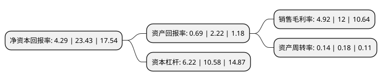

> 本页面由自动化程序生成于 2022年5月20日 01:28
> 内容可能存在错误，如有bug请提交issue至：https://github.com/Eroleice/doc-pi/issues
{.is-warning}

# 上市公司基本情况

## 基本资料

京投发展股份有限公司（以下简称“京投发展”）成立于1992年09月08日，宁波市。于1993年10月25日在上交所主板上市。

京投发展注册资本74,077.76万元，主要业务:商业(内贸)，外贸进出口。以下是详细信息：

- 公司名称: 京投发展股份有限公司
- 股票代码: 600683.SH
- 所在地: 浙江 - 宁波市
- 成立日期: 1992年09月08日
- 注册资本: 74,077.76万元
- 法定代表人: 魏怡
- 主营业务: 商业(内贸)，外贸进出口
- 公司官网: www.600683.com
- 公司介绍: 公司是一家地产开发经营集团。公司主营房地产开发经营，近期来依托两大股东的资源、资金和专业开发团队的优势，经营规模迅速扩大，土地储备日益增加。现下辖北京、上海、无锡等地多个房地产开发项目及酒店经营物业，公司已基本完成“以北京为中心、以轨道交通为依托”的战略布局，成为以轨道物业综合开发为主要特色并且极具竞争力的地产开发经营集团。公司为进一步回报股东，服务民众，贡献于社会，将在深耕轨道物业领域的基础上进一步探索新的赢利增长点、稳健发展企业规模并不断提高经营效益，向“亚洲轨道物业专家”这一企业愿景不断迈进。

## 股东及高管情况

上市公司第一大股东为北京市基础设施投资有限公司，持股281,495,391股，占比38%，为上市公司实际控制人。

截至2022年03月31日，上市公司的前十大股东中，共有7名自然人股东，2名机构股东，1名其他股东，其中5%以上大股东共有2名。上市公司前十大股东明细如下：

> 截至2022年03月31日，上市公司前十大股东信息如下：

| 股东名称 | 持股数量（股） | 持股比例 |
| --- | --- | --- |
| 北京市基础设施投资有限公司 | 281,495,391 | 38% |
| 程少良 | 139,129,736 | 18.78% |
| 龚万伦 | 7,080,850 | 0.96% |
| 中国银泰投资有限公司 | 6,236,650 | 0.84% |
| 程开武 | 5,970,300 | 0.81% |
| 宁波市银河综合服务管理中心 | 4,280,100 | 0.58% |
| 童晓阳 | 3,749,162 | 0.51% |
| 龚岚 | 3,541,700 | 0.48% |
| 杨雪梅 | 3,345,800 | 0.45% |
| 向正秀 | 2,555,200 | 0.34% |

## 利润表分析

上市公司2021年总收入为67.65亿元，净利润为3.32亿元，实现盈利。

## 杜邦分析

> 数据列示周期：2021年 | 2020年 | 2019年
{.is-info}

上市公司的净资产收益率在近一年有所下降，下降幅度为-81.69%，其变化情况分解如下：
- 上市公司的销售毛利率在近一年下降了-59%，可能是生产效率的下降、商品原材料价格上涨或商品价格的下跌所致。
- 上市公司的资产周转率在近一年下降了-22.22%，可能是源自于更慢的销售回款或库存管理效果下降。
- 上市公司的财务杠杆比率在近一年下降了-41.21%，可能是减少负债降低财务费用。

