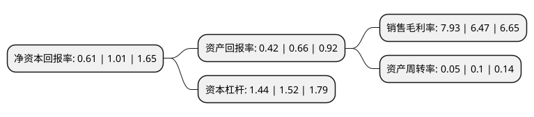

> 本页面由自动化程序生成于 2022年5月20日 01:28
> 内容可能存在错误，如有bug请提交issue至：https://github.com/Eroleice/doc-pi/issues
{.is-warning}

# 上市公司基本情况

## 基本资料

江苏凤凰置业投资股份有限公司（以下简称“凤凰股份”）成立于1996年06月24日，南京市。于1996年07月02日在上交所主板上市。

凤凰股份注册资本93,606.059万元，房地产投资及其他实业投资以下是详细信息：

- 公司名称: 江苏凤凰置业投资股份有限公司
- 股票代码: 600716.SH
- 所在地: 江苏 - 南京市
- 成立日期: 1996年06月24日
- 注册资本: 93,606.059万元
- 法定代表人: 林海涛
- 主营业务: 房地产投资及其他实业投资
- 公司官网: www.fhzy.cn
- 公司介绍: 公司系凤凰出版传媒集团控股上市公司，主要从事房地产投资、实业投资、房屋租赁及物业管理。其所属的江苏凤凰置业有限公司专业从事房地产开发、经营等，房地产开发一级资质。公司将国有文化企业的优势引入地产领域，结合文化产业开发房地产，打造文化地产品牌。公司是以文化产业基础设施建设和文化街区开发为依托，同时推进周边商、住项目开发的房地产开发企业。凤凰置业以“筑造城市文化标杆”为目标，将文化主题落实到地产开发中，加强“文化地产”发展战略，积极探索新的产业发展方向，创立独特的文化地产开发模式，立足南京，发展江苏，辐射华东，打造一流的文化地产开发项目。

## 股东及高管情况

上市公司第一大股东为江苏凤凰出版传媒集团有限公司，持股487,883,543股，占比52.12%，为上市公司实际控制人。

截至2022年03月31日，上市公司的前十大股东中，共有7名自然人股东，2名机构股东，1个产品账户，其中5%以上大股东共有1名。上市公司前十大股东明细如下：

> 截至2022年03月31日，上市公司前十大股东信息如下：

| 股东名称 | 持股数量（股） | 持股比例 |
| --- | --- | --- |
| 江苏凤凰出版传媒集团有限公司 | 487,883,543 | 52.12% |
| 冯建霖 | 21,151,065 | 2.26% |
| 王帮利 | 12,577,721 | 1.34% |
| 林子鑫 | 7,452,100 | 0.8% |
| 深圳微诚文娱集团有限公司 | 7,217,200 | 0.77% |
| 阮彩友 | 7,052,573 | 0.75% |
| 深圳力拓睿合投资有限责任公司-微诚力拓6号私募证券投资基金 | 5,647,000 | 0.6% |
| 俞红霞 | 5,399,100 | 0.58% |
| 林佳仪 | 5,073,897 | 0.54% |
| 阮友林 | 4,704,701 | 0.5% |

## 利润表分析

上市公司2021年总收入为4.41亿元，净利润为0.34亿元，实现盈利。

## 杜邦分析

> 数据列示周期：2021年 | 2020年 | 2019年
{.is-info}

上市公司的净资产收益率在近一年有所下降，下降幅度为-39.6%，其变化情况分解如下：
- 上市公司的销售毛利率在近一年上升了22.57%，可能是生产效率的提升、商品原材料价格下跌或商品价格的上涨所致。
- 上市公司的资产周转率在近一年下降了-50%，可能是源自于更慢的销售回款或库存管理效果下降。
- 上市公司的财务杠杆比率在近一年下降了-5.26%，可能是减少负债降低财务费用。

