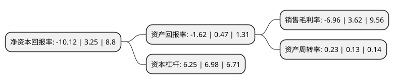

> 本页面由自动化程序生成于 2022年5月20日 01:28
> 内容可能存在错误，如有bug请提交issue至：https://github.com/Eroleice/doc-pi/issues
{.is-warning}

# 上市公司基本情况

## 基本资料

华远地产股份有限公司（以下简称“华远地产”）成立于1992年02月08日，北京市。于1996年09月09日在上交所主板上市。

华远地产注册资本234,610.087万元，房地产开发与经营。以下是详细信息：

- 公司名称: 华远地产股份有限公司
- 股票代码: 600743.SH
- 所在地: 北京 - 北京市
- 成立日期: 1992年02月08日
- 注册资本: 234,610.087万元
- 法定代表人: 王乐斌
- 主营业务: 房地产开发与经营
- 公司官网: www.hy-online.com
- 公司介绍: 公司于八十年代初进入房地产业，“华远”是国内房地产业最早创立的品牌之一，一直致力于开发高品质的具有市场代表性的房地产产品。2008年公司对上海证券交易所上市公司湖北幸福实业股份有限公司进行了重组，以幸福实业吸收合并华远地产的方式实现了借壳上市。公司主营业务为房地产开发与销售、租赁，属于房地产行业。公司开发的房地产产品涉及住宅、写字楼、商业等多种物业类型。公司曾多次获得“中国房地产名牌企业”、“中国区域房地产品牌价值TOP10”、“地产杰出贡献企业”、“中国责任地产TOP100”等荣誉，是在行业内外享有盛誉的老牌优质房企。

## 股东及高管情况

上市公司第一大股东为北京市华远集团有限公司，持股1,088,584,808股，占比46.4%，为上市公司实际控制人。

截至2022年03月31日，上市公司的前十大股东中，共有1名自然人股东，7名机构股东，2个产品账户，其中5%以上大股东共有4名。上市公司前十大股东明细如下：

> 截至2022年03月31日，上市公司前十大股东信息如下：

| 股东名称 | 持股数量（股） | 持股比例 |
| --- | --- | --- |
| 北京市华远集团有限公司 | 1,088,584,808 | 46.4% |
| 天津华远浩利投资股份有限公司 | 160,449,031 | 6.84% |
| 天津华远浩利企业管理咨询股份有限公司 | 160,449,031 | 6.84% |
| 北京北控京泰投资管理有限公司 | 127,951,000 | 5.4538% |
| 南京栖霞建设股份有限公司 | 48,400,000 | 2.06% |
| 中央汇金资产管理有限责任公司 | 43,418,720 | 1.85% |
| 中国光大银行股份有限公司-华夏磐益一年定期开放混合型证券投资基金 | 14,600,910 | 0.62% |
| 招商银行股份有限公司-华夏磐锐一年定期开放混合型证券投资基金 | 12,032,700 | 0.51% |
| 尹树臣 | 9,101,900 | 0.39% |
| 湖北潜江农村商业银行股份有限公司 | 8,941,644 | 0.38% |

## 利润表分析

上市公司2021年总收入为136.93亿元，净利润为-9.54亿元，**未实现盈利**。

## 杜邦分析

> 数据列示周期：2021年 | 2020年 | 2019年
{.is-info}

上市公司的净资产收益率在近一年有所下降，下降幅度为-411.38%，其变化情况分解如下：
- 上市公司的销售毛利率在近一年下降了-292.27%，可能是生产效率的下降、商品原材料价格上涨或商品价格的下跌所致。
- 上市公司的资产周转率在近一年上升了76.92%，可能是源自于更快的销售回款或库存管理效果提升。
- 上市公司的财务杠杆比率在近一年下降了-10.46%，可能是减少负债降低财务费用。

