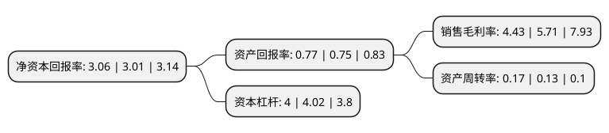

> 本页面由自动化程序生成于 2022年5月20日 01:28
> 内容可能存在错误，如有bug请提交issue至：https://github.com/Eroleice/doc-pi/issues
{.is-warning}

# 上市公司基本情况

## 基本资料

西藏城市发展投资股份有限公司（以下简称“西藏城投”）成立于1996年10月25日，拉萨市。于1996年11月08日在上交所主板上市。

西藏城投注册资本81,966.074万元，主营业务为房地产开发，销售，咨询服务以及对矿业，金融，实业的投资。以下是详细信息：

- 公司名称: 西藏城市发展投资股份有限公司
- 股票代码: 600773.SH
- 所在地: 西藏 - 拉萨市
- 成立日期: 1996年10月25日
- 注册资本: 81,966.074万元
- 法定代表人: 陈卫东
- 主营业务: 主营业务为房地产开发，销售，咨询服务以及对矿业，金融，实业的投资
- 公司官网: www.600773sh.com
- 公司介绍: 公司前身为西藏雅砻藏药股份有限公司,于2009年完成与上海市闸北区国有资产监督管理委员会下属全资子公司的重大资产重组,公司完成主营业务向房地产开发、旧区改造、保障性住房建设的转变。2010年，公司收购了拥有龙木错、结则茶卡盐湖资源的阿里圣拓矿业，圣拓矿业更名为西藏国能矿业发展有限公司；2012年，与西藏投资、西藏国资、金泰工贸公司合作组建了西藏旺盛公司，并与中国地质科学院合作开展阿里革吉3200多平方公里硼、有色金属找矿科学考察项目；2013年,收购了西藏龙辉矿业，介入有色金属矿产领域。另外，在金昌成立金昌北方国能锂业实施锂盐下游产品开发和生产，在西安成立陕西国能锂业作为高纯度碳酸锂开发和生产基地。与清华大学合作成立开发和生产碳纳米管公司向新能源汽车的电池原件领域介入。通过几年的努力，逐步确立了“房地产、矿业两业并举，两翼发展，做强房地产、做大矿业”的战略格局，初步实现了业务跨区域、跨行业转型，进一步探索产(业)地(产)结合、产(业)金(融)互动、产(业)技(术)共济，广泛与社会资本、地方政府、技术合作的经营模式。

## 股东及高管情况

上市公司第一大股东为上海市静安区国有资产监督管理委员会，持股391,617,705股，占比47.78%，为上市公司实际控制人。

截至2022年03月31日，上市公司的前十大股东中，共有6名自然人股东，1名机构股东，2个产品账户，1名其他股东，其中5%以上大股东共有1名。上市公司前十大股东明细如下：

> 截至2022年03月31日，上市公司前十大股东信息如下：

| 股东名称 | 持股数量（股） | 持股比例 |
| --- | --- | --- |
| 上海市静安区国有资产监督管理委员会 | 391,617,705 | 47.78% |
| 江苏陶朱公私募基金管理有限公司-银壹捌陶朱公二号私募证券投资基金 | 5,200,075 | 0.63% |
| 朱振国 | 5,161,401 | 0.63% |
| 南京长恒实业有限公司 | 4,650,338 | 0.57% |
| 罗彬 | 4,136,310 | 0.5% |
| 中国邮政储蓄银行有限责任公司-东方增长中小盘混合型开放式证券投资基金 | 3,632,452 | 0.44% |
| 雷响 | 2,865,400 | 0.35% |
| 解丹 | 2,366,800 | 0.29% |
| 刘凯 | 2,226,100 | 0.27% |
| 卢文书 | 2,202,311 | 0.27% |

## 利润表分析

上市公司2021年总收入为25.14亿元，净利润为1.11亿元，实现盈利。

## 杜邦分析

> 数据列示周期：2021年 | 2020年 | 2019年
{.is-info}

上市公司的净资产收益率在近一年有所上升，上升幅度为1.66%，其变化情况分解如下：
- 上市公司的销售毛利率在近一年下降了-22.42%，可能是生产效率的下降、商品原材料价格上涨或商品价格的下跌所致。
- 上市公司的资产周转率在近一年上升了30.77%，可能是源自于更快的销售回款或库存管理效果提升。
- 上市公司的财务杠杆比率在近一年下降了-0.5%，可能是减少负债降低财务费用。

