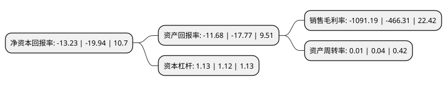

> 本页面由自动化程序生成于 2022年5月20日 01:29
> 内容可能存在错误，如有bug请提交issue至：https://github.com/Eroleice/doc-pi/issues
{.is-warning}

# 上市公司基本情况

## 基本资料

中房置业股份有限公司（以下简称“*ST中房”）成立于1993年06月12日，北京市。于1996年03月18日在上交所主板上市。

*ST中房注册资本57,919.493万元，主要业务:房地产开发。以下是详细信息：

- 公司名称: 中房置业股份有限公司
- 股票代码: 600890.SH
- 所在地: 北京 - 北京市
- 成立日期: 1993年06月12日
- 注册资本: 57,919.493万元
- 法定代表人: 朱雷
- 主营业务: 房地产开发
- 公司官网: www.credholding.com
- 公司介绍: 公司原名为长春长铃实业股份有限公司，是经长春市经济体制改革委员会批准，于1993年通过改制设立的股份有限公司。1996年3月18日，公司A股股票在上海证券交易所挂牌交易。目前，公司主要业务为投资性房产的销售及自有物业的出租。经过多年来的努力，公司逐步摆脱了收购重组时期遗留下来的诸多历史遗留问题，公司治理结构不断完善。至今已先后在北京和天津开发了长远天地项目、乐城经济适用房项目、静源居项目、天津凯摩国际公寓项目等，取得了良好的经济效益和市场评价。

## 股东及高管情况

上市公司第一大股东为嘉益(天津)投资管理有限公司，持股112,782,809股，占比19.47%，**疑似为**上市公司实际控制人。

截至2022年04月22日，上市公司的前十大股东中，共有1名自然人股东，9名机构股东，其中5%以上大股东共有8名。上市公司前十大股东明细如下：

> 未能通过持股比例判定出上市公司实际控制人（持股30%以上）
> 可能存在通过间接持股、联合持股、协议控制等方式拥有实际控制权的主体，具体请参考上市公司定期公告！
{.is-warning}

> 截至2022年04月22日，上市公司前十大股东信息如下：

| 股东名称 | 持股数量（股） | 持股比例 |
| --- | --- | --- |
| 嘉益(天津)投资管理有限公司 | 112,782,809 | 19.47% |
| 嘉益(天津)投资管理有限公司 | 112,782,809 | 19.47% |
| 中国铁路兰州局集团有限公司 | 78,323,457 | 13.5228% |
| 中国铁路兰州局集团有限公司 | 78,323,457 | 13.5228% |
| 中国铁路兰州局集团有限公司 | 78,323,457 | 13.52% |
| 天津中维商贸集团有限公司 | 35,375,300 | 6.11% |
| 天津中维商贸集团有限公司 | 29,975,300 | 5.18% |
| 天津中维商贸集团有限公司 | 29,585,300 | 5.108% |
| 上海华山康健医疗有限公司 | 12,073,395 | 2.08% |
| 林文赛 | 4,379,359 | 0.76% |

## 利润表分析

上市公司2021年总收入为0.02亿元，净利润为-0.3亿元，**未实现盈利**。

## 杜邦分析

> 数据列示周期：2021年 | 2020年 | 2019年
{.is-info}

上市公司的净资产收益率在近一年有所下降，下降幅度为-33.65%，其变化情况分解如下：
- 上市公司的销售毛利率在近一年上升了134.01%，可能是生产效率的提升、商品原材料价格下跌或商品价格的上涨所致。
- 上市公司的资产周转率在近一年下降了-75%，可能是源自于更慢的销售回款或库存管理效果下降。
- 上市公司的财务杠杆比率在近一年上升了0.89%，可能是增加负债扩大生产规模。

