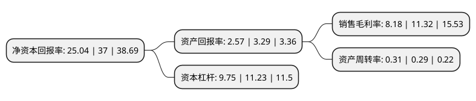

> 本页面由自动化程序生成于 2022年5月20日 01:30
> 内容可能存在错误，如有bug请提交issue至：https://github.com/Eroleice/doc-pi/issues
{.is-warning}

# 上市公司基本情况

## 基本资料

新城控股集团股份有限公司（以下简称“新城控股”）成立于1996年06月30日，常州市。于2015年12月04日在上交所主板上市。

新城控股注册资本226,358.614万元，主营业务:房地产开发与销售以下是详细信息：

- 公司名称: 新城控股集团股份有限公司
- 股票代码: 601155.SH
- 所在地: 江苏 - 常州市
- 成立日期: 1996年06月30日
- 注册资本: 226,358.614万元
- 法定代表人: 王晓松
- 主营业务: 主营业务:房地产开发与销售
- 公司官网: www.seazen.com.cn
- 公司介绍: 公司以房地产开发与销售为主营业务，在我国房地产企业中具有较强竞争力。公司以诚信、互利、创新构筑企业的文化内核，籍公司内外部资源的和谐整合，矢志跻身中国最优秀房地产企业的行列。公司2005-2017年连续十三年获“江苏省房地产业综合实力五十强”第1位。同时，公司成功入选新华社民族品牌工程，公司将借助新华社通达全球的媒体资源、国际化视野和高端智库平台，释放出更强大的品牌力，打造新城海内外品牌形象，在品牌建设的道路上走得更快、更远。

## 股东及高管情况

上市公司第一大股东为富域发展集团有限公司，持股1,378,000,000股，占比60.88%，为上市公司实际控制人。

截至2022年05月18日，上市公司的前十大股东中，共有1名自然人股东，3名机构股东，5个产品账户，1个海外主体，其中5%以上大股东共有2名。上市公司前十大股东明细如下：

> 截至2022年05月18日，上市公司前十大股东信息如下：

| 股东名称 | 持股数量（股） | 持股比例 |
| --- | --- | --- |
| 富域发展集团有限公司 | 1,378,000,000 | 60.88% |
| 常州德润咨询管理有限公司 | 137,800,000 | 6.09% |
| 香港中央结算有限公司(陆股通) | 37,368,765 | 1.65% |
| 龙松书 | 28,254,959 | 1.25% |
| 中国证券金融股份有限公司 | 27,816,200 | 1.23% |
| 全国社保基金一零六组合 | 22,041,330 | 0.97% |
| 中信证券股份有限公司-社保基金1106组合 | 9,552,083 | 0.47% |
| 基本养老保险基金八零七组合 | 8,282,331 | 0.37% |
| 交通银行-融通行业景气证券投资基金 | 6,169,470 | 0.27% |
| 兴业银行股份有限公司-南方金融主题灵活配置混合型证券投资基金 | 5,615,179 | 0.25% |

## 利润表分析

上市公司2021年总收入为1,682.31亿元，净利润为137.59亿元，实现盈利。

## 杜邦分析

> 数据列示周期：2021年 | 2020年 | 2019年
{.is-info}

上市公司的净资产收益率在近一年有所下降，下降幅度为-32.32%，其变化情况分解如下：
- 上市公司的销售毛利率在近一年下降了-27.74%，可能是生产效率的下降、商品原材料价格上涨或商品价格的下跌所致。
- 上市公司的资产周转率在近一年上升了6.9%，可能是源自于更快的销售回款或库存管理效果提升。
- 上市公司的财务杠杆比率在近一年下降了-13.18%，可能是减少负债降低财务费用。

