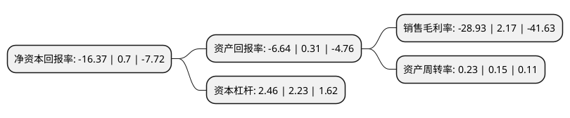

> 本页面由自动化程序生成于 2022年5月20日 01:02
> 内容可能存在错误，如有bug请提交issue至：https://github.com/Eroleice/doc-pi/issues
{.is-warning}

# 上市公司基本情况

## 基本资料

西安国际医学投资股份有限公司（以下简称“国际医学”）成立于1996年12月31日，西安市。于1993年08月09日在深交所主板上市。

国际医学注册资本227,592.735万元，主要业务:医疗服务。以下是详细信息：

- 公司名称: 西安国际医学投资股份有限公司
- 股票代码: 000516.SZ
- 所在地: 陕西 - 西安市
- 成立日期: 1996年12月31日
- 注册资本: 227,592.735万元
- 法定代表人: 史今
- 主营业务: 医疗服务
- 公司官网: www.000516.cn
- 公司介绍: 公司前身是西安市解放百货商场，创建于1956年，是西安市及陕西省最大的百货零售业企业。2018年，公司将全资子公司开元商业有限公司100%股权出售给银泰百货有限公司，并已顺利完成，剥离百货零售业务资产后，公司成功实现整体业务战略转型，将专注于发展医疗服务主业。公司目前以大健康医疗服务和现代医学技术转化应用为主业，正在运营西安高新医院、商洛国际医学中心、二〇四所医院等医疗机构。公司目前按照三甲标准在建的医疗项目有西安国际医学中心、西安高新医院二期改扩建、商洛国际医学中心(新院区)、西安国际康复医学中心等。旗下西安高新医院始创于2002年，为中国首家社会资本兴办的三级甲等综合医院。近年，公司联合阿里健康建设“互联网+医疗”新模式，建成阿里健康西安高新互联网医院；积极拓展分级诊疗网点，全力打造新型医联体，先后设立了西安蓝博社区卫生服务中心，三星、比亚迪医务室等；公司也积极布局干细胞等现代医学技术转化应用。

## 股东及高管情况

上市公司第一大股东为陕西世纪新元商业管理有限公司，持股676,971,198股，占比29.74%，**疑似为**上市公司实际控制人。

截至2022年03月31日，上市公司的前十大股东中，共有2名自然人股东，4名机构股东，4个产品账户，其中5%以上大股东共有1名。上市公司前十大股东明细如下：

> 未能通过持股比例判定出上市公司实际控制人（持股30%以上）
> 可能存在通过间接持股、联合持股、协议控制等方式拥有实际控制权的主体，具体请参考上市公司定期公告！
{.is-warning}

> 截至2022年03月31日，上市公司前十大股东信息如下：

| 股东名称 | 持股数量（股） | 持股比例 |
| --- | --- | --- |
| 陕西世纪新元商业管理有限公司 | 676,971,198 | 29.74% |
| 申华控股集团有限公司 | 91,486,283 | 4.02% |
| 曹鹤玲 | 54,397,770 | 2.39% |
| 深圳市元帆信息咨询有限公司 | 44,336,163 | 1.95% |
| 中国邮政储蓄银行股份有限公司-易方达新收益灵活配置混合型证券投资基金 | 19,719,095 | 0.87% |
| 西安商业科技开发公司 | 14,631,128 | 0.64% |
| 招商银行股份有限公司-东方红睿泽三年定期开放灵活配置混合型证券投资基金 | 13,324,900 | 0.59% |
| 邢博越 | 11,437,800 | 0.5% |
| 中国银行股份有限公司-华安文体健康主题灵活配置混合型证券投资基金 | 10,925,750 | 0.48% |
| 易方达泰利增长股票型养老金产品-中国工商银行股份有限公司 | 10,500,000 | 0.46% |

## 利润表分析

上市公司2021年总收入为29.21亿元，净利润为-8.46亿元，**未实现盈利**。

## 杜邦分析

> 数据列示周期：2021年 | 2020年 | 2019年
{.is-info}

上市公司的净资产收益率在近一年有所下降，下降幅度为-2438.57%，其变化情况分解如下：
- 上市公司的销售毛利率在近一年下降了-1433.18%，可能是生产效率的下降、商品原材料价格上涨或商品价格的下跌所致。
- 上市公司的资产周转率在近一年上升了53.33%，可能是源自于更快的销售回款或库存管理效果提升。
- 上市公司的财务杠杆比率在近一年上升了10.31%，可能是增加负债扩大生产规模。

