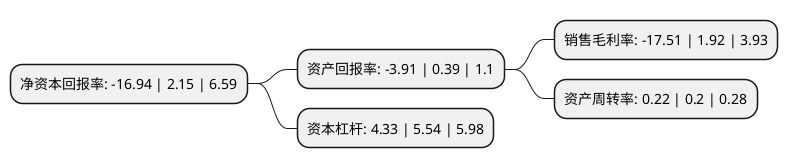

> 本页面由自动化程序生成于 2022年5月20日 01:02
> 内容可能存在错误，如有bug请提交issue至：https://github.com/Eroleice/doc-pi/issues
{.is-warning}

# 上市公司基本情况

## 基本资料

奥园美谷科技股份有限公司（以下简称“奥园美谷”）成立于1993年06月08日，襄阳市。于1996年10月16日在深交所主板上市。

奥园美谷注册资本78,118.032万元，主要产品:粘胶长丝，移动通信器材，房地产业务和粘胶纤维业务。以下是详细信息：

- 公司名称: 奥园美谷科技股份有限公司
- 股票代码: 000615.SZ
- 所在地: 湖北 - 襄阳市
- 成立日期: 1993年06月08日
- 注册资本: 78,118.032万元
- 法定代表人: 范时杰
- 主营业务: 主要产品:粘胶长丝，移动通信器材，房地产业务和粘胶纤维业务
- 公司官网: www.aoyuanbeauty.com
- 公司介绍: 公司是深圳证券交易所主板上市公司，成立于1993年。秉承“成就美丽人生”的品牌理念，坚持“美丽健康产业的科技商、材料商、服务商”的战略定位，通过并购医美服务机构快速切入医美赛道，深耕长三角和粤港澳大湾区市场。布局上游医美科技和医美产品,下游对接医美新零售平台，打通上下游产业链，形成横向贯通、纵向联动的发展格局，致力成为国内美丽健康产业头部品牌和医美生态集成商。

## 股东及高管情况

上市公司第一大股东为深圳奥园科星投资有限公司，持股229,231,817股，占比29.34%，**疑似为**上市公司实际控制人。

截至2022年03月31日，上市公司的前十大股东中，共有4名自然人股东，4名机构股东，1个产品账户，1名其他股东，其中5%以上大股东共有2名。上市公司前十大股东明细如下：

> 未能通过持股比例判定出上市公司实际控制人（持股30%以上）
> 可能存在通过间接持股、联合持股、协议控制等方式拥有实际控制权的主体，具体请参考上市公司定期公告！
{.is-warning}

> 截至2022年03月31日，上市公司前十大股东信息如下：

| 股东名称 | 持股数量（股） | 持股比例 |
| --- | --- | --- |
| 深圳奥园科星投资有限公司 | 229,231,817 | 29.34% |
| 京汉控股集团有限公司 | 60,504,314 | 7.75% |
| 上海通怡投资管理有限公司-通怡梧桐22号私募证券投资基金 | 15,623,600 | 2% |
| 北京合力万通信息咨询中心(有限合伙) | 13,674,654 | 1.75% |
| 建水泰融企业管理有限公司 | 6,726,742 | 0.86% |
| 关明广 | 3,009,991 | 0.39% |
| 法国兴业银行 | 2,668,300 | 0.34% |
| 石耀 | 2,646,400 | 0.34% |
| 段亚娟 | 2,633,845 | 0.34% |
| 陈蘸木 | 2,447,700 | 0.31% |

## 利润表分析

上市公司2021年总收入为15.38亿元，净利润为-2.7亿元，**未实现盈利**。

## 杜邦分析

> 数据列示周期：2021年 | 2020年 | 2019年
{.is-info}

上市公司的净资产收益率在近一年有所下降，下降幅度为-887.91%，其变化情况分解如下：
- 上市公司的销售毛利率在近一年下降了-1011.98%，可能是生产效率的下降、商品原材料价格上涨或商品价格的下跌所致。
- 上市公司的资产周转率在近一年上升了10%，可能是源自于更快的销售回款或库存管理效果提升。
- 上市公司的财务杠杆比率在近一年下降了-21.84%，可能是减少负债降低财务费用。

