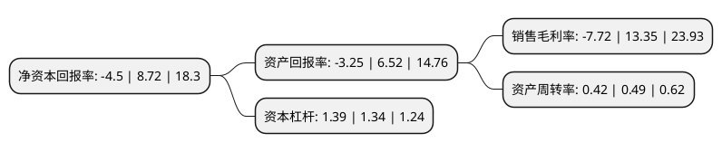

> 本页面由自动化程序生成于 2022年5月20日 01:03
> 内容可能存在错误，如有bug请提交issue至：https://github.com/Eroleice/doc-pi/issues
{.is-warning}

# 上市公司基本情况

## 基本资料

成都市贝瑞和康基因技术股份有限公司（以下简称“贝瑞基因”）成立于1997年04月14日，成都市。于1997年04月22日在深交所主板上市。

贝瑞基因注册资本35,460.587万元，主要业务:以测序为基础的基因检测服务与设备试剂销售。以下是详细信息：

- 公司名称: 成都市贝瑞和康基因技术股份有限公司
- 股票代码: 000710.SZ
- 所在地: 四川 - 成都市
- 成立日期: 1997年04月14日
- 注册资本: 35,460.587万元
- 法定代表人: 高扬
- 主营业务: 以测序为基础的基因检测服务与设备试剂销售
- 公司官网: www.berrygenomics.com
- 公司介绍: 公司是一家先进的创新型生物科技公司，致力于实现基因测序技术向应用的全面转化，专注于用测序技术促进生命科学的研究。公司主要业务为以高通量测序技术为基础的基因检测和设备、试剂销售。其中，基因检测分为医学产品及服务和基础科研服务。公司的医学产品及服务分为医疗检测服务、试剂销售和设备销售。公司医疗检测服务主要分为遗传学和肿瘤学两个应用方向。公司从成立之初就开始建设具有国际标准的研发、生产、市场、销售和客户服务体系，始终保持与国内外一流的科研院所、高等院校和医疗机构的合作与交流，客户覆盖国内外的医疗机构、科研机构、高等院校以及各行业的企业。

## 股东及高管情况

上市公司第一大股东为成都天兴仪表(集团)有限公司，持股44,002,000股，占比12.41%，**疑似为**上市公司实际控制人。

截至2022年03月31日，上市公司的前十大股东中，共有3名自然人股东，5名机构股东，1个产品账户，1个海外主体，其中5%以上大股东共有4名。上市公司前十大股东明细如下：

> 未能通过持股比例判定出上市公司实际控制人（持股30%以上）
> 可能存在通过间接持股、联合持股、协议控制等方式拥有实际控制权的主体，具体请参考上市公司定期公告！
{.is-warning}

> 截至2022年03月31日，上市公司前十大股东信息如下：

| 股东名称 | 持股数量（股） | 持股比例 |
| --- | --- | --- |
| 成都天兴仪表(集团)有限公司 | 44,002,000 | 12.41% |
| 高扬 | 40,310,572 | 11.37% |
| 宏瓴思齐(珠海)并购股权投资企业(有限合伙) | 30,000,000 | 8.46% |
| 侯颖 | 23,355,661 | 6.59% |
| 天津君睿祺股权投资合伙企业(有限合伙) | 13,682,261 | 3.86% |
| 香港中央结算有限公司(陆股通) | 7,340,078 | 2.07% |
| 成都市贝瑞和康基因技术股份有限公司-第一期员工持股计划 | 2,823,000 | 0.8% |
| 北京君联茂林股权投资合伙企业(有限合伙) | 2,078,233 | 0.59% |
| 平潭天祺瑞投资合伙企业(有限合伙) | 2,000,000 | 0.56% |
| 程华九 | 1,821,688 | 0.51% |

## 利润表分析

上市公司2021年总收入为14.22亿元，净利润为-1.1亿元，**未实现盈利**。

## 杜邦分析

> 数据列示周期：2021年 | 2020年 | 2019年
{.is-info}

上市公司的净资产收益率在近一年有所下降，下降幅度为-151.61%，其变化情况分解如下：
- 上市公司的销售毛利率在近一年下降了-157.83%，可能是生产效率的下降、商品原材料价格上涨或商品价格的下跌所致。
- 上市公司的资产周转率在近一年下降了-14.29%，可能是源自于更慢的销售回款或库存管理效果下降。
- 上市公司的财务杠杆比率在近一年上升了3.73%，可能是增加负债扩大生产规模。

