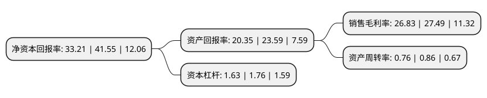

> 本页面由自动化程序生成于 2022年5月20日 01:05
> 内容可能存在错误，如有bug请提交issue至：https://github.com/Eroleice/doc-pi/issues
{.is-warning}

# 上市公司基本情况

## 基本资料

上海科华生物工程股份有限公司（以下简称“*ST科华”）成立于1981年11月22日，上海市。于2004年07月21日在深交所中小板上市。

*ST科华注册资本51,428.439万元，主要产品:体外临床诊断试剂，医疗仪器以下是详细信息：

- 公司名称: 上海科华生物工程股份有限公司
- 股票代码: 002022.SZ
- 所在地: 上海 - 上海市
- 成立日期: 1981年11月22日
- 注册资本: 51,428.439万元
- 法定代表人: 周琴琴
- 主营业务: 主要产品:体外临床诊断试剂，医疗仪器
- 公司官网: www.skhb.com
- 公司介绍: 公司是国内首家在深圳证券交易所中小板上市的诊断用品专业公司，融产品研发、生产、销售于一体，拥有医疗诊断领域完整产业链。公司主营业务涵盖体外诊断试剂和医疗检验仪器。作为研发驱动型高科技企业，公司依托生物技术创新中心和博士后科研工作站，创建了临床体外诊断试剂和全自动检测分析仪器两大研发技术平台，逐步推进试剂和仪器的“系列化”、“一体化”发展目标；公司产品线延伸策略成效显著，主要产品国内市场占有率名列前茅；公司在打造国内优秀营销网络的同时，积极拓展国际市场，科华品牌产品已出口至海外多个国家和地区，艾滋病诊断试剂被列入世界卫生组织、联合国儿童基金会、美国总统基金等国际知名机构的采购名录，并与美国克林顿基金会签署了长期供货合同。

## 股东及高管情况

上市公司第一大股东为上海嘉恳资产管理有限公司-嘉恳杰容2号私募证券投资基金，持股4,490,000股，占比0.87%，**疑似为**上市公司实际控制人。

截至2022年03月31日，上市公司的前十大股东中，共有1名自然人股东，9个产品账户。上市公司前十大股东明细如下：

> 未能通过持股比例判定出上市公司实际控制人（持股30%以上）
> 可能存在通过间接持股、联合持股、协议控制等方式拥有实际控制权的主体，具体请参考上市公司定期公告！
{.is-warning}

> 上市公司第一大股东持股不超过10%，请检查是否存在公司控制权风险！
{.is-danger}

> 截至2022年03月31日，上市公司前十大股东信息如下：

| 股东名称 | 持股数量（股） | 持股比例 |
| --- | --- | --- |
| 上海嘉恳资产管理有限公司-嘉恳杰容2号私募证券投资基金 | 4,490,000 | 0.87% |
| 杨白 | 3,106,200 | 0.6% |
| 工银瑞信基金-农业银行-工银瑞信中证金融资产管理计划 | 2,960,800 | 0.58% |
| 银华基金-农业银行-银华中证金融资产管理计划 | 2,960,800 | 0.58% |
| 大成基金-农业银行-大成中证金融资产管理计划 | 2,960,800 | 0.58% |
| 南方基金-农业银行-南方中证金融资产管理计划 | 2,960,800 | 0.58% |
| 中欧基金-农业银行-中欧中证金融资产管理计划 | 2,960,800 | 0.58% |
| 易方达基金-农业银行-易方达中证金融资产管理计划 | 2,960,800 | 0.58% |
| 博时基金-农业银行-博时中证金融资产管理计划 | 2,960,800 | 0.58% |
| 广发基金-农业银行-广发中证金融资产管理计划 | 2,960,800 | 0.58% |

## 利润表分析

上市公司2021年总收入为42.68亿元，净利润为11.45亿元，实现盈利。

## 杜邦分析

> 数据列示周期：2021年 | 2020年 | 2019年
{.is-info}

上市公司的净资产收益率在近一年有所下降，下降幅度为-20.07%，其变化情况分解如下：
- 上市公司的销售毛利率在近一年下降了-2.4%，可能是生产效率的下降、商品原材料价格上涨或商品价格的下跌所致。
- 上市公司的资产周转率在近一年下降了-11.63%，可能是源自于更慢的销售回款或库存管理效果下降。
- 上市公司的财务杠杆比率在近一年下降了-7.39%，可能是减少负债降低财务费用。

