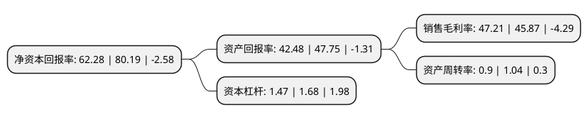

> 本页面由自动化程序生成于 2022年5月20日 01:05
> 内容可能存在错误，如有bug请提交issue至：https://github.com/Eroleice/doc-pi/issues
{.is-warning}

# 上市公司基本情况

## 基本资料

广州达安基因股份有限公司（以下简称“达安基因”）成立于1988年08月17日，广州市。于2004年08月09日在深交所中小板上市。

达安基因注册资本140,344.603万元，试剂，仪器，服务以下是详细信息：

- 公司名称: 广州达安基因股份有限公司
- 股票代码: 002030.SZ
- 所在地: 广东 - 广州市
- 成立日期: 1988年08月17日
- 注册资本: 140,344.603万元
- 法定代表人: 何蕴韶
- 主营业务: 试剂，仪器，服务
- 公司官网: www.daangene.com
- 公司介绍: 公司是以分子诊断技术为主导的，集临床检验试剂和仪器的研发、生产、销售以及全国连锁医学独立实验室临床检验服务为一体的生物医药高科技企业。公司在分子生物学技术方面，尤其是基因诊断技术及其试剂产品的研制、开发和应用上始终处于领先地位，目前主要从事荧光PCR检测技术研究、开发和应用，以及荧光PCR检测试剂盒的生产和销售。公司不断完善创新机制，以全面的技术创新、管理创新、经营模式创新，探索生命的奥秘，以一流的产品和服务推动公司的不断成长。

## 股东及高管情况

上市公司第一大股东为广州中大控股有限公司，持股233,391,995股，占比16.63%，**疑似为**上市公司实际控制人。

截至2022年03月31日，上市公司的前十大股东中，共有3名自然人股东，3名机构股东，3个产品账户，1个海外主体，其中5%以上大股东共有2名。上市公司前十大股东明细如下：

> 未能通过持股比例判定出上市公司实际控制人（持股30%以上）
> 可能存在通过间接持股、联合持股、协议控制等方式拥有实际控制权的主体，具体请参考上市公司定期公告！
{.is-warning}

> 截至2022年03月31日，上市公司前十大股东信息如下：

| 股东名称 | 持股数量（股） | 持股比例 |
| --- | --- | --- |
| 广州中大控股有限公司 | 233,391,995 | 16.63% |
| 广州生物工程中心有限公司 | 205,959,209 | 14.68% |
| 香港中央结算有限公司(陆股通) | 33,300,081 | 2.37% |
| 何蕴韶 | 25,483,707 | 1.82% |
| 周新宇 | 16,647,266 | 1.19% |
| 中国银行股份有限公司-招商国证生物医药指数分级证券投资基金 | 15,867,399 | 1.13% |
| 中央汇金资产管理有限责任公司 | 12,817,911 | 0.91% |
| 中国银行股份有限公司-华宝中证医疗交易型开放式指数证券投资基金 | 10,323,837 | 0.74% |
| 中国农业银行股份有限公司-中证500交易型开放式指数证券投资基金 | 4,790,748 | 0.34% |
| 田立新 | 2,718,808 | 0.19% |

## 利润表分析

上市公司2021年总收入为76.64亿元，净利润为36.18亿元，实现盈利。

## 杜邦分析

> 数据列示周期：2021年 | 2020年 | 2019年
{.is-info}

上市公司的净资产收益率在近一年有所下降，下降幅度为-22.33%，其变化情况分解如下：
- 上市公司的销售毛利率在近一年上升了2.92%，可能是生产效率的提升、商品原材料价格下跌或商品价格的上涨所致。
- 上市公司的资产周转率在近一年下降了-13.46%，可能是源自于更慢的销售回款或库存管理效果下降。
- 上市公司的财务杠杆比率在近一年下降了-12.5%，可能是减少负债降低财务费用。

