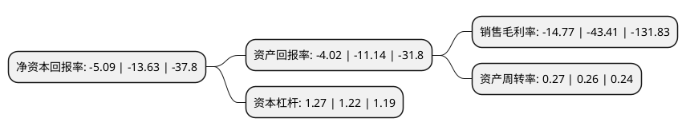

> 本页面由自动化程序生成于 2022年5月20日 01:06
> 内容可能存在错误，如有bug请提交issue至：https://github.com/Eroleice/doc-pi/issues
{.is-warning}

# 上市公司基本情况

## 基本资料

创新医疗管理股份有限公司（以下简称“创新医疗”）成立于2003年09月30日，绍兴市。于2007年09月25日在深交所中小板上市。

创新医疗注册资本45,307.958万元，主营业务为医疗服务，医疗投资，淡水珍珠的养殖与加工以下是详细信息：

- 公司名称: 创新医疗管理股份有限公司
- 股票代码: 002173.SZ
- 所在地: 浙江 - 绍兴市
- 成立日期: 2003年09月30日
- 注册资本: 45,307.958万元
- 法定代表人: 陈海军
- 主营业务: 主营业务为医疗服务，医疗投资，淡水珍珠的养殖与加工
- 公司官网: www.chxyl.com
- 公司介绍: 公司原主要从事淡水珍珠养殖、加工与销售业务。公司于2016年2月顺利完成重大资产重组，公司2016年主营业务拓展到医疗服务行业，向大健康产业转型，由单一的养殖加工企业转变为珍珠饰品加工生产、批发零售和医疗服务并行的双主业上市公司，公司实现多元化发展。建华医院是一所以烧伤科、腰间盘科、乳腺科、神经内科、妇产科等为特色的集医疗、教学、科研、康复、预防、社区卫生服务于一体的国家综合性三级甲等医院，也是齐齐哈尔市唯一的一家三级甲等民营医院。康华医院为浙江省二级甲等综合医院，是一所按照三级乙等综合医院标准设置，集医疗、康复、保健、教学为一体的新型现代化综合性医院。福恬医院是溧阳市唯一一家二级康复专科医院、残疾人康复中心，溧阳地区唯一一家纯氧舱高压氧治疗基地，南京卫生学校教学实践基地。明珠医院是齐齐哈尔市富拉尔基区的一家二级甲等综合医院，拥有妇产科、神经外科、心血管、烧伤、风湿免疫疾病治理等特色专科。

## 股东及高管情况

上市公司第一大股东为陈夏英，持股77,616,997股，占比17.131%，**疑似为**上市公司实际控制人。

截至2022年04月11日，上市公司的前十大股东中，共有5名自然人股东，5名机构股东，其中5%以上大股东共有7名。上市公司前十大股东明细如下：

> 未能通过持股比例判定出上市公司实际控制人（持股30%以上）
> 可能存在通过间接持股、联合持股、协议控制等方式拥有实际控制权的主体，具体请参考上市公司定期公告！
{.is-warning}

> 截至2022年04月11日，上市公司前十大股东信息如下：

| 股东名称 | 持股数量（股） | 持股比例 |
| --- | --- | --- |
| 陈夏英 | 77,616,997 | 17.131% |
| 陈夏英 | 77,616,997 | 17.13% |
| 上海康瀚投资管理中心(有限合伙) | 44,957,436 | 9.9226% |
| 上海康瀚投资管理中心(有限合伙) | 44,957,436 | 9.92% |
| 杭州昌健投资合伙企业(有限合伙) | 33,955,857 | 7.4945% |
| 杭州昌健投资合伙企业(有限合伙) | 33,955,857 | 7.49% |
| 冯美娟 | 31,225,580 | 6.89% |
| 陈海军 | 22,225,300 | 4.91% |
| 杭州岚创投资合伙企业(有限合伙) | 12,733,430 | 2.81% |
| 陈越孟 | 8,488,964 | 1.87% |

## 利润表分析

上市公司2021年总收入为7.11亿元，净利润为-1.06亿元，**未实现盈利**。

## 杜邦分析

> 数据列示周期：2021年 | 2020年 | 2019年
{.is-info}

上市公司的净资产收益率在近一年有所下降，下降幅度为-62.66%，其变化情况分解如下：
- 上市公司的销售毛利率在近一年下降了-65.98%，可能是生产效率的下降、商品原材料价格上涨或商品价格的下跌所致。
- 上市公司的资产周转率在近一年上升了3.85%，可能是源自于更快的销售回款或库存管理效果提升。
- 上市公司的财务杠杆比率在近一年上升了4.1%，可能是增加负债扩大生产规模。

