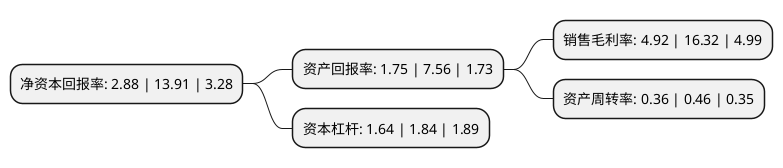

> 本页面由自动化程序生成于 2022年5月20日 01:10
> 内容可能存在错误，如有bug请提交issue至：https://github.com/Eroleice/doc-pi/issues
{.is-warning}

# 上市公司基本情况

## 基本资料

深圳市尚荣医疗股份有限公司（以下简称“尚荣医疗”）成立于1998年03月13日，深圳市。于2011年02月25日在深交所中小板上市。

尚荣医疗注册资本84,468.582万元，主要提供以洁净手术部为核心的医疗专业工程整体解决方案，具体包括医疗专业工程(如手术室，ICU，实验室，化验室，医用气体工程等)的规划设计，装饰施工，器具配置，系统运维等一体化服务。以下是详细信息：

- 公司名称: 深圳市尚荣医疗股份有限公司
- 股票代码: 002551.SZ
- 所在地: 广东 - 深圳市
- 成立日期: 1998年03月13日
- 注册资本: 84,468.582万元
- 法定代表人: 梁桂秋
- 主营业务: 主要提供以洁净手术部为核心的医疗专业工程整体解决方案，具体包括医疗专业工程(如手术室，ICU，实验室，化验室，医用气体工程等)的规划设计，装饰施工，器具配置，系统运维等一体化服务
- 公司官网: www.glory-medical.com.cn
- 公司介绍: 公司主要提供以洁净手术部为核心的医疗专业工程整体解决方案，具体包括医疗专业工程(如手术室、ICU、实验室、化验室、医用气体工程等)的规划设计、装饰施工、器具配置、系统运维等一体化服务。公司坚持“以人为本，用科技关爱生命”的宗旨，秉承“以德为尚、以质为荣”企业经营理念，为医院打造洁净、无菌、智能的手术环境及就医环境。公司的智能自控手术室产品荣获国家科技部、商务部、质量监督总局及环保总局颁发的国家重点新产品荣誉。公司是中国医疗治疗类设备和医院系统集成领域的行业领导企业，是中国规模领先、技术力量雄厚、综合实力强、影响力大的医疗治疗类设备研发制造企业。公司秉承“以德为尚，以质为荣”的经营理念，以“搭建国内大型的医疗服务平台”的公司愿景为目标围绕公司发展战略并基于对大健康行业市场现状及未来发展前景的判断，不断夯实产业基础，完善产业链配套，促成PPP项目落地，为公司可持续发展奠定了坚实基础。

## 股东及高管情况

上市公司第一大股东为梁桂秋，持股249,586,723股，占比29.55%，**疑似为**上市公司实际控制人。

截至2022年03月31日，上市公司的前十大股东中，共有6名自然人股东，2名机构股东，1个产品账户，1个海外主体，其中5%以上大股东共有2名。上市公司前十大股东明细如下：

> 未能通过持股比例判定出上市公司实际控制人（持股30%以上）
> 可能存在通过间接持股、联合持股、协议控制等方式拥有实际控制权的主体，具体请参考上市公司定期公告！
{.is-warning}

> 截至2022年03月31日，上市公司前十大股东信息如下：

| 股东名称 | 持股数量（股） | 持股比例 |
| --- | --- | --- |
| 梁桂秋 | 249,586,723 | 29.55% |
| 梁桂添 | 58,093,225 | 6.88% |
| 梁桂忠 | 12,767,205 | 1.51% |
| 黄宁 | 3,990,568 | 0.47% |
| 国信证券股份有限公司 | 3,687,635 | 0.44% |
| 国金证券股份有限公司 | 2,687,256 | 0.32% |
| 靳玉德 | 2,497,286 | 0.3% |
| 高华-汇丰-GOLDMAN, SACHS & CO.LLC | 2,170,651 | 0.26% |
| 广东大兴华旗资产管理有限公司-大兴华旗奋斗二号私募证券投资基金 | 2,059,617 | 0.24% |
| 罗霞 | 2,000,000 | 0.24% |

## 利润表分析

上市公司2021年总收入为17.9亿元，净利润为0.88亿元，实现盈利。

## 杜邦分析

> 数据列示周期：2021年 | 2020年 | 2019年
{.is-info}

上市公司的净资产收益率在近一年有所下降，下降幅度为-79.3%，其变化情况分解如下：
- 上市公司的销售毛利率在近一年下降了-69.85%，可能是生产效率的下降、商品原材料价格上涨或商品价格的下跌所致。
- 上市公司的资产周转率在近一年下降了-21.74%，可能是源自于更慢的销售回款或库存管理效果下降。
- 上市公司的财务杠杆比率在近一年下降了-10.87%，可能是减少负债降低财务费用。

