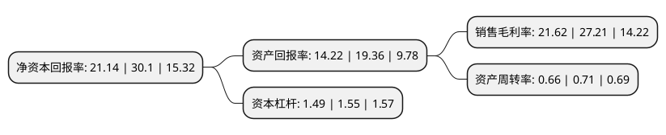

> 本页面由自动化程序生成于 2022年5月20日 01:10
> 内容可能存在错误，如有bug请提交issue至：https://github.com/Eroleice/doc-pi/issues
{.is-warning}

# 上市公司基本情况

## 基本资料

厦门金达威集团股份有限公司（以下简称“金达威”）成立于1997年11月24日，厦门市。于2011年10月28日在深交所中小板上市。

金达威注册资本61,648.193万元，主要生产和销售辅酶Q10，VA，VD3，微藻DHA，植物性ARA等五大系列产品。主要产品包括辅酶Q10，VA，VD3，微藻DHA，植物性ARA等五大系列。以下是详细信息：

- 公司名称: 厦门金达威集团股份有限公司
- 股票代码: 002626.SZ
- 所在地: 福建 - 厦门市
- 成立日期: 1997年11月24日
- 注册资本: 61,648.193万元
- 法定代表人: 江斌
- 主营业务: 主要生产和销售辅酶Q10，VA，VD3，微藻DHA，植物性ARA等五大系列产品主要产品包括辅酶Q10，VA，VD3，微藻DHA，植物性ARA等五大系列
- 公司官网: www.kingdomway.com
- 公司介绍: 公司是国家火炬计划重点高新技术企业和创新型试点企业。几十年来，金达威肩负“科学营养、运动活力、健康魅力”的使命，立足于医药原料制造，充分整合国内外营养健康领域资源，逐步提升产业优势，现已发展成为保健品、运动营养品制造行业的新星。28项国内外发明专利、“国家驰名商标”、“国家企业技术中心”等荣誉称号是业界对金达威给予的莫大肯定，这也是金达威砥砺前行的动力。自上市以来，金达威借助强大的资本市场平台，运筹帷幄，成功兼并、收购海内外多家知名企业，赞助、运营多个国际知名体育赛事，形成从原料研发制造-成品研发制造-品牌营销-渠道布局-品牌传播系列大健康全产业链，为全球千万家庭提供高科技、高品质、高性价比的健康营养产品。

## 股东及高管情况

上市公司第一大股东为厦门金达威投资有限公司，持股211,712,732股，占比34.34%，为上市公司实际控制人。

截至2022年03月31日，上市公司的前十大股东中，共有6名自然人股东，3名机构股东，1个海外主体，其中5%以上大股东共有2名。上市公司前十大股东明细如下：

> 截至2022年03月31日，上市公司前十大股东信息如下：

| 股东名称 | 持股数量（股） | 持股比例 |
| --- | --- | --- |
| 厦门金达威投资有限公司 | 211,712,732 | 34.34% |
| 中牧实业股份有限公司 | 131,469,593 | 21.33% |
| 厦门特工开发有限公司 | 29,762,564 | 4.83% |
| 廖方红 | 15,074,319 | 2.45% |
| 香港中央结算有限公司(陆股通) | 6,604,650 | 1.07% |
| 谢玉娟 | 5,310,043 | 0.86% |
| 郑丽雅 | 2,366,600 | 0.38% |
| 李红 | 1,812,658 | 0.29% |
| 廖嘉文 | 1,450,027 | 0.24% |
| 廖方春 | 1,360,000 | 0.22% |

## 利润表分析

上市公司2021年总收入为36.16亿元，净利润为7.81亿元，实现盈利。

## 杜邦分析

> 数据列示周期：2021年 | 2020年 | 2019年
{.is-info}

上市公司的净资产收益率在近一年有所下降，下降幅度为-29.77%，其变化情况分解如下：
- 上市公司的销售毛利率在近一年下降了-20.54%，可能是生产效率的下降、商品原材料价格上涨或商品价格的下跌所致。
- 上市公司的资产周转率在近一年下降了-7.04%，可能是源自于更慢的销售回款或库存管理效果下降。
- 上市公司的财务杠杆比率在近一年下降了-3.87%，可能是减少负债降低财务费用。

