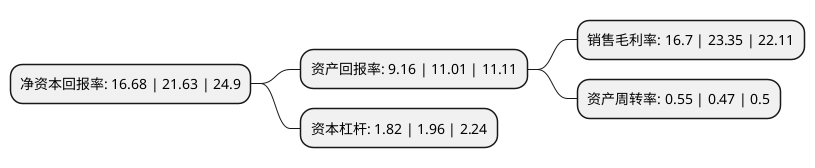

> 本页面由自动化程序生成于 2022年5月20日 01:14
> 内容可能存在错误，如有bug请提交issue至：https://github.com/Eroleice/doc-pi/issues
{.is-warning}

# 上市公司基本情况

## 基本资料

乐普(北京)医疗器械股份有限公司（以下简称“乐普医疗”）成立于1999年06月11日，北京市。于2009年10月30日在深交所创业板上市。

乐普医疗注册资本180,458.731万元，公司的主营业务包括医疗器械业务(含心脏病治疗产品，新型介入诊疗业务，体外诊断试剂和医疗产品代理配送)，药品业务及海外业务三大板块。公司主要产品包括血管内药物(雷帕霉素)洗脱支架系统，冠脉支架输送系统，PTCA球囊扩张导管，药物中心静脉导管等。以下是详细信息：

- 公司名称: 乐普(北京)医疗器械股份有限公司
- 股票代码: 300003.SZ
- 所在地: 北京 - 北京市
- 成立日期: 1999年06月11日
- 注册资本: 180,458.731万元
- 法定代表人: 蒲忠杰
- 主营业务: 公司的主营业务包括医疗器械业务(含心脏病治疗产品，新型介入诊疗业务，体外诊断试剂和医疗产品代理配送)，药品业务及海外业务三大板块公司主要产品包括血管内药物(雷帕霉素)洗脱支架系统，冠脉支架输送系统，PTCA球囊扩张导管，药物中心静脉导管等
- 公司官网: www.lepumedical.com
- 公司介绍: 公司是一家专业从事冠脉支架、PTCA球囊导管、中心静脉导管及压力传感器的研发、生产和销售的企业，国内高端医疗器械领域能够与国外产品形成强有力竞争的为数较少的企业之一。自成立以来，相继完成了支架、导管等多项介入医疗核心产品的研制开发和产业化工作，在业内第一个获得国家药监局颁发的“冠状动脉支架输送系统”产品注册证(III类)、第一个研发并试制成功抗感染“药物中心静脉导管”。公司具备了心血管介入、麻醉监护产品的工业化生产能力，PARTNER药物支架成功上市使公司为拥有雷帕霉素药物支架生产技术的公司。

## 股东及高管情况

上市公司第一大股东为中国船舶重工集团公司第七二五研究所(洛阳船舶材料研究所)，持股244,063,788股，占比13.52%，**疑似为**上市公司实际控制人。

截至2022年03月31日，上市公司的前十大股东中，共有3名自然人股东，3名机构股东，2个产品账户，2个海外主体，其中5%以上大股东共有4名。上市公司前十大股东明细如下：

> 未能通过持股比例判定出上市公司实际控制人（持股30%以上）
> 可能存在通过间接持股、联合持股、协议控制等方式拥有实际控制权的主体，具体请参考上市公司定期公告！
{.is-warning}

> 截至2022年03月31日，上市公司前十大股东信息如下：

| 股东名称 | 持股数量（股） | 持股比例 |
| --- | --- | --- |
| 中国船舶重工集团公司第七二五研究所(洛阳船舶材料研究所) | 244,063,788 | 13.52% |
| 蒲忠杰 | 228,074,749 | 12.64% |
| WP MEDICAL TECHNOLOGIES, INC | 123,968,600 | 6.87% |
| 香港中央结算有限公司(陆股通) | 92,588,482 | 5.13% |
| 北京厚德义民投资管理有限公司 | 67,750,000 | 3.75% |
| 宁波厚德义民投资管理有限公司 | 35,850,000 | 1.99% |
| 兴业银行股份有限公司-富国兴远优选12个月持有期混合型证券投资基金 | 17,588,462 | 0.97% |
| 中国银行股份有限公司-华宝中证医疗交易型开放式指数证券投资基金 | 15,162,700 | 0.84% |
| 熊晴川 | 14,120,400 | 0.78% |
| 王云友 | 9,904,383 | 0.55% |

## 利润表分析

上市公司2021年总收入为106.59亿元，净利润为17.8亿元，实现盈利。

## 杜邦分析

> 数据列示周期：2021年 | 2020年 | 2019年
{.is-info}

上市公司的净资产收益率在近一年有所下降，下降幅度为-22.88%，其变化情况分解如下：
- 上市公司的销售毛利率在近一年下降了-28.48%，可能是生产效率的下降、商品原材料价格上涨或商品价格的下跌所致。
- 上市公司的资产周转率在近一年上升了17.02%，可能是源自于更快的销售回款或库存管理效果提升。
- 上市公司的财务杠杆比率在近一年下降了-7.14%，可能是减少负债降低财务费用。

