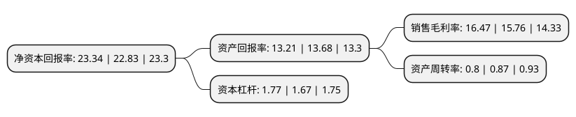

> 本页面由自动化程序生成于 2022年5月20日 01:14
> 内容可能存在错误，如有bug请提交issue至：https://github.com/Eroleice/doc-pi/issues
{.is-warning}

# 上市公司基本情况

## 基本资料

爱尔眼科医院集团股份有限公司（以下简称“爱尔眼科”）成立于2003年01月24日，长沙市。于2009年10月30日在深交所创业板上市。

爱尔眼科注册资本540,610.786万元，主营业务:各类眼科疾病诊疗，手术服务与医学验光配镜。以下是详细信息：

- 公司名称: 爱尔眼科医院集团股份有限公司
- 股票代码: 300015.SZ
- 所在地: 湖南 - 长沙市
- 成立日期: 2003年01月24日
- 注册资本: 540,610.786万元
- 法定代表人: 陈邦
- 主营业务: 主营业务:各类眼科疾病诊疗，手术服务与医学验光配镜
- 公司官网: www.aierchina.com
- 公司介绍: 公司是我国最大规模的眼科医疗机构，致力于引进国际一流的眼科技术与管理方法，以专业化、规模化、科学化为发展战略，联合国内外战略合作伙伴，共同推动中国眼科医疗事业的发展。利用人才、技术和管理等方面的优势，公司通过全国各连锁医院良好的诊疗质量、优质的医疗服务和深入的市场推广，使自身的市场影响力和渗透力得到迅速的提升，也使公司成为具有全国影响力的眼科品牌。

## 股东及高管情况

上市公司第一大股东为爱尔医疗投资集团有限公司，持股1,896,021,039股，占比35.07%，为上市公司实际控制人。

截至2022年03月31日，上市公司的前十大股东中，共有3名自然人股东，3名机构股东，2个产品账户，2个海外主体，其中5%以上大股东共有2名。上市公司前十大股东明细如下：

> 截至2022年03月31日，上市公司前十大股东信息如下：

| 股东名称 | 持股数量（股） | 持股比例 |
| --- | --- | --- |
| 爱尔医疗投资集团有限公司 | 1,896,021,039 | 35.07% |
| 陈邦 | 854,835,474 | 15.81% |
| 香港中央结算有限公司(陆股通) | 205,728,398 | 3.81% |
| 李力 | 188,303,148 | 3.48% |
| 中国工商银行股份有限公司-中欧医疗健康混合型证券投资基金 | 149,106,666 | 2.76% |
| 郭宏伟 | 95,000,000 | 1.76% |
| TEMASEK FULLERTON ALPHA PTE LTD | 52,201,551 | 0.97% |
| 北京磐茂投资管理有限公司-磐茂(上海)投资中心(有限合伙) | 38,802,174 | 0.72% |
| 北京磐茂投资管理有限公司-磐信(上海)投资中心(有限合伙) | 38,802,173 | 0.72% |
| 中国银行股份有限公司-华宝中证医疗交易型开放式指数证券投资基金 | 29,399,978 | 0.54% |

## 利润表分析

上市公司2021年总收入为150亿元，净利润为24.69亿元，实现盈利。

## 杜邦分析

> 数据列示周期：2021年 | 2020年 | 2019年
{.is-info}

上市公司的净资产收益率在近一年有所上升，上升幅度为2.23%，其变化情况分解如下：
- 上市公司的销售毛利率在近一年上升了4.51%，可能是生产效率的提升、商品原材料价格下跌或商品价格的上涨所致。
- 上市公司的资产周转率在近一年下降了-8.05%，可能是源自于更慢的销售回款或库存管理效果下降。
- 上市公司的财务杠杆比率在近一年上升了5.99%，可能是增加负债扩大生产规模。

