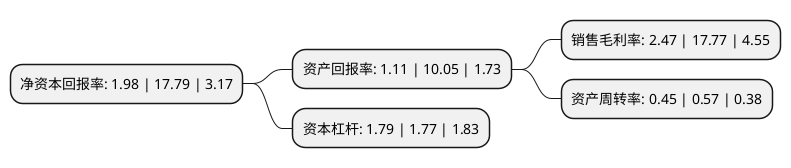

> 本页面由自动化程序生成于 2022年5月20日 01:14
> 内容可能存在错误，如有bug请提交issue至：https://github.com/Eroleice/doc-pi/issues
{.is-warning}

# 上市公司基本情况

## 基本资料

阳普医疗科技股份有限公司（以下简称“阳普医疗”）成立于1996年08月19日，珠海市。于2009年12月25日在深交所创业板上市。

阳普医疗注册资本30,918.732万元，主营业务:为临床检验实验室与临床护理提供以专业解决方案为依托的技术，产品和服务。主要产品为第三代真空采血系统。以下是详细信息：

- 公司名称: 阳普医疗科技股份有限公司
- 股票代码: 300030.SZ
- 所在地: 广东 - 珠海市
- 成立日期: 1996年08月19日
- 注册资本: 30,918.732万元
- 法定代表人: 邓冠华
- 主营业务: 主营业务:为临床检验实验室与临床护理提供以专业解决方案为依托的技术，产品和服务主要产品为第三代真空采血系统
- 公司官网: www.improve-medical.com
- 公司介绍: 公司是国内真空采血系统行业的龙头企业，为临床检验实验室与临床护理提供以专业解决方案为依托的技术、产品和服务。公司的主要业务为医学实验室诊断及医疗信息化建设。自成立以来，公司通过持续的技术创新与管理创新，不断向医疗器械产品平台和医疗服务相结合的集团化、国际化公司迈进。公司业务领域已涵盖“临床实验室标本解决方案”、“临床实验室诊断”、“影像学诊断”、“临床护理与麻醉”、“健康管理”和“医院数字化整体解决方案”等大平台。公司在中国大陆、中国香港、美国与德国等地拥有多家子公司及分支机构，产品和服务已覆盖全球数十个国家和地区的近万家医疗机构。

## 股东及高管情况

上市公司第一大股东为邓冠华，持股54,268,555股，占比17.55%，**疑似为**上市公司实际控制人。

截至2022年03月31日，上市公司的前十大股东中，共有6名自然人股东，2名机构股东，2个产品账户，其中5%以上大股东共有3名。上市公司前十大股东明细如下：

> 未能通过持股比例判定出上市公司实际控制人（持股30%以上）
> 可能存在通过间接持股、联合持股、协议控制等方式拥有实际控制权的主体，具体请参考上市公司定期公告！
{.is-warning}

> 截至2022年03月31日，上市公司前十大股东信息如下：

| 股东名称 | 持股数量（股） | 持股比例 |
| --- | --- | --- |
| 邓冠华 | 54,268,555 | 17.55% |
| 珠海格力金融投资管理有限公司 | 33,528,364 | 10.84% |
| 赵吉庆 | 19,960,000 | 6.46% |
| 易方达基金-中央汇金资产管理有限责任公司-易方达基金 | 9,620,800 | 3.11% |
| 余伟平 | 3,695,000 | 1.2% |
| 广东省羊城大健康产业集团有限公司 | 2,126,300 | 0.69% |
| 元达信资本-工商银行-元达信腾飞1号资产管理计划 | 1,187,500 | 0.38% |
| 张钰 | 1,120,500 | 0.36% |
| 连庆明 | 1,066,498 | 0.34% |
| 刘炜 | 1,000,000 | 0.32% |

## 杜邦分析

> 数据列示周期：2021年 | 2020年 | 2019年
{.is-info}

上市公司的净资产收益率在近一年有所下降，下降幅度为-88.87%，其变化情况分解如下：
- 上市公司的销售毛利率在近一年下降了-86.1%，可能是生产效率的下降、商品原材料价格上涨或商品价格的下跌所致。
- 上市公司的资产周转率在近一年下降了-21.05%，可能是源自于更慢的销售回款或库存管理效果下降。
- 上市公司的财务杠杆比率在近一年上升了1.13%，可能是增加负债扩大生产规模。

