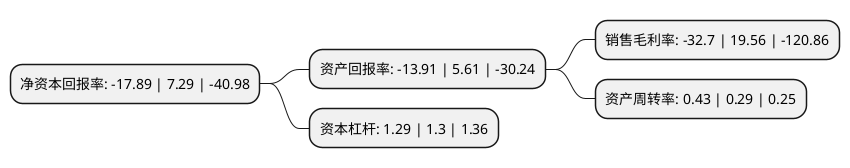

> 本页面由自动化程序生成于 2022年5月20日 01:15
> 内容可能存在错误，如有bug请提交issue至：https://github.com/Eroleice/doc-pi/issues
{.is-warning}

# 上市公司基本情况

## 基本资料

盈康生命科技股份有限公司（以下简称“盈康生命”）成立于1998年08月06日，青岛市。于2010年12月09日在深交所创业板上市。

盈康生命注册资本64,216.701万元，主营业务为鲜品食用菌的研发，生产和销售;主要产品包括金针菇，真姬菇和白玉菇等鲜品食用菌。以下是详细信息：

- 公司名称: 盈康生命科技股份有限公司
- 股票代码: 300143.SZ
- 所在地: 山东 - 青岛市
- 成立日期: 1998年08月06日
- 注册资本: 64,216.701万元
- 法定代表人: 彭文
- 主营业务: 主营业务为鲜品食用菌的研发，生产和销售;主要产品包括金针菇，真姬菇和白玉菇等鲜品食用菌
- 公司官网: yksm.haier.net
- 公司介绍: 公司原主营鲜品食用菌的研发、生产和销售，主要产品包括金针菇、真姬菇和白玉菇等鲜品食用菌。2016年公司通过收购玛西普100%股权将进入放射外科设备领域，注入盈利能力较强，发展前景广阔的医疗器械业务。玛西普便专注于伽玛刀的研发、销售和服务，目前已成为领先的大型立体定向放射外科治疗设备供应商。玛西普自成立以来，专注于伽玛刀产品的生产、研发、销售和服务，目前生产拥有自主知识产权的伽玛刀包括：第一代头部伽玛刀、第二代头部伽玛刀和体部伽玛刀三种产品，并先后获得中国CFDA认证、美国FDA认证和欧盟CE认证等权威认证资质，已出口至多个国家，为国内大型医疗设备真正进入国际市场，特别是美国等发达国家市场并实现临床应用树立了标杆。

## 股东及高管情况

上市公司第一大股东为青岛盈康医疗投资有限公司，持股254,876,285股，占比39.69%，为上市公司实际控制人。

截至2022年03月31日，上市公司的前十大股东中，共有3名自然人股东，3名机构股东，4个产品账户，其中5%以上大股东共有1名。上市公司前十大股东明细如下：

> 截至2022年03月31日，上市公司前十大股东信息如下：

| 股东名称 | 持股数量（股） | 持股比例 |
| --- | --- | --- |
| 青岛盈康医疗投资有限公司 | 254,876,285 | 39.69% |
| 叶运寿 | 16,635,293 | 2.59% |
| 章志坚 | 15,280,000 | 2.38% |
| 中国工商银行股份有限公司-华安安康灵活配置混合型证券投资基金 | 13,271,513 | 2.07% |
| 中国对外经济贸易信托有限公司-外贸信托-睿郡稳享私募证券投资基金 | 10,116,027 | 1.58% |
| 中国银行股份有限公司-华宝中证医疗交易型开放式指数证券投资基金 | 5,504,374 | 0.86% |
| 通用技术集团投资管理有限公司 | 5,463,870 | 0.85% |
| 兴业银行股份有限公司-太平智远三个月定期开放股票型发起式证券投资基金 | 5,459,682 | 0.85% |
| 陈纯萍 | 5,400,000 | 0.84% |
| 青岛海创智管理咨询企业(有限合伙) | 5,236,300 | 0.82% |

## 利润表分析

上市公司2021年总收入为10.89亿元，净利润为-3.57亿元，**未实现盈利**。

## 杜邦分析

> 数据列示周期：2021年 | 2020年 | 2019年
{.is-info}

上市公司的净资产收益率在近一年有所下降，下降幅度为-345.4%，其变化情况分解如下：
- 上市公司的销售毛利率在近一年下降了-267.18%，可能是生产效率的下降、商品原材料价格上涨或商品价格的下跌所致。
- 上市公司的资产周转率在近一年上升了48.28%，可能是源自于更快的销售回款或库存管理效果提升。
- 上市公司的财务杠杆比率在近一年下降了-0.77%，可能是减少负债降低财务费用。

