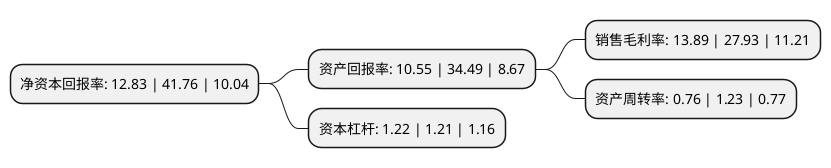

> 本页面由自动化程序生成于 2022年5月20日 01:15
> 内容可能存在错误，如有bug请提交issue至：https://github.com/Eroleice/doc-pi/issues
{.is-warning}

# 上市公司基本情况

## 基本资料

深圳市理邦精密仪器股份有限公司（以下简称“理邦仪器”）成立于1995年08月02日，深圳市。于2011年04月21日在深交所创业板上市。

理邦仪器注册资本58,172.185万元，专注于医疗电子设备领域，产品主要包括产科，心电，监护，超声影像四大类设备。以下是详细信息：

- 公司名称: 深圳市理邦精密仪器股份有限公司
- 股票代码: 300206.SZ
- 所在地: 广东 - 深圳市
- 成立日期: 1995年08月02日
- 注册资本: 58,172.185万元
- 法定代表人: 张浩
- 主营业务: 专注于医疗电子设备领域，产品主要包括产科，心电，监护，超声影像四大类设备
- 公司官网: www.edan.com
- 公司介绍: 公司是集医疗电子设备产品的研发、生产、销售、服务为一体的国家高新技术企业，主要涵盖妇幼保健产品及系统、多参数监护产品及系统、心电产品及系统、数字超声诊断系统、体外诊断五大领域一百多种型号，已成为国内领先并在全球持续快速成长的医疗电子设备供应商。公司主要从事医疗电子设备产品和体外诊断产品的研发、生产、销售、服务，主要涵盖妇幼保健产品及系统、多参数监护产品及系统、心电产品及系统、数字超声诊断系统、体外诊断、智慧健康六大领域。公司坚持“创新性、平台型、国际化”的发展战略，以市场需求为导向，以研发创新为核心，通过前沿的科技，采用先进的技术开发出满足客户需要的产品。同时公司以高品质为标准，具备强大的产品质量控制能力，建立了涵盖研发、供应链、管理、市场营销及售后服务的多层次、全方位的质量管理体系。

## 股东及高管情况

上市公司第一大股东为张浩，持股122,038,160股，占比20.98%，**疑似为**上市公司实际控制人。

截至2022年03月31日，上市公司的前十大股东中，共有6名自然人股东，1名机构股东，2个产品账户，1个海外主体，其中5%以上大股东共有3名。上市公司前十大股东明细如下：

> 未能通过持股比例判定出上市公司实际控制人（持股30%以上）
> 可能存在通过间接持股、联合持股、协议控制等方式拥有实际控制权的主体，具体请参考上市公司定期公告！
{.is-warning}

> 截至2022年03月31日，上市公司前十大股东信息如下：

| 股东名称 | 持股数量（股） | 持股比例 |
| --- | --- | --- |
| 张浩 | 122,038,160 | 20.98% |
| 祖幼冬 | 100,104,140 | 17.21% |
| 谢锡城 | 99,569,408 | 17.12% |
| 香港中央结算有限公司(陆股通) | 26,392,845 | 4.54% |
| 兴业银行股份有限公司-太平智远三个月定期开放股票型发起式证券投资基金 | 6,497,350 | 1.12% |
| 赵建军 | 5,000,000 | 0.86% |
| 深圳市理邦精密仪器股份有限公司-第二期员工持股计划 | 3,984,500 | 0.68% |
| 孙楚根 | 3,432,500 | 0.59% |
| 泰康人寿保险有限责任公司-分红-个人分红-019L-FH002深 | 2,039,800 | 0.35% |
| 徐兵 | 1,704,000 | 0.29% |

## 利润表分析

上市公司2021年总收入为16.36亿元，净利润为2.27亿元，实现盈利。

## 杜邦分析

> 数据列示周期：2021年 | 2020年 | 2019年
{.is-info}

上市公司的净资产收益率在近一年有所下降，下降幅度为-69.28%，其变化情况分解如下：
- 上市公司的销售毛利率在近一年下降了-50.27%，可能是生产效率的下降、商品原材料价格上涨或商品价格的下跌所致。
- 上市公司的资产周转率在近一年下降了-38.21%，可能是源自于更慢的销售回款或库存管理效果下降。
- 上市公司的财务杠杆比率在近一年上升了0.83%，可能是增加负债扩大生产规模。

