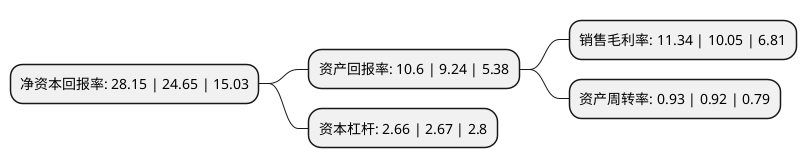

> 本页面由自动化程序生成于 2022年5月20日 01:16
> 内容可能存在错误，如有bug请提交issue至：https://github.com/Eroleice/doc-pi/issues
{.is-warning}

# 上市公司基本情况

## 基本资料

迪安诊断技术集团股份有限公司（以下简称“迪安诊断”）成立于2001年09月05日，杭州市。于2011年07月19日在深交所创业板上市。

迪安诊断注册资本62,045.83万元，主营业务:面向各类综合医院与专科医院，社区卫生服务中心(站)，乡(镇)卫生院，体检中心，疾病预防控制中心等各级医疗卫生机构，以提供医学诊断服务外包为核心业务的医学诊断服务整体解决方案。以下是详细信息：

- 公司名称: 迪安诊断技术集团股份有限公司
- 股票代码: 300244.SZ
- 所在地: 浙江 - 杭州市
- 成立日期: 2001年09月05日
- 注册资本: 62,045.83万元
- 法定代表人: 陈海斌
- 主营业务: 主营业务:面向各类综合医院与专科医院，社区卫生服务中心(站)，乡(镇)卫生院，体检中心，疾病预防控制中心等各级医疗卫生机构，以提供医学诊断服务外包为核心业务的医学诊断服务整体解决方案
- 公司官网: www.dazd.cn
- 公司介绍: 公司是一家独立的第三方医学诊断服务平台，主要向各级医疗卫生机构提供以医学诊断服务外包为核心业务的医学诊断服务整体解决方案。经过多年的发展，公司现已形成具有迪安特色的“服务+产品”的一体化商业模式，公司不仅可以向各级医疗卫生机构提供医学诊断服务外包业务，还可以向其提供国内外知名的诊断产品。公司已在全国布局20余家连锁化实验室，并相继通过ISO15189与CAP国际质量认证认可体系，为全国12000多家医疗机构提供以服务外包为核心的医学诊断服务整体解决方案。

## 股东及高管情况

上市公司第一大股东为陈海斌，持股163,658,933股，占比26.38%，**疑似为**上市公司实际控制人。

截至2022年03月31日，上市公司的前十大股东中，共有3名自然人股东，2名机构股东，2个产品账户，3个海外主体，其中5%以上大股东共有2名。上市公司前十大股东明细如下：

> 未能通过持股比例判定出上市公司实际控制人（持股30%以上）
> 可能存在通过间接持股、联合持股、协议控制等方式拥有实际控制权的主体，具体请参考上市公司定期公告！
{.is-warning}

> 截至2022年03月31日，上市公司前十大股东信息如下：

| 股东名称 | 持股数量（股） | 持股比例 |
| --- | --- | --- |
| 陈海斌 | 163,658,933 | 26.38% |
| 香港中央结算有限公司(陆股通) | 66,233,076 | 10.67% |
| 中国华融资产管理股份有限公司 | 22,847,326 | 3.68% |
| 高华-汇丰-GOLDMAN, SACHS & CO.LLC | 14,203,104 | 2.29% |
| CITIGROUP GLOBAL MARKETS LIMITED | 13,606,504 | 2.19% |
| 全国社保基金四一八组合 | 12,174,573 | 1.96% |
| 杭州迪安控股有限公司 | 10,636,390 | 1.71% |
| 钟佳富 | 10,507,820 | 1.69% |
| 徐敏 | 10,001,300 | 1.61% |
| 中信证券-中信银行-中信证券卓越成长两年持有期混合型集合资产管理计划 | 9,989,497 | 1.61% |

## 利润表分析

上市公司2021年总收入为130.82亿元，净利润为14.83亿元，实现盈利。

## 杜邦分析

> 数据列示周期：2021年 | 2020年 | 2019年
{.is-info}

上市公司的净资产收益率在近一年有所上升，上升幅度为14.2%，其变化情况分解如下：
- 上市公司的销售毛利率在近一年上升了12.84%，可能是生产效率的提升、商品原材料价格下跌或商品价格的上涨所致。
- 上市公司的资产周转率在近一年上升了1.09%，可能是源自于更快的销售回款或库存管理效果提升。
- 上市公司的财务杠杆比率在近一年下降了-0.37%，可能是减少负债降低财务费用。

