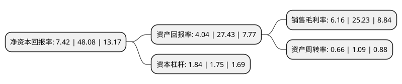

> 本页面由自动化程序生成于 2022年5月20日 01:16
> 内容可能存在错误，如有bug请提交issue至：https://github.com/Eroleice/doc-pi/issues
{.is-warning}

# 上市公司基本情况

## 基本资料

广东宝莱特医用科技股份有限公司（以下简称“宝莱特”）成立于1993年06月28日，珠海市。于2011年07月19日在深交所创业板上市。

宝莱特注册资本17,481.488万元，主营业务为医疗监护仪及相关医疗器械的研发，生产和销售。公司的主要产品为多参数监护仪，主要包括掌上监护仪，常规一体式监护仪以及插件式监护仪三大系列产品。以下是详细信息：

- 公司名称: 广东宝莱特医用科技股份有限公司
- 股票代码: 300246.SZ
- 所在地: 广东 - 珠海市
- 成立日期: 1993年06月28日
- 注册资本: 17,481.488万元
- 法定代表人: 燕金元
- 主营业务: 主营业务为医疗监护仪及相关医疗器械的研发，生产和销售公司的主要产品为多参数监护仪，主要包括掌上监护仪，常规一体式监护仪以及插件式监护仪三大系列产品
- 公司官网: www.blt.com.cn
- 公司介绍: 公司是国家发改委授予的“国家多参数监护仪产业化基地”，公司主要从事医疗监护仪及相关医疗器械的研发、生产和销售，是医疗监护设备的专业供应商，处于国内领先地位。公司主要产品为多参数监护仪，主要包括掌上监护仪、常规一体式监护仪以及插件式监护仪等三大系列的监护仪产品，广泛应用于家庭保健、社区医疗、普通病房、急诊室、高压氧舱、ICU、CCU、手术室等领域。公司开发的插件式监护仪产品采用自主研发的一系列监护新技术，所研制出的带显示且可独立使用的多参数插件式模块，填补了中国监护仪生产企业在该领域的空白，实现了病人转运过程中的有效无缝监测。公司产品线完整，是全球监护仪产品线最完善的公司之一，主要产品为监护仪设备，高中低档产品齐全，同时研制出多款数字心电图机、胎儿监护仪、脉搏血氧仪，以及中央监护系统等。

## 股东及高管情况

上市公司第一大股东为燕金元，持股47,136,790股，占比26.96%，**疑似为**上市公司实际控制人。

截至2022年03月31日，上市公司的前十大股东中，共有6名自然人股东，4个产品账户，其中5%以上大股东共有1名。上市公司前十大股东明细如下：

> 未能通过持股比例判定出上市公司实际控制人（持股30%以上）
> 可能存在通过间接持股、联合持股、协议控制等方式拥有实际控制权的主体，具体请参考上市公司定期公告！
{.is-warning}

> 截至2022年03月31日，上市公司前十大股东信息如下：

| 股东名称 | 持股数量（股） | 持股比例 |
| --- | --- | --- |
| 燕金元 | 47,136,790 | 26.96% |
| 王石 | 4,331,520 | 2.48% |
| 黄志敏 | 3,457,446 | 1.98% |
| 戴羿 | 3,457,446 | 1.98% |
| 深圳市前海久银投资基金管理有限公司-久银定增7号私募证券投资基金 | 3,340,425 | 1.91% |
| 杭华 | 2,927,394 | 1.67% |
| 招商银行股份有限公司-华夏磐锐一年定期开放混合型证券投资基金 | 2,712,765 | 1.55% |
| 华夏基金-邮储银行-华夏基金秋实混合策略1号集合资产管理计划 | 1,702,127 | 0.97% |
| 燕传平 | 1,663,380 | 0.95% |
| 华实浩瑞(武汉)资产管理有限公司-武汉华实劲鸿私募股权投资基金合伙企业(有限合伙) | 1,595,744 | 0.91% |

## 利润表分析

上市公司2021年总收入为10.91亿元，净利润为0.67亿元，实现盈利。

## 杜邦分析

> 数据列示周期：2021年 | 2020年 | 2019年
{.is-info}

上市公司的净资产收益率在近一年有所下降，下降幅度为-84.57%，其变化情况分解如下：
- 上市公司的销售毛利率在近一年下降了-75.58%，可能是生产效率的下降、商品原材料价格上涨或商品价格的下跌所致。
- 上市公司的资产周转率在近一年下降了-39.45%，可能是源自于更慢的销售回款或库存管理效果下降。
- 上市公司的财务杠杆比率在近一年上升了5.14%，可能是增加负债扩大生产规模。

