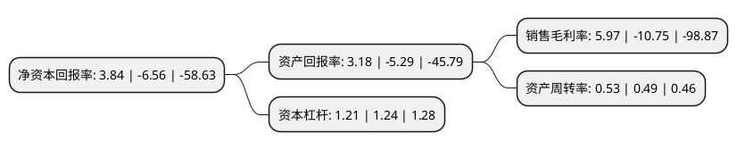

> 本页面由自动化程序生成于 2022年5月20日 01:16
> 内容可能存在错误，如有bug请提交issue至：https://github.com/Eroleice/doc-pi/issues
{.is-warning}

# 上市公司基本情况

## 基本资料

融捷健康科技股份有限公司（以下简称“融捷健康”）成立于1995年04月21日，合肥市。于2011年07月29日在深交所创业板上市。

融捷健康注册资本80,404.031万元，主要产品:家用远红外理疗房及便携式产品主营业务:家用远红外健康设备的研发，生产和销售。以下是详细信息：

- 公司名称: 融捷健康科技股份有限公司
- 股票代码: 300247.SZ
- 所在地: 安徽 - 合肥市
- 成立日期: 1995年04月21日
- 注册资本: 80,404.031万元
- 法定代表人: 邢芬玲
- 主营业务: 主要产品:家用远红外理疗房及便携式产品主营业务:家用远红外健康设备的研发，生产和销售
- 公司官网: www.lekingwellness.com
- 公司介绍: 公司原名安徽桑乐金科技股份有限公司，公司主要生产销售桑拿设备、空气净化产品、健身器材等相关产品。自2015年确立转型大健康产业以来，先后收购了深圳卓先实业、上海久工、深圳福瑞斯、上海瑞宇等优质公司，从专注于桑拿设备制造商逐步转变为产供销健康服务为一体的国内大健康行业整合平台,并致力成为国内大健康行业的龙头企业。2016年7月公司开始着力打造乐金健康商业连锁平台的建设，乐金健康商业连锁店以打造家庭健康系统解决方案为宗旨，为百姓健康服务为使命，大力发展大健康产业。围绕公司在行业领先地位及旗下各子公司现有的空气净化产品、健身器材等产品的基础上，继续整合优质健康资源，以亲民的会员价格将公司的系列产品及部分参股公司的产品成列于市，开辟了健康用品、健康检测、健康服务等四个产品体系，为百姓提供家庭健康解决方案，使其可以放心享用到优质实惠的健康用品的同时，在多个领域为百姓实现一条龙式的健康服务。

## 股东及高管情况

上市公司第一大股东为融捷投资控股集团有限公司，持股116,912,302股，占比14.54%，**疑似为**上市公司实际控制人。

截至2022年03月31日，上市公司的前十大股东中，共有8名自然人股东，2名机构股东，其中5%以上大股东共有1名。上市公司前十大股东明细如下：

> 未能通过持股比例判定出上市公司实际控制人（持股30%以上）
> 可能存在通过间接持股、联合持股、协议控制等方式拥有实际控制权的主体，具体请参考上市公司定期公告！
{.is-warning}

> 截至2022年03月31日，上市公司前十大股东信息如下：

| 股东名称 | 持股数量（股） | 持股比例 |
| --- | --- | --- |
| 融捷投资控股集团有限公司 | 116,912,302 | 14.54% |
| 金道明 | 31,662,200 | 3.94% |
| 韩道虎 | 15,000,000 | 1.87% |
| 栗忠玲 | 11,870,000 | 1.48% |
| 马绍琴 | 10,064,400 | 1.25% |
| 安徽皖投工业投资有限公司 | 9,650,053 | 1.2% |
| 张晓燕 | 5,600,000 | 0.7% |
| 喻新惠 | 4,560,000 | 0.57% |
| 岳俊锋 | 3,941,000 | 0.49% |
| 王建军 | 3,800,000 | 0.47% |

## 利润表分析

上市公司2021年总收入为5.26亿元，净利润为0.31亿元，实现盈利。

## 杜邦分析

> 数据列示周期：2021年 | 2020年 | 2019年
{.is-info}

上市公司的净资产收益率在近一年有所下降，下降幅度为-158.54%，其变化情况分解如下：
- 上市公司的销售毛利率在近一年下降了-155.53%，可能是生产效率的下降、商品原材料价格上涨或商品价格的下跌所致。
- 上市公司的资产周转率在近一年上升了8.16%，可能是源自于更快的销售回款或库存管理效果提升。
- 上市公司的财务杠杆比率在近一年下降了-2.42%，可能是减少负债降低财务费用。

