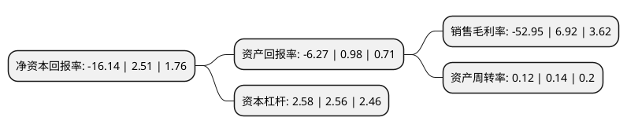

> 本页面由自动化程序生成于 2022年5月20日 01:16
> 内容可能存在错误，如有bug请提交issue至：https://github.com/Eroleice/doc-pi/issues
{.is-warning}

# 上市公司基本情况

## 基本资料

珠海和佳医疗设备股份有限公司（以下简称“*ST和佳”）成立于1996年04月01日，珠海市。于2011年10月26日在深交所创业板上市。

*ST和佳注册资本79,235.422万元，主营业务为一直从事医疗设备的研发，生产，销售和服务。主要产品为亚低温治疗仪，电脑骨折愈合仪，多功能损伤治疗仪，臭氧冲洗治疗机，多功能盆腔炎治疗仪等。以下是详细信息：

- 公司名称: 珠海和佳医疗设备股份有限公司
- 股票代码: 300273.SZ
- 所在地: 广东 - 珠海市
- 成立日期: 1996年04月01日
- 注册资本: 79,235.422万元
- 法定代表人: 郝镇熙
- 主营业务: 主营业务为一直从事医疗设备的研发，生产，销售和服务主要产品为亚低温治疗仪，电脑骨折愈合仪，多功能损伤治疗仪，臭氧冲洗治疗机，多功能盆腔炎治疗仪等
- 公司官网: www.hokai.com
- 公司介绍: 公司是国家高新技术企业。公司主营业务包括：医疗设备及医用工程、医疗信息化、医疗服务、医疗金融、医院整体建设等业务板块。公司创立以来，秉承“一切为客户创造价值”的经营理念，恪守“让医疗简单易行”的企业宗旨，配合国家新医改的总体目标和主要内容，践行国家鼓励和引导社会资本发展医疗卫生事业的方针政策，始终投身以县级医院为主体的基层医疗机构建设主战场，服务对象涵盖居民、患者、医生、医联体、医共体和主管医疗机构的政府单位。从单一的设备供应商发展成为以智慧医院建设、康复医疗服务、互联网+医疗、医疗金融、医疗供应链和后勤管理服务为五大核心业务的医疗资源与服务平台型公司，和佳打通了从医院投资、医院整体建设、医院运营服务，医疗供应链到医院后勤管理服务的全业务链的布局。

## 股东及高管情况

上市公司第一大股东为郝镇熙，持股93,606,897股，占比11.81%，**疑似为**上市公司实际控制人。

截至2022年03月31日，上市公司的前十大股东中，共有10名自然人股东，其中5%以上大股东共有2名。上市公司前十大股东明细如下：

> 未能通过持股比例判定出上市公司实际控制人（持股30%以上）
> 可能存在通过间接持股、联合持股、协议控制等方式拥有实际控制权的主体，具体请参考上市公司定期公告！
{.is-warning}

> 截至2022年03月31日，上市公司前十大股东信息如下：

| 股东名称 | 持股数量（股） | 持股比例 |
| --- | --- | --- |
| 郝镇熙 | 93,606,897 | 11.81% |
| 蔡孟珂 | 74,822,778 | 9.44% |
| 滕立喜 | 9,989,700 | 1.26% |
| 赵喜臣 | 5,817,300 | 0.73% |
| 刘强 | 5,000,048 | 0.63% |
| 王国平 | 4,309,840 | 0.54% |
| 谢其冰 | 4,279,820 | 0.54% |
| 蔡德茂 | 4,148,032 | 0.52% |
| 赵吉庆 | 4,141,300 | 0.52% |
| 宋磊 | 4,110,600 | 0.52% |

## 利润表分析

上市公司2021年总收入为7.34亿元，净利润为-3.89亿元，**未实现盈利**。

## 杜邦分析

> 数据列示周期：2021年 | 2020年 | 2019年
{.is-info}

上市公司的净资产收益率在近一年有所下降，下降幅度为-743.03%，其变化情况分解如下：
- 上市公司的销售毛利率在近一年下降了-865.17%，可能是生产效率的下降、商品原材料价格上涨或商品价格的下跌所致。
- 上市公司的资产周转率在近一年下降了-14.29%，可能是源自于更慢的销售回款或库存管理效果下降。
- 上市公司的财务杠杆比率在近一年上升了0.78%，可能是增加负债扩大生产规模。

