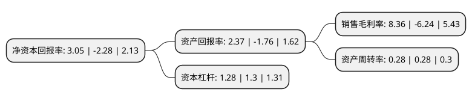

> 本页面由自动化程序生成于 2022年5月20日 01:16
> 内容可能存在错误，如有bug请提交issue至：https://github.com/Eroleice/doc-pi/issues
{.is-warning}

# 上市公司基本情况

## 基本资料

北京利德曼生化股份有限公司（以下简称“利德曼”）成立于1997年11月05日，北京市。于2012年02月16日在深交所创业板上市。

利德曼注册资本54,401.149万元，公司主营业务覆盖体外诊断试剂，诊断仪器及生物化学原料三大产品领域，体外诊断试剂包括生化诊断试剂，免疫诊断试剂，凝血类诊断试剂系列产品。以下是详细信息：

- 公司名称: 北京利德曼生化股份有限公司
- 股票代码: 300289.SZ
- 所在地: 北京 - 北京市
- 成立日期: 1997年11月05日
- 注册资本: 54,401.149万元
- 法定代表人: 王凯翔
- 主营业务: 公司主营业务覆盖体外诊断试剂，诊断仪器及生物化学原料三大产品领域，体外诊断试剂包括生化诊断试剂，免疫诊断试剂，凝血类诊断试剂系列产品
- 公司官网: www.leadmanbio.com
- 公司介绍: 公司是我国生化诊断试剂品种最齐全的生产厂商之一，是一家在生物化学、体外诊断试剂及医疗器械领域拥有核心竞争力的多元化企业。公司先后通过YY/T0287idt ISO13485医疗器械专用标准和GB/T19001idt ISO9001质量管理体系认证。公司主营业务覆盖体外诊断试剂、诊断仪器及生物化学原料三大产品领域，体外诊断试剂包括生化诊断试剂、免疫诊断试剂、凝血类诊断试剂系列产品。公司诊断试剂产品特别是生化诊断试剂产品以其质量的稳定得到了市场的认同，“利德曼”品牌及子公司德赛系统经销的“德赛DiaSys”品牌生化试剂产品，在国内大中型医院的检验机构具有良好的产品口碑。

## 股东及高管情况

上市公司第一大股东为广州高新区科技控股集团有限公司，持股252,133,152股，占比46.35%，为上市公司实际控制人。

截至2022年03月31日，上市公司的前十大股东中，共有5名自然人股东，3名机构股东，2个产品账户，其中5%以上大股东共有1名。上市公司前十大股东明细如下：

> 截至2022年03月31日，上市公司前十大股东信息如下：

| 股东名称 | 持股数量（股） | 持股比例 |
| --- | --- | --- |
| 广州高新区科技控股集团有限公司 | 252,133,152 | 46.35% |
| 成都力鼎银科股权投资基金中心(有限合伙) | 17,117,002 | 3.15% |
| 沈广仟 | 15,701,200 | 2.89% |
| 玲珑集团有限公司 | 5,800,000 | 1.07% |
| 上海赛领并购投资基金合伙企业(有限合伙) | 3,749,100 | 0.69% |
| 张斌 | 3,687,000 | 0.68% |
| 拉萨智度德诚创业投资合伙企业(有限合伙) | 3,532,216 | 0.65% |
| 张宇红 | 3,152,400 | 0.58% |
| 张金钢 | 2,908,000 | 0.53% |
| 甄文江 | 2,636,700 | 0.48% |

## 利润表分析

上市公司2021年总收入为5.64亿元，净利润为0.47亿元，实现盈利。

## 杜邦分析

> 数据列示周期：2021年 | 2020年 | 2019年
{.is-info}

上市公司的净资产收益率在近一年有所下降，下降幅度为-233.77%，其变化情况分解如下：
- 上市公司的销售毛利率在近一年下降了-233.97%，可能是生产效率的下降、商品原材料价格上涨或商品价格的下跌所致。
- 上市公司的资产周转率在近一年下降了0%，可能是源自于更慢的销售回款或库存管理效果下降。
- 上市公司的财务杠杆比率在近一年下降了-1.54%，可能是减少负债降低财务费用。

