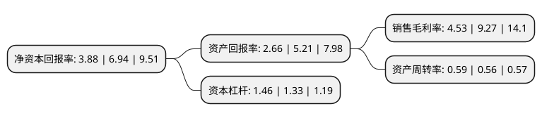

> 本页面由自动化程序生成于 2022年5月20日 01:16
> 内容可能存在错误，如有bug请提交issue至：https://github.com/Eroleice/doc-pi/issues
{.is-warning}

# 上市公司基本情况

## 基本资料

三诺生物传感股份有限公司（以下简称“三诺生物”）成立于2002年08月07日，长沙市。于2012年03月19日在深交所创业板上市。

三诺生物注册资本56,476.817万元，主要产品为:血糖监测系统，包括血糖测试仪及配套专用试条。以下是详细信息：

- 公司名称: 三诺生物传感股份有限公司
- 股票代码: 300298.SZ
- 所在地: 湖南 - 长沙市
- 成立日期: 2002年08月07日
- 注册资本: 56,476.817万元
- 法定代表人: 李少波
- 主营业务: 主要产品为:血糖监测系统，包括血糖测试仪及配套专用试条
- 公司官网: www.sinocare.com
- 公司介绍: 公司是国内最早的生产血糖监测系统产品的厂商之一，也是国家生物医学工程高技术产业化示范项目的承担单位。主营业务是利用生物传感技术研发、生产、销售即时检测(POCT)产品，主要产品为微量血快速血糖测试仪及配套血糖检测试条。公司通过了德国技术集团质量体系认证与欧盟CE认证，同时公司作为国家生物医学工程高技术产业化示范项目，多次获得国家创新基金支持，并率先通过了ISO13485质量管理体系认证及欧盟CE认证。公司生产的“三诺”系列血糖仪及配套试纸，以其“准确、简单、经济”的特点，获得广大消费者的认可。

## 股东及高管情况

上市公司第一大股东为李少波，持股142,685,648股，占比25.26%，**疑似为**上市公司实际控制人。

截至2022年03月31日，上市公司的前十大股东中，共有2名自然人股东，1名机构股东，5个产品账户，2个海外主体，其中5%以上大股东共有3名。上市公司前十大股东明细如下：

> 未能通过持股比例判定出上市公司实际控制人（持股30%以上）
> 可能存在通过间接持股、联合持股、协议控制等方式拥有实际控制权的主体，具体请参考上市公司定期公告！
{.is-warning}

> 截至2022年03月31日，上市公司前十大股东信息如下：

| 股东名称 | 持股数量（股） | 持股比例 |
| --- | --- | --- |
| 李少波 | 142,685,648 | 25.26% |
| 车宏莉 | 123,806,943 | 21.92% |
| 香港中央结算有限公司(陆股通) | 39,380,083 | 6.97% |
| 招商银行股份有限公司-睿远成长价值混合型证券投资基金 | 28,207,887 | 4.99% |
| 招商银行股份有限公司-睿远均衡价值三年持有期混合型证券投资基金 | 26,649,357 | 4.72% |
| 长城国融投资管理有限公司 | 7,763,400 | 1.37% |
| 三诺生物传感股份有限公司-第二期员工持股计划 | 5,901,628 | 1.04% |
| UBS AG | 5,645,581 | 1% |
| 中国邮政储蓄银行股份有限公司-太平丰和一年定期开放债券型发起式证券投资基金 | 5,594,202 | 0.99% |
| 睿远基金-东方证券-睿远基金睿见11号集合资产管理计划 | 5,593,020 | 0.99% |

## 利润表分析

上市公司2021年总收入为23.61亿元，净利润为1.07亿元，实现盈利。

## 杜邦分析

> 数据列示周期：2021年 | 2020年 | 2019年
{.is-info}

上市公司的净资产收益率在近一年有所下降，下降幅度为-44.09%，其变化情况分解如下：
- 上市公司的销售毛利率在近一年下降了-51.13%，可能是生产效率的下降、商品原材料价格上涨或商品价格的下跌所致。
- 上市公司的资产周转率在近一年上升了5.36%，可能是源自于更快的销售回款或库存管理效果提升。
- 上市公司的财务杠杆比率在近一年上升了9.77%，可能是增加负债扩大生产规模。

