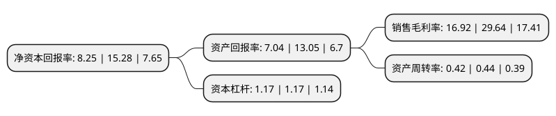

> 本页面由自动化程序生成于 2022年5月20日 01:16
> 内容可能存在错误，如有bug请提交issue至：https://github.com/Eroleice/doc-pi/issues
{.is-warning}

# 上市公司基本情况

## 基本资料

宁波戴维医疗器械股份有限公司（以下简称“戴维医疗”）成立于1992年09月18日，宁波市。于2012年05月08日在深交所创业板上市。

戴维医疗注册资本28,800万元，公司的主营业务为于婴儿保育设备的研发，生产和销售。主要产品包括婴儿培养箱，婴儿辐射保暖台，新生儿黄疸治疗设备三大系列，其中新生儿黄疸治疗设备包括新生儿黄疸治疗箱，新生儿黄疸治疗仪，黄疸治疗灯，新生儿黄疸治疗床，其他婴幼保育设备包括母婴同室婴儿床，婴儿无接触输氧头罩，低压吸引器，呼吸复苏(器)囊，远红外加温器及婴幼儿头部固定架等。以下是详细信息：

- 公司名称: 宁波戴维医疗器械股份有限公司
- 股票代码: 300314.SZ
- 所在地: 浙江 - 宁波市
- 成立日期: 1992年09月18日
- 注册资本: 28,800万元
- 法定代表人: 陈再宏
- 主营业务: 公司的主营业务为于婴儿保育设备的研发，生产和销售主要产品包括婴儿培养箱，婴儿辐射保暖台，新生儿黄疸治疗设备三大系列，其中新生儿黄疸治疗设备包括新生儿黄疸治疗箱，新生儿黄疸治疗仪，黄疸治疗灯，新生儿黄疸治疗床，其他婴幼保育设备包括母婴同室婴儿床，婴儿无接触输氧头罩，低压吸引器，呼吸复苏(器)囊，远红外加温器及婴幼儿头部固定架等
- 公司官网: www.nbdavid.com
- 公司介绍: 公司是一家集自主研制、生产和销售为一体的国家级高新技术企业，主要生产婴儿培养箱、运输用培养箱、婴儿辐射保暖台、新生儿黄疸治疗系列设备等医疗器械。现已成长为国内最大的婴儿培养箱等婴儿保育设备的专业制造商，素以提供高品质的产品和优质的服务而闻名。公司具有完整的质量保障体系，是国内率先通过ISO9000国际质量管理体系认证的五家医疗器械生产企业之一。凭借高品质的产品和优质的服务，“戴维”品牌目前已深入用户心中，产品遍布全球，国内市场占有率名列前茅，在技术开发和应用上处于领先地位。公司将秉承不断创新，以严谨、高效和可靠的作风，确保“成为全球最大的婴儿保育设备生产基地”这一目标能得以实现。

## 股东及高管情况

上市公司第一大股东为陈再宏，持股71,108,200股，占比24.69%，**疑似为**上市公司实际控制人。

截至2022年03月31日，上市公司的前十大股东中，共有9名自然人股东，1名机构股东，其中5%以上大股东共有3名。上市公司前十大股东明细如下：

> 未能通过持股比例判定出上市公司实际控制人（持股30%以上）
> 可能存在通过间接持股、联合持股、协议控制等方式拥有实际控制权的主体，具体请参考上市公司定期公告！
{.is-warning}

> 截至2022年03月31日，上市公司前十大股东信息如下：

| 股东名称 | 持股数量（股） | 持股比例 |
| --- | --- | --- |
| 陈再宏 | 71,108,200 | 24.69% |
| 陈云勤 | 60,820,000 | 21.12% |
| 陈再慰 | 58,320,000 | 20.25% |
| 李则东 | 972,000 | 0.34% |
| 俞永伟 | 850,500 | 0.3% |
| 北京嘉华宝通咨询有限公司 | 840,000 | 0.29% |
| 朱富德 | 680,000 | 0.24% |
| 吕振堂 | 503,200 | 0.17% |
| 颜宏蕾 | 501,900 | 0.17% |
| 王键 | 500,000 | 0.17% |

## 利润表分析

上市公司2021年总收入为4.74亿元，净利润为0.8亿元，实现盈利。

## 杜邦分析

> 数据列示周期：2021年 | 2020年 | 2019年
{.is-info}

上市公司的净资产收益率在近一年有所下降，下降幅度为-46.01%，其变化情况分解如下：
- 上市公司的销售毛利率在近一年下降了-42.91%，可能是生产效率的下降、商品原材料价格上涨或商品价格的下跌所致。
- 上市公司的资产周转率在近一年下降了-4.55%，可能是源自于更慢的销售回款或库存管理效果下降。
- 上市公司的财务杠杆比率在近一年下降了0%，可能是减少负债降低财务费用。

