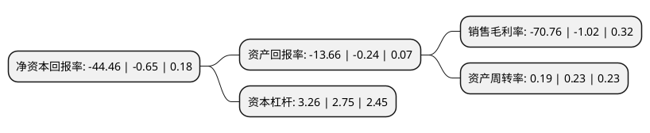

> 本页面由自动化程序生成于 2022年5月20日 01:16
> 内容可能存在错误，如有bug请提交issue至：https://github.com/Eroleice/doc-pi/issues
{.is-warning}

# 上市公司基本情况

## 基本资料

北京博晖创新生物技术集团股份有限公司（以下简称“博晖创新”）成立于2001年07月12日，北京市。于2012年05月23日在深交所创业板上市。

博晖创新注册资本81,690.05万元，主要从事临床检验快速检测技术的研发及应用产品系统(含检测仪器，检测试剂，校准品等)的开发，生产和销售。公司主要产品为人体微量元素检测系统，包括仪器，试剂等，用于检测人体内铜，铁，钙，镁，锌，钾，钠，铅，镉等微量元素的含量。以下是详细信息：

- 公司名称: 北京博晖创新生物技术集团股份有限公司
- 股票代码: 300318.SZ
- 所在地: 北京 - 北京市
- 成立日期: 2001年07月12日
- 注册资本: 81,690.05万元
- 法定代表人: 翟晓枫
- 主营业务: 主要从事临床检验快速检测技术的研发及应用产品系统(含检测仪器，检测试剂，校准品等)的开发，生产和销售公司主要产品为人体微量元素检测系统，包括仪器，试剂等，用于检测人体内铜，铁，钙，镁，锌，钾，钠，铅，镉等微量元素的含量
- 公司官网: www.bohui-tech.com
- 公司介绍: 公司是一家专注于医疗检测产品及元素分析产品的研发、生产、销售及售后服务为一体的高新技术企业。公司拥有强大的自主研发实力，建立了国际一流水准的研发平台，公司致力于医学检验产品的智能化、快速化、集成化。依靠突出的研发能力、通过不断的技术创新，目前已发展了元素检测、免疫检测、微流控核酸检测、原子荧光重金属检测、质谱分析等技术平台，并成功实现了上述技术平台相关产品的产业化。其中原子吸收法人体元素快速检测系统，是由博晖公司研发并率先应用于医疗检测诊断行业，并推动了其在医疗检测诊断行业中的广泛应用。近几年公司还承担了多项国家重大科技产业化项目，如十二五科技部重大仪器专项“微膜泵驱动核酸微全分析仪”的研制、863项目“医用ICP-MS人体微量元素分析系统”的研制等。

## 股东及高管情况

上市公司第一大股东为杜江涛，持股318,811,388股，占比39.03%，为上市公司实际控制人。

截至2022年03月31日，上市公司的前十大股东中，共有9名自然人股东，1个海外主体，其中5%以上大股东共有2名。上市公司前十大股东明细如下：

> 截至2022年03月31日，上市公司前十大股东信息如下：

| 股东名称 | 持股数量（股） | 持股比例 |
| --- | --- | --- |
| 杜江涛 | 318,811,388 | 39.03% |
| 郝虹 | 102,809,951 | 12.59% |
| 杨奇 | 35,863,954 | 4.39% |
| 杜江虹 | 24,478,560 | 3% |
| 梅迎军 | 12,153,741 | 1.49% |
| 何晓雨 | 6,959,818 | 0.85% |
| 顾春宇 | 4,378,200 | 0.54% |
| 刘彩玲 | 4,200,000 | 0.51% |
| 刘合普 | 2,836,245 | 0.35% |
| 香港中央结算有限公司(陆股通) | 2,561,618 | 0.31% |

## 利润表分析

上市公司2021年总收入为7.14亿元，净利润为-5.06亿元，**未实现盈利**。

## 杜邦分析

> 数据列示周期：2021年 | 2020年 | 2019年
{.is-info}

上市公司的净资产收益率在近一年有所上升，上升幅度为6740%，其变化情况分解如下：
- 上市公司的销售毛利率在近一年上升了6837.25%，可能是生产效率的提升、商品原材料价格下跌或商品价格的上涨所致。
- 上市公司的资产周转率在近一年下降了-17.39%，可能是源自于更慢的销售回款或库存管理效果下降。
- 上市公司的财务杠杆比率在近一年上升了18.55%，可能是增加负债扩大生产规模。

