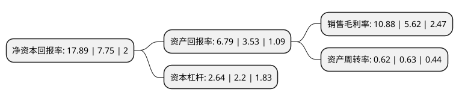

> 本页面由自动化程序生成于 2022年5月20日 01:17
> 内容可能存在错误，如有bug请提交issue至：https://github.com/Eroleice/doc-pi/issues
{.is-warning}

# 上市公司基本情况

## 基本资料

楚天科技股份有限公司（以下简称“楚天科技”）成立于2002年11月08日，长沙市。于2014年01月21日在深交所创业板上市。

楚天科技注册资本57,505.298万元，公司主营业务为水剂类制药装备的研发，设计，生产，销售和服务。主要产品:安瓿瓶洗烘灌封联动机组，抗生素瓶洗烘灌封联动机组，口服液瓶洗烘灌封联动机组和软袋大输液联动线等。以下是详细信息：

- 公司名称: 楚天科技股份有限公司
- 股票代码: 300358.SZ
- 所在地: 湖南 - 长沙市
- 成立日期: 2002年11月08日
- 注册资本: 57,505.298万元
- 法定代表人: 唐岳
- 主营业务: 公司主营业务为水剂类制药装备的研发，设计，生产，销售和服务主要产品:安瓿瓶洗烘灌封联动机组，抗生素瓶洗烘灌封联动机组，口服液瓶洗烘灌封联动机组和软袋大输液联动线等
- 公司官网: www.truking.cn
- 公司介绍: 公司现已成为世界医药装备行业的主要企业之一。公司主营业务为水剂类制药装备的研发、设计、生产、销售和服务。已利用自动化与信息化技术成功研制了部分智能医药生产机器人及其生产线，正向打造医药工业4.0智慧工厂整体解决方案的EPC服务商转型。自成立以来，公司一直致力于为制药企业提供专业化、个性化的制药装备解决方案。公司是国内领先的制药装备制造商，是我国替代进口制药装备产品的代表企业，水剂类制药装备产销量居国内行业前列。

## 股东及高管情况

上市公司第一大股东为长沙楚天投资集团有限公司，持股224,049,214股，占比38.96%，为上市公司实际控制人。

截至2022年03月31日，上市公司的前十大股东中，共有4名自然人股东，3名机构股东，2个产品账户，1个海外主体，其中5%以上大股东共有2名。上市公司前十大股东明细如下：

> 截至2022年03月31日，上市公司前十大股东信息如下：

| 股东名称 | 持股数量（股） | 持股比例 |
| --- | --- | --- |
| 长沙楚天投资集团有限公司 | 224,049,214 | 38.96% |
| 湖南财信精信投资合伙企业(有限合伙) | 37,057,700 | 6.44% |
| 香港中央结算有限公司(陆股通) | 8,010,550 | 1.39% |
| 何毅 | 7,008,500 | 1.22% |
| 湖南省财信资产管理有限公司 | 5,662,447 | 0.98% |
| 中国银行股份有限公司-前海开源医疗健康灵活配置混合型证券投资基金 | 5,396,300 | 0.94% |
| 徐任 | 4,880,000 | 0.85% |
| 徐莺 | 4,365,697 | 0.76% |
| 唐岳 | 3,379,200 | 0.59% |
| 招商银行股份有限公司-汇添富医疗服务灵活配置混合型证券投资基金 | 3,355,258 | 0.58% |

## 利润表分析

上市公司2021年总收入为52.59亿元，净利润为5.72亿元，实现盈利。

## 杜邦分析

> 数据列示周期：2021年 | 2020年 | 2019年
{.is-info}

上市公司的净资产收益率在近一年有所上升，上升幅度为130.84%，其变化情况分解如下：
- 上市公司的销售毛利率在近一年上升了93.59%，可能是生产效率的提升、商品原材料价格下跌或商品价格的上涨所致。
- 上市公司的资产周转率在近一年下降了-1.59%，可能是源自于更慢的销售回款或库存管理效果下降。
- 上市公司的财务杠杆比率在近一年上升了20%，可能是增加负债扩大生产规模。

