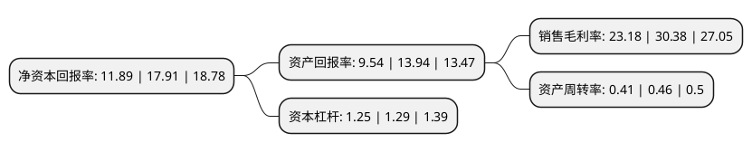

> 本页面由自动化程序生成于 2022年5月20日 01:17
> 内容可能存在错误，如有bug请提交issue至：https://github.com/Eroleice/doc-pi/issues
{.is-warning}

# 上市公司基本情况

## 基本资料

迪瑞医疗科技股份有限公司（以下简称“迪瑞医疗”）成立于1994年12月26日，长春市。于2014年09月10日在深交所创业板上市。

迪瑞医疗注册资本27,589.46万元，公司主营业务是医疗检验仪器及配套试纸试剂的研发，生产与销售。公司产品用于日常体检及病情诊断，通过对人体尿液，血液等体液的检验，为预防，治疗疾病提供身体指标信息。以下是详细信息：

- 公司名称: 迪瑞医疗科技股份有限公司
- 股票代码: 300396.SZ
- 所在地: 吉林 - 长春市
- 成立日期: 1994年12月26日
- 注册资本: 27,589.46万元
- 法定代表人: 王学敏
- 主营业务: 公司主营业务是医疗检验仪器及配套试纸试剂的研发，生产与销售公司产品用于日常体检及病情诊断，通过对人体尿液，血液等体液的检验，为预防，治疗疾病提供身体指标信息
- 公司官网: www.dirui.com.cn
- 公司介绍: 公司是国内领先的医疗检验仪器及配套试纸试剂制造商，公司主营业务是医疗检验仪器及配套试纸试剂的研发、生产与销售。公司产品用于日常体检及病情诊断，通过对人体尿液、血液等体液的检验，为预防、治疗疾病提供身体指标信息。公司产品主要包括尿液分析、尿有形成分、生化、血细胞、化学发光免疫分析、妇科分泌物分析系统等系列。公司产品荣获多项国家发明专利，试纸抗V.C、液体尿液分析质控液技术是国内首创；率先在国内研制出品CS-800型全自动生化分析仪、H-800型全自动尿液分析仪，FUS-100全自动尿有形成分分析仪采用流式细胞技术及影像法进行尿有形成分的识别与分类，填补了国内空白。公司产品出口到100多个国家和地区，医疗检验产品在行业内率先通过了欧盟的CE认证和美国的FDA认证，迪瑞质量管理体系通过了ISO9001、ISO13485国际质量体系认证。公司是国家火炬计划承办单位、国家创新基金支持企业。

## 股东及高管情况

上市公司第一大股东为深圳市华德欣润股权投资企业(有限合伙)，持股77,288,400股，占比28.01%，**疑似为**上市公司实际控制人。

截至2022年03月31日，上市公司的前十大股东中，共有6名自然人股东，4名机构股东，其中5%以上大股东共有5名。上市公司前十大股东明细如下：

> 未能通过持股比例判定出上市公司实际控制人（持股30%以上）
> 可能存在通过间接持股、联合持股、协议控制等方式拥有实际控制权的主体，具体请参考上市公司定期公告！
{.is-warning}

> 截至2022年03月31日，上市公司前十大股东信息如下：

| 股东名称 | 持股数量（股） | 持股比例 |
| --- | --- | --- |
| 深圳市华德欣润股权投资企业(有限合伙) | 77,288,400 | 28.01% |
| 广东恒健国际投资有限公司 | 33,123,600 | 12.01% |
| 宋洁 | 30,180,960 | 10.94% |
| 易湘苹 | 18,148,400 | 6.58% |
| 宋勇 | 16,547,800 | 6% |
| 中央汇金资产管理有限责任公司 | 2,732,400 | 0.99% |
| 江颖 | 2,127,811 | 0.77% |
| 玲珑集团有限公司 | 1,300,300 | 0.47% |
| 陈金城 | 1,266,000 | 0.46% |
| 陈如意 | 1,143,800 | 0.41% |

## 利润表分析

上市公司2021年总收入为9.05亿元，净利润为2.09亿元，实现盈利。

## 杜邦分析

> 数据列示周期：2021年 | 2020年 | 2019年
{.is-info}

上市公司的净资产收益率在近一年有所下降，下降幅度为-33.61%，其变化情况分解如下：
- 上市公司的销售毛利率在近一年下降了-23.7%，可能是生产效率的下降、商品原材料价格上涨或商品价格的下跌所致。
- 上市公司的资产周转率在近一年下降了-10.87%，可能是源自于更慢的销售回款或库存管理效果下降。
- 上市公司的财务杠杆比率在近一年下降了-3.1%，可能是减少负债降低财务费用。

