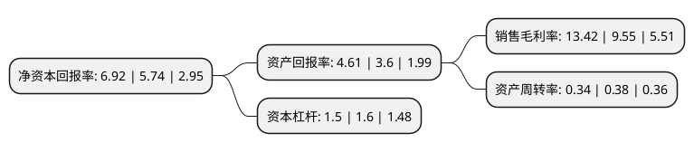

> 本页面由自动化程序生成于 2022年5月20日 01:17
> 内容可能存在错误，如有bug请提交issue至：https://github.com/Eroleice/doc-pi/issues
{.is-warning}

# 上市公司基本情况

## 基本资料

博济医药科技股份有限公司（以下简称“博济医药”）成立于2002年09月29日，广州市。于2015年04月24日在深交所创业板上市。

博济医药注册资本26,145.637万元，主营业务为医药企业和其他新药研发机构的新药研发提供临床前研究服务，临床研究服务，技术成果转化服务以及与新药研发有关的其他咨询服务等，协助客户快速，高效地完成新药研发的各个阶段。以下是详细信息：

- 公司名称: 博济医药科技股份有限公司
- 股票代码: 300404.SZ
- 所在地: 广东 - 广州市
- 成立日期: 2002年09月29日
- 注册资本: 26,145.637万元
- 法定代表人: 王廷春
- 主营业务: 主营业务为医药企业和其他新药研发机构的新药研发提供临床前研究服务，临床研究服务，技术成果转化服务以及与新药研发有关的其他咨询服务等，协助客户快速，高效地完成新药研发的各个阶段
- 公司官网: www.gzboji.com
- 公司介绍: 公司是一家从事新药研发外包服务的新型高新技术企业。自成立以来，博济医药始终坚持“诚实、守信、专业、权威”的经营理念，为医药企业和其他新药研发机构提供新药研发全流程“一站式”外包服务，包括药学研究、药物评价(动物)、临床试验、上市后再评价、技术成果转化、数据管理和统计分析等，以及医疗器械、保健品的注册及临床研究服务等。

## 股东及高管情况

上市公司第一大股东为王廷春，持股76,367,692股，占比29.21%，**疑似为**上市公司实际控制人。

截至2022年03月31日，上市公司的前十大股东中，共有6名自然人股东，3名机构股东，1个产品账户，其中5%以上大股东共有2名。上市公司前十大股东明细如下：

> 未能通过持股比例判定出上市公司实际控制人（持股30%以上）
> 可能存在通过间接持股、联合持股、协议控制等方式拥有实际控制权的主体，具体请参考上市公司定期公告！
{.is-warning}

> 截至2022年03月31日，上市公司前十大股东信息如下：

| 股东名称 | 持股数量（股） | 持股比例 |
| --- | --- | --- |
| 王廷春 | 76,367,692 | 29.21% |
| 赵伶俐 | 15,083,300 | 5.77% |
| 横琴广金美好基金管理有限公司-广金美好费米十三号私募证券投资基金 | 6,665,500 | 2.55% |
| 广州高新区投资集团有限公司 | 5,656,280 | 2.16% |
| 毕树真 | 3,900,200 | 1.49% |
| 共青城银池投资合伙企业(有限合伙) | 2,436,647 | 0.93% |
| 共青城银溢投资合伙企业(有限合伙) | 2,436,647 | 0.93% |
| 史久武 | 2,204,800 | 0.84% |
| 王领娣 | 2,002,300 | 0.77% |
| 马仁强 | 1,914,896 | 0.73% |

## 利润表分析

上市公司2021年总收入为3.24亿元，净利润为0.43亿元，实现盈利。

## 杜邦分析

> 数据列示周期：2021年 | 2020年 | 2019年
{.is-info}

上市公司的净资产收益率在近一年有所上升，上升幅度为20.56%，其变化情况分解如下：
- 上市公司的销售毛利率在近一年上升了40.52%，可能是生产效率的提升、商品原材料价格下跌或商品价格的上涨所致。
- 上市公司的资产周转率在近一年下降了-10.53%，可能是源自于更慢的销售回款或库存管理效果下降。
- 上市公司的财务杠杆比率在近一年下降了-6.25%，可能是减少负债降低财务费用。

