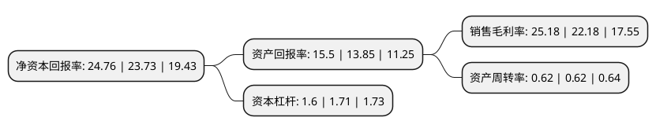

> 本页面由自动化程序生成于 2022年5月20日 01:17
> 内容可能存在错误，如有bug请提交issue至：https://github.com/Eroleice/doc-pi/issues
{.is-warning}

# 上市公司基本情况

## 基本资料

迈克生物股份有限公司（以下简称“迈克生物”）成立于1994年10月20日，成都市。于2015年05月28日在深交所创业板上市。

迈克生物注册资本61,246.959万元，公司主营业务是自主研发，生产和销售体外诊断产品以及代理销售国外知名品牌的体外诊断产品。主要产品包括生化诊断产品，免疫诊断产品，血液及体液学诊断产品等。以下是详细信息：

- 公司名称: 迈克生物股份有限公司
- 股票代码: 300463.SZ
- 所在地: 四川 - 成都市
- 成立日期: 1994年10月20日
- 注册资本: 61,246.959万元
- 法定代表人: 唐勇
- 主营业务: 公司主营业务是自主研发，生产和销售体外诊断产品以及代理销售国外知名品牌的体外诊断产品主要产品包括生化诊断产品，免疫诊断产品，血液及体液学诊断产品等
- 公司官网: www.maccura.com
- 公司介绍: 公司一直以来专注于体外诊断产品的研究、生产、销售和服务，是体外诊断产品系统的研发、生产、销售、服务企业，拥有国际一流的诊断产品研发团队，在数名科学家的带领下，建立了临床生化、发光免疫、快速诊断、血栓与止血、分子诊断的产品技术开发平台。公司是国际临床化学与检验医学联合会(IFCC)在中国的第一家企业会员，是中国首批建立酶学参考实验室的体外诊断产品生产企业，迈克诊断产品的溯源成果达到国际先进水平。公司是经国家相关部门认证的“高新技术企业”，先后通过了CMDISO13485、CQCISO14001、TUVISO13485认证和部分产品CE认证并于2013年获得CNAS医学参考实验室认可。公司拥有国际一流的产品生产条件及生产管理水平，能向市场提供涵盖临床生化、发光免疫、快速诊断、血栓与止血等专业项目多达几百种高品质产品。

## 股东及高管情况

上市公司第一大股东为唐勇，持股68,062,301股，占比11.11%，**疑似为**上市公司实际控制人。

截至2022年03月31日，上市公司的前十大股东中，共有6名自然人股东，2名机构股东，1个产品账户，1个海外主体，其中5%以上大股东共有4名。上市公司前十大股东明细如下：

> 未能通过持股比例判定出上市公司实际控制人（持股30%以上）
> 可能存在通过间接持股、联合持股、协议控制等方式拥有实际控制权的主体，具体请参考上市公司定期公告！
{.is-warning}

> 截至2022年03月31日，上市公司前十大股东信息如下：

| 股东名称 | 持股数量（股） | 持股比例 |
| --- | --- | --- |
| 唐勇 | 68,062,301 | 11.11% |
| 王登明 | 45,534,495 | 7.43% |
| 郭雷 | 35,774,906 | 5.84% |
| 刘启林 | 33,127,360 | 5.41% |
| 陈梅 | 26,046,900 | 4.25% |
| 王传英 | 22,894,262 | 3.74% |
| 香港中央结算有限公司(陆股通) | 21,336,544 | 3.48% |
| 中信里昂资产管理有限公司-客户资金 | 7,726,861 | 1.26% |
| 济南江山投资合伙企业(有限合伙) | 7,114,905 | 1.16% |
| 上海高毅资产管理合伙企业(有限合伙)-高毅晓峰2号致信基金 | 7,114,905 | 1.16% |

## 利润表分析

上市公司2021年总收入为39.8亿元，净利润为10.02亿元，实现盈利。

## 杜邦分析

> 数据列示周期：2021年 | 2020年 | 2019年
{.is-info}

上市公司的净资产收益率在近一年有所上升，上升幅度为4.34%，其变化情况分解如下：
- 上市公司的销售毛利率在近一年上升了13.53%，可能是生产效率的提升、商品原材料价格下跌或商品价格的上涨所致。
- 上市公司的资产周转率在近一年下降了0%，可能是源自于更慢的销售回款或库存管理效果下降。
- 上市公司的财务杠杆比率在近一年下降了-6.43%，可能是减少负债降低财务费用。

