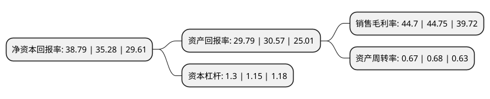

> 本页面由自动化程序生成于 2022年5月20日 01:18
> 内容可能存在错误，如有bug请提交issue至：https://github.com/Eroleice/doc-pi/issues
{.is-warning}

# 上市公司基本情况

## 基本资料

健帆生物科技集团股份有限公司（以下简称“健帆生物”）成立于1989年12月19日，珠海市。于2016年08月02日在深交所创业板上市。

健帆生物注册资本80,549.734万元，主要业务为研发，生产及销售具有创新技术的血液净化产品。主要产品:一次性使用血液灌流器，血液灌流机，一次性使用血浆胆红素吸附器，DX-10型血液净化机等。以下是详细信息：

- 公司名称: 健帆生物科技集团股份有限公司
- 股票代码: 300529.SZ
- 所在地: 广东 - 珠海市
- 成立日期: 1989年12月19日
- 注册资本: 80,549.734万元
- 法定代表人: 董凡
- 主营业务: 主要业务为研发，生产及销售具有创新技术的血液净化产品主要产品:一次性使用血液灌流器，血液灌流机，一次性使用血浆胆红素吸附器，DX-10型血液净化机等
- 公司官网: www.jafron.com
- 公司介绍: 公司是具有创新技术的血液净化产品提供商，主要从事血液灌流相关产品的研发、生产与销售，自主研发的一次性使用血液灌流器、一次性使用血浆胆红素吸附器、DNA免疫吸附柱及血液净化设备等产品广泛应用于尿毒症、中毒、重型肝病、自身免疫性疾病、多器官功能衰竭等领域的治疗，可有效挽救患者生命或提高病患者生活质量。作为手术、药物之外的第三种疗法，血液净化技术正越来越广泛的用于各种疑难危重疾病的临床治疗。公司立足于产品研发及创新，依靠自身专业的营销团队，通过产品技术的学术推广及对各医疗机构的服务支持，为患者提供安全有效的血液净化产品。公司产品已通过CE认证、ISO国际质量管理体系认证，承担两项“国家重点新产品项目”和三项“国家级火炬计划项目”，获批组建广东省血液净化工程技术研究开发中心、省级企业技术中心、博士后科研工作站、院士工作站。

## 股东及高管情况

上市公司第一大股东为董凡，持股355,131,867股，占比44.09%，为上市公司实际控制人。

截至2022年03月31日，上市公司的前十大股东中，共有5名自然人股东，4个产品账户，1个海外主体，其中5%以上大股东共有1名。上市公司前十大股东明细如下：

> 截至2022年03月31日，上市公司前十大股东信息如下：

| 股东名称 | 持股数量（股） | 持股比例 |
| --- | --- | --- |
| 董凡 | 355,131,867 | 44.09% |
| 唐先敏 | 21,416,425 | 2.66% |
| 香港中央结算有限公司(陆股通) | 19,130,158 | 2.37% |
| 中国工商银行股份有限公司-广发双擎升级混合型证券投资基金 | 13,340,413 | 1.66% |
| 中国工商银行股份有限公司-广发创新升级灵活配置混合型证券投资基金 | 10,117,135 | 1.26% |
| 中国建设银行股份有限公司-广发科技先锋混合型证券投资基金 | 9,788,622 | 1.22% |
| 上海浦东发展银行股份有限公司-广发小盘成长混合型证券投资基金(LOF) | 9,432,185 | 1.17% |
| 郭学锐 | 8,296,881 | 1.03% |
| 江焕新 | 8,000,882 | 0.99% |
| 黄河 | 7,466,800 | 0.93% |

## 利润表分析

上市公司2021年总收入为26.75亿元，净利润为11.95亿元，实现盈利。

## 杜邦分析

> 数据列示周期：2021年 | 2020年 | 2019年
{.is-info}

上市公司的净资产收益率在近一年有所上升，上升幅度为9.95%，其变化情况分解如下：
- 上市公司的销售毛利率在近一年下降了-0.11%，可能是生产效率的下降、商品原材料价格上涨或商品价格的下跌所致。
- 上市公司的资产周转率在近一年下降了-1.47%，可能是源自于更慢的销售回款或库存管理效果下降。
- 上市公司的财务杠杆比率在近一年上升了13.04%，可能是增加负债扩大生产规模。

