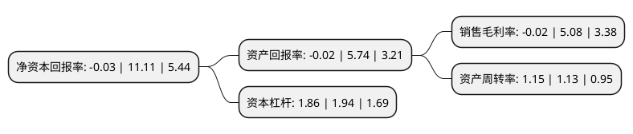

> 本页面由自动化程序生成于 2022年5月20日 01:18
> 内容可能存在错误，如有bug请提交issue至：https://github.com/Eroleice/doc-pi/issues
{.is-warning}

# 上市公司基本情况

## 基本资料

广东乐心医疗电子股份有限公司（以下简称“乐心医疗”）成立于2002年07月18日，中山市。于2016年11月16日在深交所创业板上市。

乐心医疗注册资本21,470.119万元，专业从事家用医疗健康电子产品的研发，生产和销售，及乐心智能健康云平台的研发与运营。目前的主要产品包括电子健康秤(可分为电子体重秤，电子厨房秤)，脂肪测量仪，电子血压计，可穿戴运动手环及其他家用医疗健康电子产品。以下是详细信息：

- 公司名称: 广东乐心医疗电子股份有限公司
- 股票代码: 300562.SZ
- 所在地: 广东 - 中山市
- 成立日期: 2002年07月18日
- 注册资本: 21,470.119万元
- 法定代表人: 潘伟潮
- 主营业务: 专业从事家用医疗健康电子产品的研发，生产和销售，及乐心智能健康云平台的研发与运营目前的主要产品包括电子健康秤(可分为电子体重秤，电子厨房秤)，脂肪测量仪，电子血压计，可穿戴运动手环及其他家用医疗健康电子产品
- 公司官网: www.lifesense.com
- 公司介绍: 公司致力于家庭健康管理事业，专业从事家用医疗健康电子产品的研发、生产和销售，以乐心智能健康云平台的研发和运营。公司的主要产品包括电子健康秤(可分为电子体重秤、电子厨房秤)、脂肪血压计、电子血压计、可穿戴运动手环及其他家用医疗健康电子产品。公司拥有独立、完整、适合自身发展的原材料采购、研究开发、生产机产品销售体系，形成了自身的盈利模式。

## 股东及高管情况

上市公司第一大股东为潘伟潮，持股80,602,574股，占比37.54%，为上市公司实际控制人。

截至2022年03月31日，上市公司的前十大股东中，共有6名自然人股东，3名机构股东，1个产品账户，其中5%以上大股东共有1名。上市公司前十大股东明细如下：

> 截至2022年03月31日，上市公司前十大股东信息如下：

| 股东名称 | 持股数量（股） | 持股比例 |
| --- | --- | --- |
| 潘伟潮 | 80,602,574 | 37.54% |
| 麦炯章 | 9,606,240 | 4.47% |
| 高榕资本(深圳)投资中心(有限合伙) | 4,895,300 | 2.28% |
| 太平基金-太平人寿保险有限公司-保险资金-太平基金-太平人寿-盛世锐进2号单一资产管理计划 | 3,640,776 | 1.7% |
| 遂川协润企业管理服务中心(有限合伙) | 2,928,300 | 1.36% |
| 王仁 | 1,876,200 | 0.87% |
| 遂川汇康企业管理服务中心(有限合伙) | 1,642,300 | 0.76% |
| 詹春涛 | 1,500,000 | 0.7% |
| 孙浩 | 1,361,200 | 0.63% |
| 詹银涛 | 1,232,912 | 0.57% |

## 利润表分析

上市公司2021年总收入为18.21亿元，净利润为-0.01亿元，**未实现盈利**。

## 杜邦分析

> 数据列示周期：2021年 | 2020年 | 2019年
{.is-info}

上市公司的净资产收益率在近一年有所下降，下降幅度为-100.27%，其变化情况分解如下：
- 上市公司的销售毛利率在近一年下降了-100.39%，可能是生产效率的下降、商品原材料价格上涨或商品价格的下跌所致。
- 上市公司的资产周转率在近一年上升了1.77%，可能是源自于更快的销售回款或库存管理效果提升。
- 上市公司的财务杠杆比率在近一年下降了-4.12%，可能是减少负债降低财务费用。

