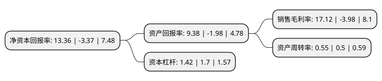

> 本页面由自动化程序生成于 2022年5月20日 01:19
> 内容可能存在错误，如有bug请提交issue至：https://github.com/Eroleice/doc-pi/issues
{.is-warning}

# 上市公司基本情况

## 基本资料

深圳开立生物医疗科技股份有限公司（以下简称“开立医疗”）成立于2002年09月27日，深圳市。于2017年04月06日在深交所创业板上市。

开立医疗注册资本42,977.175万元，主要产品:医疗诊断设备，具体包括医用超声诊断设备和医用内窥镜设备等;主营业务:医疗诊断设备的研发，生产与销售以下是详细信息：

- 公司名称: 深圳开立生物医疗科技股份有限公司
- 股票代码: 300633.SZ
- 所在地: 广东 - 深圳市
- 成立日期: 2002年09月27日
- 注册资本: 42,977.175万元
- 法定代表人: 陈志强
- 主营业务: 主要产品:医疗诊断设备，具体包括医用超声诊断设备和医用内窥镜设备等;主营业务:医疗诊断设备的研发，生产与销售
- 公司官网: www.sonoscape.com
- 公司介绍: 公司主营业务为医疗诊断设备的自主研发、生产与销售。公司始终以客户需求为导向，致力于为全球医疗机构提供优质的产品和服务。主要产品包括医用超声诊断设备(主要为彩色多普勒超声诊断设备与B型超声诊断设备)、医用电子内窥镜设备、血液分析仪。公司立足自主技术创新和产品研发，是国内超声诊断设备领域较早独立掌握彩超设备核心技术与探头核心技术的生产企业，目前已掌握基于PC的Linux彩超软件技术，128通道彩超技术，嵌入式计算机技术，高密度、宽频带探头技术，单晶探头技术，特种应用探头技术等多项超声诊断设备领域专利技术。公司各类产品质量过硬，性能突出，多项产品通过FDA注册、CE认证，并得到国际认可。

## 股东及高管情况

上市公司第一大股东为陈志强，持股95,725,200股，占比22.27%，**疑似为**上市公司实际控制人。

截至2022年03月31日，上市公司的前十大股东中，共有6名自然人股东，1名机构股东，1个产品账户，2个海外主体，其中5%以上大股东共有2名。上市公司前十大股东明细如下：

> 未能通过持股比例判定出上市公司实际控制人（持股30%以上）
> 可能存在通过间接持股、联合持股、协议控制等方式拥有实际控制权的主体，具体请参考上市公司定期公告！
{.is-warning}

> 截至2022年03月31日，上市公司前十大股东信息如下：

| 股东名称 | 持股数量（股） | 持股比例 |
| --- | --- | --- |
| 陈志强 | 95,725,200 | 22.27% |
| 吴坤祥 | 95,725,200 | 22.27% |
| 黄奕波 | 20,095,613 | 4.68% |
| 周文平 | 15,503,800 | 3.61% |
| 香港中央结算有限公司(陆股通) | 9,886,671 | 2.3% |
| 李浩 | 7,963,240 | 1.85% |
| 中国工商银行股份有限公司-融通健康产业灵活配置混合型证券投资基金 | 5,422,140 | 1.26% |
| 刘映芳 | 4,788,800 | 1.11% |
| 中信里昂资产管理有限公司-客户资金 | 3,672,369 | 0.85% |
| UBS   AG | 2,447,024 | 0.57% |

## 利润表分析

上市公司2021年总收入为14.44亿元，净利润为2.47亿元，实现盈利。

## 杜邦分析

> 数据列示周期：2021年 | 2020年 | 2019年
{.is-info}

上市公司的净资产收益率在近一年有所下降，下降幅度为-496.44%，其变化情况分解如下：
- 上市公司的销售毛利率在近一年下降了-530.15%，可能是生产效率的下降、商品原材料价格上涨或商品价格的下跌所致。
- 上市公司的资产周转率在近一年上升了10%，可能是源自于更快的销售回款或库存管理效果提升。
- 上市公司的财务杠杆比率在近一年下降了-16.47%，可能是减少负债降低财务费用。

