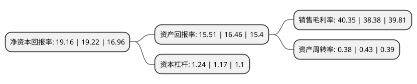

> 本页面由自动化程序生成于 2022年5月20日 01:19
> 内容可能存在错误，如有bug请提交issue至：https://github.com/Eroleice/doc-pi/issues
{.is-warning}

# 上市公司基本情况

## 基本资料

烟台正海生物科技股份有限公司（以下简称“正海生物”）成立于2003年10月22日，烟台市。于2017年05月16日在深交所创业板上市。

正海生物注册资本12,000万元，主营业务:生物再生材料的研发，生产与销售，主要产品包括口腔修复膜，生物膜等软组织修复材料以及骨修复材料等硬组织修复材料。以下是详细信息：

- 公司名称: 烟台正海生物科技股份有限公司
- 股票代码: 300653.SZ
- 所在地: 山东 - 烟台市
- 成立日期: 2003年10月22日
- 注册资本: 12,000万元
- 法定代表人: 王涛
- 主营业务: 主营业务:生物再生材料的研发，生产与销售，主要产品包括口腔修复膜，生物膜等软组织修复材料以及骨修复材料等硬组织修复材料
- 公司官网: www.zhbio.com
- 公司介绍: 公司是我国再生医学领域领先企业，是山东省科技厅、财政厅、国税局、地税局联合认定的高新技术企业，建有山东省医用再生修复材料工程技术研究中心、山东省企业技术中心。公司主营业务为生物再生材料的研发、生产与销售，主要产品包括口腔修复膜、生物膜等软组织修复材料以及骨修复材料等硬组织修复材料。公司产品主要用于临床组织再生和创伤修复。经过多年发展，公司已经成为我国生物再生材料领域软组织修复、硬组织修复产品规格种类较全、产品结构较为完善，具有较高市场知名度和美誉度的企业，产品及服务受到客户的广泛认可。

## 股东及高管情况

上市公司第一大股东为秘波海，持股45,030,000股，占比37.53%，为上市公司实际控制人。

截至2022年03月31日，上市公司的前十大股东中，共有2名自然人股东，3名机构股东，3个产品账户，2个海外主体，其中5%以上大股东共有2名。上市公司前十大股东明细如下：

> 截至2022年03月31日，上市公司前十大股东信息如下：

| 股东名称 | 持股数量（股） | 持股比例 |
| --- | --- | --- |
| 秘波海 | 45,030,000 | 37.53% |
| Longwood Biotechnologies Inc. | 9,927,983 | 8.27% |
| 中国银行股份有限公司-华夏行业景气混合型证券投资基金 | 4,244,270 | 3.54% |
| 嘉兴正海创业投资合伙企业(有限合伙) | 2,850,000 | 2.38% |
| 大家人寿保险股份有限公司-万能产品 | 2,025,364 | 1.69% |
| 华夏人寿保险股份有限公司-自有资金 | 1,922,800 | 1.6% |
| 香港中央结算有限公司(陆股通) | 1,292,625 | 1.08% |
| 纪翔 | 696,000 | 0.58% |
| 华夏基金-信泰人寿保险股份有限公司-分红产品-华夏基金-信泰人寿1号单一资产管理计划 | 680,451 | 0.57% |
| 深圳市浚灏商贸有限公司 | 644,162 | 0.54% |

## 利润表分析

上市公司2021年总收入为4亿元，净利润为1.68亿元，实现盈利。

## 杜邦分析

> 数据列示周期：2020年 | 2019年 | 2018年
{.is-info}

上市公司的净资产收益率在近一年有所下降，下降幅度为-0.31%，其变化情况分解如下：
- 上市公司的销售毛利率在近一年上升了5.13%，可能是生产效率的提升、商品原材料价格下跌或商品价格的上涨所致。
- 上市公司的资产周转率在近一年下降了-11.63%，可能是源自于更慢的销售回款或库存管理效果下降。
- 上市公司的财务杠杆比率在近一年上升了5.98%，可能是增加负债扩大生产规模。

