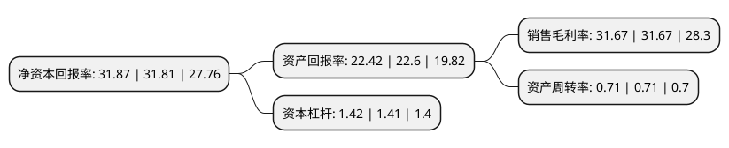

> 本页面由自动化程序生成于 2022年5月20日 01:20
> 内容可能存在错误，如有bug请提交issue至：https://github.com/Eroleice/doc-pi/issues
{.is-warning}

# 上市公司基本情况

## 基本资料

深圳迈瑞生物医疗电子股份有限公司（以下简称“迈瑞医疗”）成立于1999年01月25日，深圳市。于2018年10月16日在深交所创业板上市。

迈瑞医疗注册资本121,244.139万元，主营业务:公司主要从事医疗器械的研发，制造，营销及服务，主要产品涵盖三大领域:生命信息与支持，体外诊断以及医学影像，目前已拥有丰富的产品品类。以下是详细信息：

- 公司名称: 深圳迈瑞生物医疗电子股份有限公司
- 股票代码: 300760.SZ
- 所在地: 广东 - 深圳市
- 成立日期: 1999年01月25日
- 注册资本: 121,244.139万元
- 法定代表人: 李西廷
- 主营业务: 主营业务:公司主要从事医疗器械的研发，制造，营销及服务，主要产品涵盖三大领域:生命信息与支持，体外诊断以及医学影像，目前已拥有丰富的产品品类
- 公司官网: www.mindray.com
- 公司介绍: 公司是中国领先的高科技医疗设备研发制造厂商，为全球市场提供医疗器械产品。公司的主营业务覆盖生命信息与支持、体外诊断、医学影像三大领域，通过前沿技术创新，提供更完善的产品解决方案，帮助世界改善医疗条件、提高诊疗效率。公司始终致力于临床医疗设备的研发和制造，产品涵盖生命信息与支持、临床检验及试剂、数字超声、放射影像四大领域，将性能与价格完美平衡的医疗电子产品带到世界每一角落。

## 股东及高管情况

上市公司第一大股东为Smartco Development Limited，持股327,072,335股，占比26.98%，**疑似为**上市公司实际控制人。

截至2022年03月31日，上市公司的前十大股东中，共有4名机构股东，2个产品账户，4个海外主体，其中5%以上大股东共有3名。上市公司前十大股东明细如下：

> 未能通过持股比例判定出上市公司实际控制人（持股30%以上）
> 可能存在通过间接持股、联合持股、协议控制等方式拥有实际控制权的主体，具体请参考上市公司定期公告！
{.is-warning}

> 截至2022年03月31日，上市公司前十大股东信息如下：

| 股东名称 | 持股数量（股） | 持股比例 |
| --- | --- | --- |
| Smartco Development Limited | 327,072,335 | 26.98% |
| Magnifice(HK)Limited | 296,951,000 | 24.49% |
| 香港中央结算有限公司(陆股通) | 97,390,618 | 8.03% |
| Ever Union(H.K.)Limited | 53,526,377 | 4.41% |
| 深圳睿隆咨询服务合伙企业(有限合伙) | 41,141,652 | 3.39% |
| 深圳睿福管理咨询合伙企业(有限合伙) | 38,953,213 | 3.21% |
| 深圳睿嘉管理咨询合伙企业(有限合伙) | 15,366,730 | 1.27% |
| 深圳睿享投资咨询合伙企业(有限合伙) | 13,991,238 | 1.15% |
| 中国工商银行股份有限公司-中欧医疗健康混合型证券投资基金 | 12,995,720 | 1.07% |
| 中国工商银行股份有限公司-景顺长城新兴成长混合型证券投资基金 | 12,499,801 | 1.03% |

## 利润表分析

上市公司2021年总收入为252.69亿元，净利润为80.04亿元，实现盈利。

## 杜邦分析

> 数据列示周期：2021年 | 2020年 | 2019年
{.is-info}

上市公司的净资产收益率在近一年有所上升，上升幅度为0.19%，其变化情况分解如下：
- 上市公司的销售毛利率在近一年下降了0%，可能是生产效率的下降、商品原材料价格上涨或商品价格的下跌所致。
- 上市公司的资产周转率在近一年下降了0%，可能是源自于更慢的销售回款或库存管理效果下降。
- 上市公司的财务杠杆比率在近一年上升了0.71%，可能是增加负债扩大生产规模。

