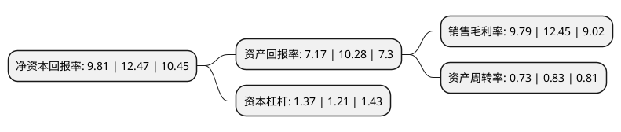

> 本页面由自动化程序生成于 2022年5月20日 01:20
> 内容可能存在错误，如有bug请提交issue至：https://github.com/Eroleice/doc-pi/issues
{.is-warning}

# 上市公司基本情况

## 基本资料

仙乐健康科技股份有限公司（以下简称“仙乐健康”）成立于1993年08月16日，汕头市。于2019年09月25日在深交所创业板上市。

仙乐健康注册资本18,016.987万元，主营业务:在营养保健食品领域提供研发，生产，销售，技术服务等。产品涵盖鱼油系列，Ω369系列，氨糖系列，钙产品系列，维生素和矿物质系列，辅酶Q10系列，葡萄籽等植物提取物系列等。以下是详细信息：

- 公司名称: 仙乐健康科技股份有限公司
- 股票代码: 300791.SZ
- 所在地: 广东 - 汕头市
- 成立日期: 1993年08月16日
- 注册资本: 18,016.987万元
- 法定代表人: 林培青
- 主营业务: 主营业务:在营养保健食品领域提供研发，生产，销售，技术服务等产品涵盖鱼油系列，Ω369系列，氨糖系列，钙产品系列，维生素和矿物质系列，辅酶Q10系列，葡萄籽等植物提取物系列等
- 公司官网: cn.siriopharm.com
- 公司介绍: 公司是营养保健食品领域一家以技术创新及国际化为战略导向，集研发、生产、销售、技术服务为一体的综合服务提供商。按照剂型分类，公司产品主要有软胶囊、片剂、粉剂、软糖、硬胶囊、口服液等，剂型丰富，可满足消费者的多样化需求。公司以技术创新为战略导向。公司专注于营养保健食品的研发与生产，以消费者需求为导向，不断开发多种剂型技术的产品应用，为海内外客户提供配方开发、工艺设计、标准研究、产品注册支持、产品生产等全面的专业服务。公司以国际化为战略导向。公司与辉瑞制药、HTC Group Ltd.、葆婴、安琪酵母、Now Foods、修正药业、Takeda等国内外知名客户建立了稳定的合作关系，客户遍及中国、德国、英国、美国、加拿大、意大利等国家。公司建立了完善的质量管理体系，在国内和全球主要营养保健食品市场取得了13项资格认证。根据商务部下属的中国医药保健品进出口商会的统计数据，2015年至2017年公司出口额均保持行业第二名。

## 股东及高管情况

上市公司第一大股东为广东光辉投资有限公司，持股77,760,000股，占比43.16%，为上市公司实际控制人。

截至2022年03月31日，上市公司的前十大股东中，共有8名自然人股东，1名机构股东，1个产品账户，其中5%以上大股东共有3名。上市公司前十大股东明细如下：

> 截至2022年03月31日，上市公司前十大股东信息如下：

| 股东名称 | 持股数量（股） | 持股比例 |
| --- | --- | --- |
| 广东光辉投资有限公司 | 77,760,000 | 43.16% |
| 陈琼 | 13,478,400 | 7.48% |
| 林培青 | 12,960,000 | 7.19% |
| 高锋 | 8,424,000 | 4.68% |
| 杨睿 | 5,873,350 | 3.26% |
| 姚壮民 | 4,665,600 | 2.59% |
| 林培春 | 4,665,600 | 2.59% |
| 林奇雄 | 3,628,800 | 2.01% |
| 林培娜 | 3,110,400 | 1.73% |
| 珠海横琴长乐汇资本管理有限公司-专享1号私募证券投资基金 | 1,836,800 | 1.02% |

## 利润表分析

上市公司2021年总收入为23.68亿元，净利润为2.31亿元，实现盈利。

## 杜邦分析

> 数据列示周期：2021年 | 2020年 | 2019年
{.is-info}

上市公司的净资产收益率在近一年有所下降，下降幅度为-21.33%，其变化情况分解如下：
- 上市公司的销售毛利率在近一年下降了-21.37%，可能是生产效率的下降、商品原材料价格上涨或商品价格的下跌所致。
- 上市公司的资产周转率在近一年下降了-12.05%，可能是源自于更慢的销售回款或库存管理效果下降。
- 上市公司的财务杠杆比率在近一年上升了13.22%，可能是增加负债扩大生产规模。

