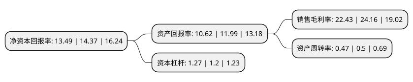

> 本页面由自动化程序生成于 2022年5月20日 01:20
> 内容可能存在错误，如有bug请提交issue至：https://github.com/Eroleice/doc-pi/issues
{.is-warning}

# 上市公司基本情况

## 基本资料

浙江泰林生物技术股份有限公司（以下简称“泰林生物”）成立于2002年01月08日，杭州市。于2020年01月14日在深交所创业板上市。

泰林生物注册资本5,197万元，主营业务为微生物检测与控制技术系统产品，有机物分析仪器等制药装备的研发，制造和销售，公司产品包括各类耗材，仪器和设备，可单独或组合应用于无菌药品的质量检测和生产辅助，同时可以拓展的应用领域包括医疗卫生，食品安全，疾病防控，生物安全，检验检疫，生物工程，实验动物和环境保护等大健康产业。以下是详细信息：

- 公司名称: 浙江泰林生物技术股份有限公司
- 股票代码: 300813.SZ
- 所在地: 浙江 - 杭州市
- 成立日期: 2002年01月08日
- 注册资本: 5,197万元
- 法定代表人: 叶大林
- 主营业务: 主营业务为微生物检测与控制技术系统产品，有机物分析仪器等制药装备的研发，制造和销售，公司产品包括各类耗材，仪器和设备，可单独或组合应用于无菌药品的质量检测和生产辅助，同时可以拓展的应用领域包括医疗卫生，食品安全，疾病防控，生物安全，检验检疫，生物工程，实验动物和环境保护等大健康产业
- 公司官网: www.tailingood.com
- 公司介绍: 公司主营业务为微生物检测与控制技术系统产品、有机物分析仪器等制药装备的研发、制造和销售，具体产品包括各类耗材、仪器和设备，可单独或组合应用于无菌药品的生产和质量检测，同时可以拓展的应用领域包括医疗卫生、食品安全、疾病防控、生物安全、检验检疫、生物工程、实验动物和环境保护等大健康产业。作为高新技术企业，公司曾参与制定20项国家标准和行业标准，其中12项为第一作者，多项产品技术促进了《中国药典》相关标准的修订和增订；目前，公司拥有200项专利，其中发明专利16项，承担了“高性能智能化无菌检测仪的开发和应用”、“高等级病原微生物实验室生物安全防护技术与产品研究”和“劳动密集型洁净厂房职业病危害防护技术与装备研发”等三个“十三五国家科技创新规划--国家重点研发计划”项目，分别担任其中的项目牵头承担单位、子项目参与单位和关键装备研发单位。

## 股东及高管情况

上市公司第一大股东为叶大林，持股27,800,000股，占比53.49%，为上市公司实际控制人。

截至2022年03月31日，上市公司的前十大股东中，共有4名自然人股东，1名机构股东，5个产品账户，其中5%以上大股东共有3名。上市公司前十大股东明细如下：

> 截至2022年03月31日，上市公司前十大股东信息如下：

| 股东名称 | 持股数量（股） | 持股比例 |
| --- | --- | --- |
| 叶大林 | 27,800,000 | 53.49% |
| 宁波高得股权投资管理合伙企业(有限合伙) | 3,750,000 | 7.22% |
| 倪卫菊 | 3,030,000 | 5.83% |
| 上海浦东发展银行股份有限公司-华夏创新未来18个月封闭运作混合型证券投资基金 | 645,565 | 1.24% |
| 基本养老保险基金三零九组合 | 557,900 | 1.07% |
| 夏信群 | 530,100 | 1.02% |
| 中国建设银行股份有限公司-银华多元机遇混合型证券投资基金 | 482,104 | 0.93% |
| 中国建设银行股份有限公司-农银汇理医疗保健主题股票型证券投资基金 | 464,200 | 0.89% |
| 潘春晓 | 461,299 | 0.89% |
| 中国建设银行股份有限公司-银华核心价值优选混合型证券投资基金 | 443,886 | 0.85% |

## 利润表分析

上市公司2021年总收入为2.83亿元，净利润为0.63亿元，实现盈利。

## 杜邦分析

> 数据列示周期：2021年 | 2020年 | 2019年
{.is-info}

上市公司的净资产收益率在近一年有所下降，下降幅度为-6.12%，其变化情况分解如下：
- 上市公司的销售毛利率在近一年下降了-7.16%，可能是生产效率的下降、商品原材料价格上涨或商品价格的下跌所致。
- 上市公司的资产周转率在近一年下降了-6%，可能是源自于更慢的销售回款或库存管理效果下降。
- 上市公司的财务杠杆比率在近一年上升了5.83%，可能是增加负债扩大生产规模。

