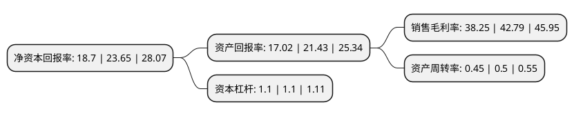

> 本页面由自动化程序生成于 2022年5月20日 01:20
> 内容可能存在错误，如有bug请提交issue至：https://github.com/Eroleice/doc-pi/issues
{.is-warning}

# 上市公司基本情况

## 基本资料

深圳市新产业生物医学工程股份有限公司（以下简称“新产业”）成立于1995年12月15日，深圳市。于2020年05月12日在深交所创业板上市。

新产业注册资本78,665.929万元，主要从事研发，生产及销售系列全自动化学发光免疫分析仪器及配套试剂，公司产品主要用于提供疾病的预防，诊断，治疗监测，预后观察，健康状态评价以及遗传性疾病预测等方面的诊断信息。以下是详细信息：

- 公司名称: 深圳市新产业生物医学工程股份有限公司
- 股票代码: 300832.SZ
- 所在地: 广东 - 深圳市
- 成立日期: 1995年12月15日
- 注册资本: 78,665.929万元
- 法定代表人: 饶微
- 主营业务: 主要从事研发，生产及销售系列全自动化学发光免疫分析仪器及配套试剂，公司产品主要用于提供疾病的预防，诊断，治疗监测，预后观察，健康状态评价以及遗传性疾病预测等方面的诊断信息
- 公司官网: www.snibe.com
- 公司介绍: 公司主要从事研发、生产及销售系列全自动化学发光免疫分析仪器及配套试剂，是国内该领域的领先者。公司产品主要用于提供疾病的预防、诊断、治疗监测、预后观察、健康状态评价以及遗传性疾病预测等方面的诊断信息。公司所处行业为医疗诊断、监护及治疗设备制造业，具体为体外诊断行业。截至2020年3月31日，公司主要有8款全自动化学发光免疫分析仪器1，122项配套试剂2，均已获得医疗器械产品注册证，是国内提供化学发光免疫诊断试剂种类最多的供应商之一。此外，公司亦积极拓展生化分析产品线，截至2020年3月31日，公司拥有4款全自动生化分析仪器，并拥有39项配套试剂，均已获得医疗器械产品注册证。公司仪器型号系列化，能够满足不同用户对仪器测试速度、样本和试剂装载量的需求；配套试剂涵盖甲状腺、性腺、肿瘤标志物、代谢、肝纤维化、传染病等检测项目，能够满足不同用户的检测需求。

## 股东及高管情况

上市公司第一大股东为西藏新产业投资管理有限公司，持股211,177,400股，占比26.84%，**疑似为**上市公司实际控制人。

截至2022年03月31日，上市公司的前十大股东中，共有4名自然人股东，5名机构股东，1个产品账户，其中5%以上大股东共有3名。上市公司前十大股东明细如下：

> 未能通过持股比例判定出上市公司实际控制人（持股30%以上）
> 可能存在通过间接持股、联合持股、协议控制等方式拥有实际控制权的主体，具体请参考上市公司定期公告！
{.is-warning}

> 截至2022年03月31日，上市公司前十大股东信息如下：

| 股东名称 | 持股数量（股） | 持股比例 |
| --- | --- | --- |
| 西藏新产业投资管理有限公司 | 211,177,400 | 26.84% |
| 天津红杉聚业股权投资合伙企业(有限合伙) | 122,740,000 | 15.6% |
| 饶微 | 108,205,000 | 13.76% |
| 翁先定 | 26,197,200 | 3.33% |
| 饶捷 | 25,066,700 | 3.19% |
| 赣州壹盛投资合伙企业(有限合伙) | 20,705,016 | 2.63% |
| 全国社保基金五零三组合 | 17,499,922 | 2.22% |
| 众怡嘉康(天津)投资合伙企业(有限合伙) | 12,285,085 | 1.56% |
| 宋洪涛 | 9,798,700 | 1.25% |
| 深圳市华澳创业投资企业(有限合伙) | 8,687,670 | 1.1% |

## 利润表分析

上市公司2021年总收入为25.45亿元，净利润为9.73亿元，实现盈利。

## 杜邦分析

> 数据列示周期：2021年 | 2020年 | 2019年
{.is-info}

上市公司的净资产收益率在近一年有所下降，下降幅度为-20.93%，其变化情况分解如下：
- 上市公司的销售毛利率在近一年下降了-10.61%，可能是生产效率的下降、商品原材料价格上涨或商品价格的下跌所致。
- 上市公司的资产周转率在近一年下降了-10%，可能是源自于更慢的销售回款或库存管理效果下降。
- 上市公司的财务杠杆比率在近一年下降了0%，可能是减少负债降低财务费用。

