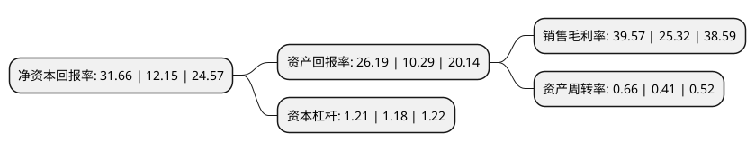

> 本页面由自动化程序生成于 2022年5月20日 01:21
> 内容可能存在错误，如有bug请提交issue至：https://github.com/Eroleice/doc-pi/issues
{.is-warning}

# 上市公司基本情况

## 基本资料

深圳市易瑞生物技术股份有限公司（以下简称“易瑞生物”）成立于2007年07月24日，深圳市。于2021年02月09日在深交所创业板上市。

易瑞生物注册资本40,086万元，主营业务为食品安全精准快速检测产品的研发，生产，销售及相关服务。以下是详细信息：

- 公司名称: 深圳市易瑞生物技术股份有限公司
- 股票代码: 300942.SZ
- 所在地: 广东 - 深圳市
- 成立日期: 2007年07月24日
- 注册资本: 40,086万元
- 法定代表人: 卢和华
- 主营业务: 主营业务为食品安全精准快速检测产品的研发，生产，销售及相关服务
- 公司官网: www.bioeasy.com
- 公司介绍: 公司作为高新技术企业，在专业人才与研发平台的支持下，承担了多项国家、省、市、区级重点研发项目，公司始终专注于食品安全快速检测领域，公司产品主要应用于乳品、肉类、水产、粮油及水果蔬菜等食品领域以及对应的种养殖环节，能够实现对兽药残留、农药残留、真菌毒素、非法添加剂、重金属等多种限量物以及致病微生物的高精度检测，为食品生产加工企业、农业种养殖产业、食品药品监督管理部门及个人消费者等提供专业、优质的食品安全快速检测产品，精准配置快检方案。公司及其产品曾获得“国家质量监督检验检疫总局‘科技兴检奖’(一等奖)”、“广东省科学技术奖励(二等奖)”、“江苏省科学技术奖(二等奖)”、“深圳市科技进步奖(一等奖)”、“深圳市宝安区科学技术奖”、“广东省自主创新示范企业”等荣誉称号。部分产品取得了欧盟CE认证、美国FDA认证、美国分析化学家协会(AOAC)认证等国际认证，是新西兰、白俄罗斯、法国、比利时、波兰、厄瓜多尔等国家认可的中国大陆快检产品。

## 股东及高管情况

上市公司第一大股东为深圳市易瑞控股有限公司，持股151,001,310股，占比37.67%，为上市公司实际控制人。

截至2022年05月12日，上市公司的前十大股东中，共有3名自然人股东，7名机构股东，其中5%以上大股东共有10名。上市公司前十大股东明细如下：

> 截至2022年05月12日，上市公司前十大股东信息如下：

| 股东名称 | 持股数量（股） | 持股比例 |
| --- | --- | --- |
| 深圳市易瑞控股有限公司 | 151,001,310 | 37.67% |
| 深圳市易瑞控股有限公司 | 151,001,310 | 37.67% |
| 朱海 | 75,213,909 | 18.76% |
| 朱海 | 75,213,909 | 18.76% |
| 朱海 | 75,213,909 | 18.76% |
| 深圳易凯瑞管理咨询合伙企业(有限合伙) | 23,544,903 | 5.87% |
| 深圳易达瑞管理咨询合伙企业(有限合伙) | 23,544,903 | 5.87% |
| 深圳易凯瑞管理咨询合伙企业(有限合伙) | 23,544,903 | 5.87% |
| 深圳易达瑞管理咨询合伙企业(有限合伙) | 23,544,903 | 5.87% |
| 北京红杉坤德投资管理中心(有限合伙)-宁波梅山保税港区红杉智盛股权投资合伙企业(有限合伙) | 20,246,008 | 5.0506% |

## 利润表分析

上市公司2021年总收入为5.97亿元，净利润为2.36亿元，实现盈利。

## 杜邦分析

> 数据列示周期：2021年 | 2020年 | 2019年
{.is-info}

上市公司的净资产收益率在近一年有所上升，上升幅度为160.58%，其变化情况分解如下：
- 上市公司的销售毛利率在近一年上升了56.28%，可能是生产效率的提升、商品原材料价格下跌或商品价格的上涨所致。
- 上市公司的资产周转率在近一年上升了60.98%，可能是源自于更快的销售回款或库存管理效果提升。
- 上市公司的财务杠杆比率在近一年上升了2.54%，可能是增加负债扩大生产规模。

