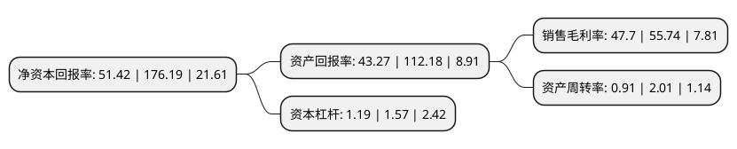

> 本页面由自动化程序生成于 2022年5月20日 01:22
> 内容可能存在错误，如有bug请提交issue至：https://github.com/Eroleice/doc-pi/issues
{.is-warning}

# 上市公司基本情况

## 基本资料

中红普林医疗用品股份有限公司（以下简称“中红医疗”）成立于2010年12月22日，唐山市。于2021年04月27日在深交所创业板上市。

中红医疗注册资本16,667万元，公司主要从事高品质丁腈手套，PVC手套等医用及工业用一次性防护手套的研发，生产与销售。，公司主要产品为一次性健康防护手套。以下是详细信息：

- 公司名称: 中红普林医疗用品股份有限公司
- 股票代码: 300981.SZ
- 所在地: 河北 - 唐山市
- 成立日期: 2010年12月22日
- 注册资本: 16,667万元
- 法定代表人: 桑树军
- 主营业务: 公司主要从事高品质丁腈手套，PVC手套等医用及工业用一次性防护手套的研发，生产与销售，公司主要产品为一次性健康防护手套
- 公司官网: www.zhonghongmedical.com
- 公司介绍: 公司主要从事高品质丁腈手套、PVC手套等医用及工业用一次性防护手套的研发、生产与销售。公司是国内最早生产销售PVC手套和丁腈手套的企业之一，自成立以来，始终专注于一次性健康防护领域，致力于为医疗、防护、食品、电子等行业客户提供性能稳定、品质卓越的防护手套产品，在国内外一次性健康防护手套市场拥有较高的知名度。公司被河北省科学技术厅认定为“河北省科技型中小企业”，被中国出口信用保险公司评为AAA+级客户。经过多年的经营积累及自主创新，公司现拥有26项专利技术，累计开发多种规格的一次性健康防护手套，可满足客户对手套性能、尺码、颜色、克重、长短等多种规格要求。公司先后通过了ISO9001国际质量体系认证、美国FDA认证、欧盟CE认证、ISO13485国际质量体系认证等，产品出口到北美、欧洲、日本等国外发达国家和地区的医疗、防护、食品、电子加工市场，远销美国、加拿大、德国、英国、法国、意大利、西班牙、荷兰、挪威、瑞典、澳大利亚、新西兰、日本等全球众多国家和地区。

## 股东及高管情况

上市公司第一大股东为中红普林集团有限公司，持股75,000,000股，占比45%，为上市公司实际控制人。

截至2022年03月31日，上市公司的前十大股东中，共有4名自然人股东，5名机构股东，1个产品账户，其中5%以上大股东共有3名。上市公司前十大股东明细如下：

> 截至2022年03月31日，上市公司前十大股东信息如下：

| 股东名称 | 持股数量（股） | 持股比例 |
| --- | --- | --- |
| 中红普林集团有限公司 | 75,000,000 | 45% |
| 厦门国贸控股集团有限公司 | 25,250,000 | 15.15% |
| 桑树军 | 18,560,000 | 11.14% |
| 张静 | 5,900,000 | 3.54% |
| 滦南普发商贸有限公司 | 2,440,000 | 1.46% |
| 厦门柏宏锐尔科技投资有限公司 | 1,875,000 | 1.12% |
| 厦门咏诚资产管理有限公司 | 1,875,000 | 1.12% |
| 中国银行股份有限公司-华宝中证医疗交易型开放式指数证券投资基金 | 700,894 | 0.42% |
| 宋俊 | 288,300 | 0.17% |
| 黎青松 | 247,500 | 0.15% |

## 利润表分析

上市公司2021年总收入为49.09亿元，净利润为23.41亿元，实现盈利。

## 杜邦分析

> 数据列示周期：2021年 | 2020年 | 2019年
{.is-info}

上市公司的净资产收益率在近一年有所下降，下降幅度为-70.82%，其变化情况分解如下：
- 上市公司的销售毛利率在近一年下降了-14.42%，可能是生产效率的下降、商品原材料价格上涨或商品价格的下跌所致。
- 上市公司的资产周转率在近一年下降了-54.73%，可能是源自于更慢的销售回款或库存管理效果下降。
- 上市公司的财务杠杆比率在近一年下降了-24.2%，可能是减少负债降低财务费用。

