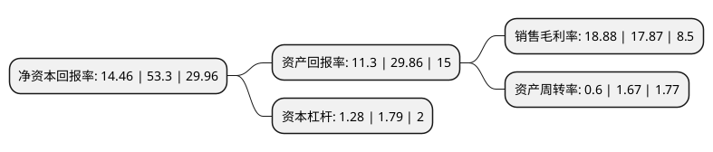

> 本页面由自动化程序生成于 2022年5月20日 01:22
> 内容可能存在错误，如有bug请提交issue至：https://github.com/Eroleice/doc-pi/issues
{.is-warning}

# 上市公司基本情况

## 基本资料

可孚医疗科技股份有限公司（以下简称“可孚医疗”）成立于2009年11月19日，长沙市。于2021年10月25日在深交所创业板上市。

可孚医疗注册资本16,037.5万元，专业从事家用医疗器械的研发，生产，销售和服务。以下是详细信息：

- 公司名称: 可孚医疗科技股份有限公司
- 股票代码: 301087.SZ
- 所在地: 湖南 - 长沙市
- 成立日期: 2009年11月19日
- 注册资本: 16,037.5万元
- 法定代表人: 张敏
- 主营业务: 专业从事家用医疗器械的研发，生产，销售和服务
- 公司官网: www.cofoe.com.cn
- 公司介绍: 可孚医疗是一家国内领先的大型、综合性家用医疗器械企业，专业从事家用医疗器械的研发、生产、销售和服务。经过十多年的专业化经营，可孚医疗已经发展成为家用医疗器械领域内品种齐、渠道全、技术先进、具有较强竞争力和影响力的企业。可孚医疗自创立之初即致力于为用户提供可靠的医疗健康产品和一站式解决方案。在大健康消费升级和电子商务迅速发展的行业背景下，公司不断强化数字运营能力，深度研究用户需求。通过持续创新的研发、科学合理的产品策划和全过程质量管理，公司迭代推出血压计、护理床、红外体温计、雾化器、轮椅等多款高品质畅销产品，积累了良好的市场口碑和品牌知名度。家用医疗器械主要是指适于公众在院外使用，安全可靠、操作简单、体积小、携带方便的以检测、治疗、保健及康复为目的的医疗器械。家用医疗器械产品种类繁多，公司主要产品涵盖五大领域：健康监测、康复辅具、呼吸支持、中医理疗、医疗护理。

## 股东及高管情况

上市公司第一大股东为长沙械字号医疗投资有限公司，持股65,446,095股，占比40.81%，为上市公司实际控制人。

截至2022年03月31日，上市公司的前十大股东中，共有3名自然人股东，3名机构股东，4个产品账户，其中5%以上大股东共有4名。上市公司前十大股东明细如下：

> 截至2022年03月31日，上市公司前十大股东信息如下：

| 股东名称 | 持股数量（股） | 持股比例 |
| --- | --- | --- |
| 长沙械字号医疗投资有限公司 | 65,446,095 | 40.81% |
| 长沙科源同创企业管理中心(有限合伙) | 9,319,139 | 5.81% |
| 张敏 | 9,319,139 | 5.81% |
| 宁波怀格健康投资管理合伙企业(有限合伙)-宁波怀格共信股权投资合伙企业(有限合伙) | 8,103,599 | 5.05% |
| 张志明 | 5,591,483 | 3.49% |
| 广州丹麓股权投资管理有限公司-广州丹麓创业投资基金合伙企业(有限合伙) | 4,676,253 | 2.92% |
| 湘潭产兴鼎信私募股权基金企业(有限合伙) | 3,908,795 | 2.44% |
| 湖南达晨文化旅游创业投资管理有限公司-湖南文化旅游创业投资基金企业(有限合伙) | 3,896,878 | 2.43% |
| 聂娟 | 2,681,338 | 1.67% |
| 长沙雨花经开鼎信私募股权基金合伙企业(有限合伙) | 2,392,945 | 1.49% |

## 利润表分析

上市公司2021年总收入为22.75亿元，净利润为4.29亿元，实现盈利。

## 杜邦分析

> 数据列示周期：2021年 | 2020年 | 2019年
{.is-info}

上市公司的净资产收益率在近一年有所下降，下降幅度为-72.87%，其变化情况分解如下：
- 上市公司的销售毛利率在近一年上升了5.65%，可能是生产效率的提升、商品原材料价格下跌或商品价格的上涨所致。
- 上市公司的资产周转率在近一年下降了-64.07%，可能是源自于更慢的销售回款或库存管理效果下降。
- 上市公司的财务杠杆比率在近一年下降了-28.49%，可能是减少负债降低财务费用。

