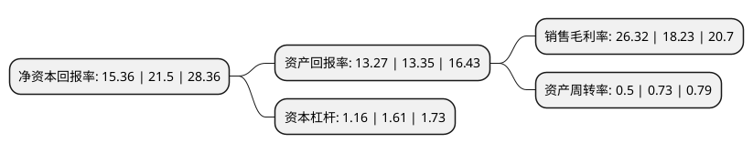

> 本页面由自动化程序生成于 2022年5月20日 01:22
> 内容可能存在错误，如有bug请提交issue至：https://github.com/Eroleice/doc-pi/issues
{.is-warning}

# 上市公司基本情况

## 基本资料

江苏华兰药用新材料股份有限公司（以下简称“华兰股份”）成立于1992年06月04日，无锡市。于2021年11月01日在深交所创业板上市。

华兰股份注册资本13,466.667万元，主要从事直接接触注射剂类药品包装材料的研发，生产和销售，主要产品包括各类覆膜胶塞，常规胶塞等以下是详细信息：

- 公司名称: 江苏华兰药用新材料股份有限公司
- 股票代码: 301093.SZ
- 所在地: 江苏 - 无锡市
- 成立日期: 1992年06月04日
- 注册资本: 13,466.667万元
- 法定代表人: 华国平
- 主营业务: 主要从事直接接触注射剂类药品包装材料的研发，生产和销售，主要产品包括各类覆膜胶塞，常规胶塞等
- 公司官网: www.hlnpm.com
- 公司介绍: 公司成立于1992年，凭借多年努力，现已发展成为一家实力雄厚、品种齐全、技术领先、规模优势显著的专业生产直接或间接接触药物包装材料的现代化高新技术企业。公司主要从事输液、冻干、粉针、小水针、采血、中药复方制剂用各类“华兰”牌胶塞和软袋接口三组件、塑瓶接口三组件、塑料输液容器用聚异戊二烯橡胶垫片等的制造和销售。在经营过程中，公司以“有诚就有成”的理念与国内外客户进行业务合作，优质的产品、良好的服务使华兰股份在市场上树立了良好的形象，赢得众多用户的依赖和社会各界的好评。近年来，公司多次被广大客户评为优秀供应商。2011年“华兰”商标荣获中国驰名商标称号。公司将始终以“以股东利益最大化、社会责任永久化、客户利益市场化”的公司宗旨，坚持“华兰产品等于药品，华兰产品安全有效”的质量方针，深化“诚信为本，人文团队，勇于创新，铸造品牌”的经营理念，不断推动企业科技进步，早日跻身药包行业世界前列。

## 股东及高管情况

上市公司第一大股东为江阴华兰机电科技有限公司，持股28,280,000股，占比21%，**疑似为**上市公司实际控制人。

截至2022年03月31日，上市公司的前十大股东中，共有3名自然人股东，7名机构股东，其中5%以上大股东共有3名。上市公司前十大股东明细如下：

> 未能通过持股比例判定出上市公司实际控制人（持股30%以上）
> 可能存在通过间接持股、联合持股、协议控制等方式拥有实际控制权的主体，具体请参考上市公司定期公告！
{.is-warning}

> 截至2022年03月31日，上市公司前十大股东信息如下：

| 股东名称 | 持股数量（股） | 持股比例 |
| --- | --- | --- |
| 江阴华兰机电科技有限公司 | 28,280,000 | 21% |
| 华夏人寿保险股份有限公司 | 21,956,522 | 16.3% |
| 华一敏 | 7,126,249 | 5.29% |
| 范素月 | 5,006,087 | 3.72% |
| 宁波励鼎股权投资合伙企业(有限合伙) | 4,117,692 | 3.06% |
| 上海亿宸投资管理有限公司-日照宸睿联合一期股权投资管理中心(有限合伙) | 3,884,615 | 2.88% |
| 王家华 | 3,107,692 | 2.31% |
| 上海林拙投资合伙企业(有限合伙)-宁波梅山保税港区惟勤投资合伙企业(有限合伙) | 2,459,129 | 1.83% |
| 上海汉仁股权投资中心(有限合伙) | 2,195,652 | 1.63% |
| 南京高科新浚创新股权投资合伙企业(有限合伙) | 1,990,503 | 1.48% |

## 利润表分析

上市公司2021年总收入为8.2亿元，净利润为2.16亿元，实现盈利。

## 杜邦分析

> 数据列示周期：2021年 | 2020年 | 2019年
{.is-info}

上市公司的净资产收益率在近一年有所下降，下降幅度为-28.56%，其变化情况分解如下：
- 上市公司的销售毛利率在近一年上升了44.38%，可能是生产效率的提升、商品原材料价格下跌或商品价格的上涨所致。
- 上市公司的资产周转率在近一年下降了-31.51%，可能是源自于更慢的销售回款或库存管理效果下降。
- 上市公司的财务杠杆比率在近一年下降了-27.95%，可能是减少负债降低财务费用。

