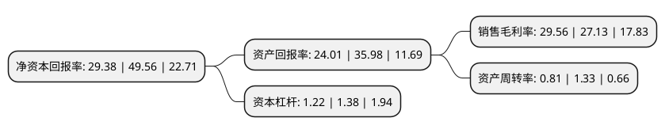

> 本页面由自动化程序生成于 2022年5月20日 01:23
> 内容可能存在错误，如有bug请提交issue至：https://github.com/Eroleice/doc-pi/issues
{.is-warning}

# 上市公司基本情况

## 基本资料

采纳科技股份有限公司（以下简称“采纳股份”）成立于2004年07月23日，无锡市。于2022年01月26日在深交所创业板上市。

采纳股份注册资本9,403.512万元，主要从事注射穿刺器械及实验室耗材的研发，生产和销售，主要产品为兽用及医用注射穿刺产品。以下是详细信息：

- 公司名称: 采纳科技股份有限公司
- 股票代码: 301122.SZ
- 所在地: 江苏 - 无锡市
- 成立日期: 2004年07月23日
- 注册资本: 9,403.512万元
- 法定代表人: 陆军
- 主营业务: 主要从事注射穿刺器械及实验室耗材的研发，生产和销售，主要产品为兽用及医用注射穿刺产品
- 公司官网: www.caina.ltd
- 公司介绍: 公司主要从事注射穿刺器械及实验室耗材的研发、生产和销售，通过ODM/OEM等方式为包括纽勤(Neogen)、麦朗(Medline)、赛默飞世尔(ThermoFisher)、麦克森(Mckesson)在内的全球知名医疗企业提供穿刺针、注射器、实验室耗材等相关产品。公司注射穿刺器械按照产品适用对象的差异可分为兽用器械和医用器械，其中，兽用器械包括兽用注射器、注射针等穿刺注射器械，主要用于动物防治防疫的药液注射；医用器械包括各类一次性注射器、注射针、采血针、胰岛素注射器/针、导管类输注产品等医用耗材，主要适用于人体皮下、皮内、肌肉、静脉等注射或输注。公司实验室耗材主要包括培养皿、试剂管、细菌过滤盒等产品，用于对各类药品、食品、保健品(主要是液体类的)等微生物或细菌进行检测。公司可为客户提供注射穿刺器械、实验室耗材等产品的概念创意、市场调研、产品设计、材料选择、模具设计及开发、工艺设计及开发、临床试验等在内的全流程服务。公司拥有国内发明专利4项，实用新型专利55项，境外PCT专利1项，公司产品质量管理体系接轨国际标准，通过ISO9001、ISO13485、MDSAP等多项认证。

## 股东及高管情况

上市公司第一大股东为陆军，持股26,600,000股，占比28.29%，**疑似为**上市公司实际控制人。

截至2022年03月31日，上市公司的前十大股东中，共有3名自然人股东，5名机构股东，2个产品账户，其中5%以上大股东共有5名。上市公司前十大股东明细如下：

> 未能通过持股比例判定出上市公司实际控制人（持股30%以上）
> 可能存在通过间接持股、联合持股、协议控制等方式拥有实际控制权的主体，具体请参考上市公司定期公告！
{.is-warning}

> 截至2022年03月31日，上市公司前十大股东信息如下：

| 股东名称 | 持股数量（股） | 持股比例 |
| --- | --- | --- |
| 陆军 | 26,600,000 | 28.29% |
| 陆维炜 | 15,200,000 | 16.16% |
| 中信保诚人寿保险有限公司 | 7,368,422 | 7.84% |
| 赵红 | 6,000,000 | 6.38% |
| 江阴市炜达尔企业管理中心(有限合伙) | 5,000,000 | 5.32% |
| 无锡维达元投资企业(有限合伙) | 3,600,000 | 3.83% |
| 无锡维达丰投资企业(有限合伙) | 3,600,000 | 3.83% |
| 江阴市新国联集团有限公司 | 3,157,900 | 3.36% |
| 中国银行股份有限公司-易方达医疗保健行业混合型证券投资基金 | 1,583,288 | 1.68% |
| 中国银行股份有限公司-广发医疗保健股票型证券投资基金 | 895,470 | 0.95% |

## 利润表分析

上市公司2021年总收入为4.42亿元，净利润为1.3亿元，实现盈利。

## 杜邦分析

> 数据列示周期：2021年 | 2020年 | 2019年
{.is-info}

上市公司的净资产收益率在近一年有所下降，下降幅度为-40.72%，其变化情况分解如下：
- 上市公司的销售毛利率在近一年上升了8.96%，可能是生产效率的提升、商品原材料价格下跌或商品价格的上涨所致。
- 上市公司的资产周转率在近一年下降了-39.1%，可能是源自于更慢的销售回款或库存管理效果下降。
- 上市公司的财务杠杆比率在近一年下降了-11.59%，可能是减少负债降低财务费用。

