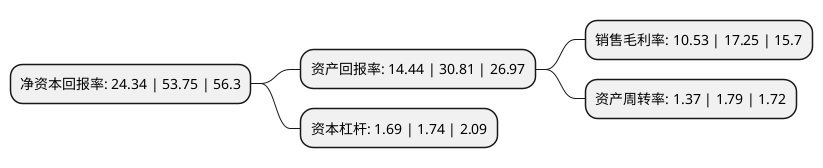

> 本页面由自动化程序生成于 2022年5月20日 01:23
> 内容可能存在错误，如有bug请提交issue至：https://github.com/Eroleice/doc-pi/issues
{.is-warning}

## 股东及高管情况

上市公司第一大股东为石河子市玺泰股权投资合伙企业(有限合伙)，持股11,364,200股，占比18.94%，**疑似为**上市公司实际控制人。

截至2022年05月17日，上市公司的前十大股东中，共有1名自然人股东，9名机构股东，其中5%以上大股东共有6名。上市公司前十大股东明细如下：

> 未能通过持股比例判定出上市公司实际控制人（持股30%以上）
> 可能存在通过间接持股、联合持股、协议控制等方式拥有实际控制权的主体，具体请参考上市公司定期公告！
{.is-warning}

> 截至2022年05月17日，上市公司前十大股东信息如下：

| 股东名称 | 持股数量（股） | 持股比例 |
| --- | --- | --- |
| 石河子市玺泰股权投资合伙企业(有限合伙) | 11,364,200 | 18.94% |
| 观由昭泰(嘉兴)股权投资合伙企业(有限合伙) | 7,245,000 | 12.08% |
| 石河子市睿新股权投资合伙企业(有限合伙) | 4,921,200 | 8.2% |
| 宁波汇桥弘甲股权投资合伙企业(有限合伙) | 4,500,000 | 7.5% |
| 石河子市睿泽盛股权投资有限公司 | 4,500,000 | 7.5% |
| 赖春宝 | 3,415,500 | 5.69% |
| 新疆泰睿股权投资合伙企业(有限合伙) | 2,298,600 | 3.83% |
| 平潭弘润盈科新材料创业投资合伙企业(有限合伙) | 2,250,000 | 3.75% |
| 西安泰明股权投资合伙企业(有限合伙) | 900,000 | 1.5% |
| 珠海高瓴思恒股权投资合伙企业(有限合伙) | 900,000 | 1.5% |

## 杜邦分析

> 数据列示周期：2020年 | 2019年 | 2018年
{.is-info}

上市公司的净资产收益率在近一年有所下降，下降幅度为-54.72%，其变化情况分解如下：
- 上市公司的销售毛利率在近一年下降了-38.96%，可能是生产效率的下降、商品原材料价格上涨或商品价格的下跌所致。
- 上市公司的资产周转率在近一年下降了-23.46%，可能是源自于更慢的销售回款或库存管理效果下降。
- 上市公司的财务杠杆比率在近一年下降了-2.87%，可能是减少负债降低财务费用。

