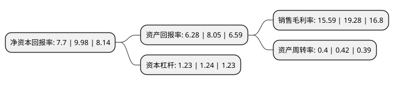

> 本页面由自动化程序生成于 2022年5月20日 01:24
> 内容可能存在错误，如有bug请提交issue至：https://github.com/Eroleice/doc-pi/issues
{.is-warning}

# 上市公司基本情况

## 基本资料

北京万东医疗科技股份有限公司（以下简称“万东医疗”）成立于1997年05月12日，北京市。于1997年05月19日在上交所主板上市。

万东医疗注册资本54,081.62万元，主要产品为医用X射线诊疗设备，磁共振成像设备等。以下是详细信息：

- 公司名称: 北京万东医疗科技股份有限公司
- 股票代码: 600055.SH
- 所在地: 北京 - 北京市
- 成立日期: 1997年05月12日
- 注册资本: 54,081.62万元
- 法定代表人: 胡自强
- 主营业务: 主要产品为医用X射线诊疗设备，磁共振成像设备等
- 公司官网: www.wandong.com.cn
- 公司介绍: 公司致力于医用X射线诊断设备、磁共振成像设备、齿科诊断和治疗设备、血液健康产品的开发、生产与销售，是国内主要的医疗器械提供商之一。公司是中国医疗器械工业的骨干企业，在医用X射线诊断设备相关技术和医学影像技术领域处于全国领先地位，以大型血管造影和介入治疗系统、高频数字胃肠诊断系统和直接数字成像系统为代表的高端产品，其技术含量已达到国际同类产品先进水平，主导产品相继通过了欧盟CE产品认证和美国FDA产品认证。

## 股东及高管情况

上市公司第一大股东为美的集团股份有限公司，持股319,579,981股，占比45.46%，为上市公司实际控制人。

截至2022年03月31日，上市公司的前十大股东中，共有6名自然人股东，3名机构股东，1个产品账户，其中5%以上大股东共有1名。上市公司前十大股东明细如下：

> 截至2022年03月31日，上市公司前十大股东信息如下：

| 股东名称 | 持股数量（股） | 持股比例 |
| --- | --- | --- |
| 美的集团股份有限公司 | 319,579,981 | 45.46% |
| 江苏鱼跃科技发展有限公司 | 18,031,825 | 2.56% |
| 赵家礼 | 15,000,023 | 2.13% |
| 上海云锋新创股权投资中心(有限合伙) | 7,897,883 | 1.12% |
| 吴庆 | 5,409,500 | 0.77% |
| 北京万东医疗科技股份有限公司回购专用证券账户 | 4,938,333 | 0.7% |
| 侯志平 | 4,551,200 | 0.65% |
| 庄华彬 | 3,547,800 | 0.5% |
| 姜永新 | 3,201,400 | 0.46% |
| 田小风 | 3,161,800 | 0.45% |

## 利润表分析

上市公司2021年总收入为11.56亿元，净利润为1.8亿元，实现盈利。

## 杜邦分析

> 数据列示周期：2021年 | 2020年 | 2019年
{.is-info}

上市公司的净资产收益率在近一年有所下降，下降幅度为-22.85%，其变化情况分解如下：
- 上市公司的销售毛利率在近一年下降了-19.14%，可能是生产效率的下降、商品原材料价格上涨或商品价格的下跌所致。
- 上市公司的资产周转率在近一年下降了-4.76%，可能是源自于更慢的销售回款或库存管理效果下降。
- 上市公司的财务杠杆比率在近一年下降了-0.81%，可能是减少负债降低财务费用。

