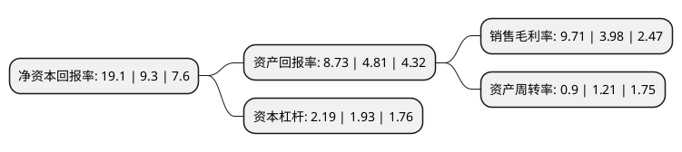

> 本页面由自动化程序生成于 2022年5月20日 01:25
> 内容可能存在错误，如有bug请提交issue至：https://github.com/Eroleice/doc-pi/issues
{.is-warning}

# 上市公司基本情况

## 基本资料

无锡商业大厦大东方股份有限公司（以下简称“大东方”）成立于1998年01月20日，无锡市。于2002年06月25日在上交所主板上市。

大东方注册资本88,477.952万元，主要业务:百货零售，汽车零售，超市，餐饮服务。以下是详细信息：

- 公司名称: 无锡商业大厦大东方股份有限公司
- 股票代码: 600327.SH
- 所在地: 江苏 - 无锡市
- 成立日期: 1998年01月20日
- 注册资本: 88,477.952万元
- 法定代表人: 高兵华
- 主营业务: 百货零售，汽车零售，超市，餐饮服务
- 公司官网: www.eastall.com
- 公司介绍: 公司是无锡市的商业龙头企业之一，除了主业百货业务之外，公司汽车销售和多元化经营也初显成效。公司以无锡为中心辐射范围内，形成消费领域的百货零售、汽车销售与服务、食品与餐饮——三个核心。“大东方百货”定位于中高端精品百货的销售与服务，主要为满足消费者的个性化、高端化商品需求。“东方汽车”定位于规模化的汽车销售及服务，与多个汽车品牌厂家建立合作关系，在无锡和周边城市共拥有多家4S门店。“三凤桥”目前由熟食产品、包装食品、餐饮等板块组成，产品销往全国多个大中城市以及日本、东南亚等国家；餐饮下辖三凤酒家、客堂间食府、大排档食府三家餐厅，以继承典型无锡本帮菜为特色，以江南“无锡的味道”、“家的味道”享有极高的声誉，同时兼顾日、韩、川、粤菜系及时尚创新菜品。公司获得“全国商贸流通服务业先进集体”等荣誉称号。

## 股东及高管情况

上市公司第一大股东为江苏无锡商业大厦集团有限公司，持股395,552,372股，占比44.71%，为上市公司实际控制人。

截至2022年03月31日，上市公司的前十大股东中，共有2名自然人股东，1名机构股东，7个产品账户，其中5%以上大股东共有1名。上市公司前十大股东明细如下：

> 截至2022年03月31日，上市公司前十大股东信息如下：

| 股东名称 | 持股数量（股） | 持股比例 |
| --- | --- | --- |
| 江苏无锡商业大厦集团有限公司 | 395,552,372 | 44.71% |
| 招商银行股份有限公司-上证红利交易型开放式指数证券投资基金 | 35,726,298 | 4.04% |
| 中国工商银行股份有限公司-富国中证红利指数增强型证券投资基金 | 25,372,336 | 2.87% |
| 中国建设银行股份有限公司-大成中证红利指数证券投资基金 | 12,487,052 | 1.41% |
| 中国银行股份有限公司-易方达中证红利交易型开放式指数证券投资基金 | 6,364,020 | 0.72% |
| 基本养老保险基金一零零六组合 | 6,337,920 | 0.72% |
| 基本养老保险基金一零零五组合 | 5,434,221 | 0.61% |
| 王健 | 4,604,456 | 0.52% |
| 基本养老保险基金一零零二组合 | 4,229,700 | 0.48% |
| 高兵华 | 3,829,800 | 0.43% |

## 杜邦分析

> 数据列示周期：2021年 | 2020年 | 2019年
{.is-info}

上市公司的净资产收益率在近一年有所上升，上升幅度为105.38%，其变化情况分解如下：
- 上市公司的销售毛利率在近一年上升了143.97%，可能是生产效率的提升、商品原材料价格下跌或商品价格的上涨所致。
- 上市公司的资产周转率在近一年下降了-25.62%，可能是源自于更慢的销售回款或库存管理效果下降。
- 上市公司的财务杠杆比率在近一年上升了13.47%，可能是增加负债扩大生产规模。

