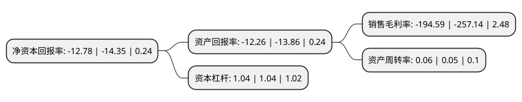

> 本页面由自动化程序生成于 2022年5月20日 01:26
> 内容可能存在错误，如有bug请提交issue至：https://github.com/Eroleice/doc-pi/issues
{.is-warning}

# 上市公司基本情况

## 基本资料

青海春天药用资源科技股份有限公司（以下简称“青海春天”）成立于1998年08月28日，西宁市。于2001年05月08日在上交所主板上市。

青海春天注册资本58,706.074万元，主营业务;青海地区冬虫夏草产品的研发，生产与销售以下是详细信息：

- 公司名称: 青海春天药用资源科技股份有限公司
- 股票代码: 600381.SH
- 所在地: 青海 - 西宁市
- 成立日期: 1998年08月28日
- 注册资本: 58,706.074万元
- 法定代表人: 张雪峰
- 主营业务: 主营业务;青海地区冬虫夏草产品的研发，生产与销售
- 公司官网: www.verygrass.com
- 公司介绍: 公司致力于以高科技手段实现珍稀自然资源的合理开发与可持续发展，尤其在冬虫夏草的高效利用方面居于领先地位，持续为消费者提供更安全、更高效、更经济的冬虫夏草产品，具有较高的市场占有率和品牌美誉度。通过严苛的质量体系管控提升了冬虫夏草行业的整体规范水平，加快了产业变革升级步伐，引领整个行业健康前行、稳步发展。公司建设在青海冬虫夏草湿地公园的参观型生产厂，配备德国、美国、意大利、瑞士的生产及检测设备，建立严格监控的生产流程体系，实现产品制造工艺的先进性和产品质量的稳定性。公司潜心研究，智慧开创了冬虫夏草领域的严苛标准——极草5X冬虫夏草体系，依托自身强大的研发实力、国内外数个研发平台、百余项发明专利和实用新型技术，使极草5X冬虫夏草系列产品成为冬虫夏草物理加工领域的最高科技成果，为冬虫夏草整个产业带来划时代的变革。

## 股东及高管情况

上市公司第一大股东为西藏荣恩科技有限公司，持股199,115,194股，占比33.92%，为上市公司实际控制人。

截至2022年03月31日，上市公司的前十大股东中，共有4名自然人股东，1名机构股东，4个产品账户，1个海外主体，其中5%以上大股东共有2名。上市公司前十大股东明细如下：

> 截至2022年03月31日，上市公司前十大股东信息如下：

| 股东名称 | 持股数量（股） | 持股比例 |
| --- | --- | --- |
| 西藏荣恩科技有限公司 | 199,115,194 | 33.92% |
| 肖融 | 56,762,789 | 9.67% |
| 北京利福资本管理有限公司-利福锦意一号私募证券投资基金 | 29,353,200 | 5% |
| 卢义萍 | 7,646,857 | 1.3% |
| 阳丁华 | 3,727,752 | 0.63% |
| 深圳富延资本管理有限公司-龙成1号私募证券投资基金 | 3,645,800 | 0.62% |
| 王宇慧 | 3,000,000 | 0.51% |
| 北京银杏盛鸿投资管理有限公司-盛鸿君享私募证券投资基金 | 2,414,966 | 0.41% |
| 深圳富延资本管理有限公司-富延1号私募证券投资基金 | 2,270,900 | 0.39% |
| MORGAN STANLEY   & CO. INTERNATIONAL PLC. | 2,116,341 | 0.36% |

## 杜邦分析

> 数据列示周期：2021年 | 2020年 | 2019年
{.is-info}

上市公司的净资产收益率在近一年有所下降，下降幅度为-10.94%，其变化情况分解如下：
- 上市公司的销售毛利率在近一年下降了-24.33%，可能是生产效率的下降、商品原材料价格上涨或商品价格的下跌所致。
- 上市公司的资产周转率在近一年上升了20%，可能是源自于更快的销售回款或库存管理效果提升。
- 上市公司的财务杠杆比率在近一年下降了0%，可能是减少负债降低财务费用。

