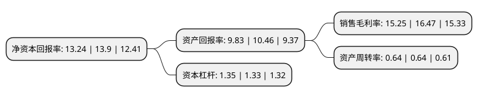

> 本页面由自动化程序生成于 2022年5月20日 01:27
> 内容可能存在错误，如有bug请提交issue至：https://github.com/Eroleice/doc-pi/issues
{.is-warning}

# 上市公司基本情况

## 基本资料

山东省药用玻璃股份有限公司（以下简称“山东药玻”）成立于1993年11月08日，淄博市。于2002年06月03日在上交所主板上市。

山东药玻注册资本59,496.775万元，主要产品:模制瓶，安瓿，管瓶，玻璃管，棕色瓶，丁基胶塞，塑料瓶，铝塑盖。以下是详细信息：

- 公司名称: 山东省药用玻璃股份有限公司
- 股票代码: 600529.SH
- 所在地: 山东 - 淄博市
- 成立日期: 1993年11月08日
- 注册资本: 59,496.775万元
- 法定代表人: 扈永刚
- 主营业务: 主要产品:模制瓶，安瓿，管瓶，玻璃管，棕色瓶，丁基胶塞，塑料瓶，铝塑盖
- 公司官网: www.pharmglass.com
- 公司介绍: 公司以医药、食品、日用品行业为服务对象，生产各种药用、食品、日用品包装材料,产品市场覆盖32个省、市、自治区，并远销欧、美、俄、日、韩、东南亚等60多个国家和地区，每年为制药、食品、化妆工业提供百亿支各种规格的包装产品，这些产品中有模制抗生素瓶系列产品、管制瓶系列产品、棕色瓶系列产品、中性硼硅玻璃系列产品、输液瓶系列产品、日化瓶系列产品、食品瓶系列产品、丁基橡胶塞系列产品、预灌封注射器系列产品、铝塑盖系列产品、塑料瓶系列产品等，适用于制药工业粉针、水针、输液、口服液、冻干、生物制剂、片剂等不同药品制剂及食品、化妆品的包装需要。其中公司的主导产品模制抗生素瓶销往国内外各制药企业，与上药集团、广药集团、哈药集团、华北制药集团、东瑞制药、辉瑞制药、中美上海施贵宝等1200多家中外制药厂家建立了长期稳定的供货关系。公司已成为中国最大的医药玻璃专业制造商，生产规模位居亚洲前列。

## 股东及高管情况

上市公司第一大股东为山东鲁中投资有限责任公司，持股129,380,980股，占比21.75%，**疑似为**上市公司实际控制人。

截至2022年03月31日，上市公司的前十大股东中，共有1名自然人股东，1名机构股东，7个产品账户，1个海外主体，其中5%以上大股东共有2名。上市公司前十大股东明细如下：

> 未能通过持股比例判定出上市公司实际控制人（持股30%以上）
> 可能存在通过间接持股、联合持股、协议控制等方式拥有实际控制权的主体，具体请参考上市公司定期公告！
{.is-warning}

> 截至2022年03月31日，上市公司前十大股东信息如下：

| 股东名称 | 持股数量（股） | 持股比例 |
| --- | --- | --- |
| 山东鲁中投资有限责任公司 | 129,380,980 | 21.75% |
| 香港中央结算有限公司(陆股通) | 91,417,328 | 15.37% |
| 中国银行股份有限公司-华宝中证医疗交易型开放式指数证券投资基金 | 5,756,383 | 0.97% |
| 中国建设银行股份有限公司-交银施罗德阿尔法核心混合型证券投资基金 | 5,703,223 | 0.96% |
| 中国工商银行股份有限公司-交银施罗德优势行业灵活配置混合型证券投资基金 | 4,172,407 | 0.7% |
| 基本养老保险基金八零七组合 | 3,777,900 | 0.63% |
| 中国银行股份有限公司-鹏华汇智优选混合型证券投资基金 | 3,536,823 | 0.59% |
| 全国社保基金四零四组合 | 3,319,325 | 0.56% |
| 中信证券股份有限公司-社保基金17051组合 | 3,281,858 | 0.55% |
| 熊玲瑶 | 3,183,295 | 0.54% |

## 利润表分析

上市公司2021年总收入为38.75亿元，净利润为5.91亿元，实现盈利。

## 杜邦分析

> 数据列示周期：2021年 | 2020年 | 2019年
{.is-info}

上市公司的净资产收益率在近一年有所下降，下降幅度为-4.75%，其变化情况分解如下：
- 上市公司的销售毛利率在近一年下降了-7.41%，可能是生产效率的下降、商品原材料价格上涨或商品价格的下跌所致。
- 上市公司的资产周转率在近一年下降了0%，可能是源自于更慢的销售回款或库存管理效果下降。
- 上市公司的财务杠杆比率在近一年上升了1.5%，可能是增加负债扩大生产规模。

