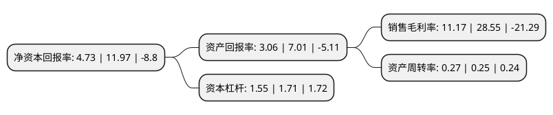

> 本页面由自动化程序生成于 2022年5月20日 01:27
> 内容可能存在错误，如有bug请提交issue至：https://github.com/Eroleice/doc-pi/issues
{.is-warning}

# 上市公司基本情况

## 基本资料

上海交大昂立股份有限公司（以下简称“交大昂立”）成立于1997年12月24日，上海市。于2001年07月02日在上交所主板上市。

交大昂立注册资本78,000万元，主营业务;食品及保健食品的原料和终端产品的研发，生产，销售。以下是详细信息：

- 公司名称: 上海交大昂立股份有限公司
- 股票代码: 600530.SH
- 所在地: 上海 - 上海市
- 成立日期: 1997年12月24日
- 注册资本: 78,000万元
- 法定代表人: 周传有
- 主营业务: 主营业务;食品及保健食品的原料和终端产品的研发，生产，销售
- 公司官网: www.onlly.com.cn
- 公司介绍: 公司是由上海交通大学、上海大众出租汽车股份有限公司、上海茸北工贸实业总公司、上海新路达商业(集团)有限公司、上海国际株式会社等九家发起人股东在原上海交大昂立生物制品有限公司的基础上以发起设立方式成立的股份公司。公司是中国保健食品行业首家上市企业，我国保健品龙头企业。公司的主要业务是食品及保健食品的原料和终端产品的研发、生产、销售。公司曾获得多项荣誉称号，主要有“上海市高新技术企业”、“上海市著名商标”、“中国驰名商标”、“上海市质量金奖企业”、“上海市文明单位”、“中国保健品十大最具公信力品牌”等，在同行中率先通过ISO9001质量体系认证和ISO22000食品安全体系认证。

## 股东及高管情况

上市公司第一大股东为大众交通(集团)股份有限公司，持股112,184,187股，占比14.38%，**疑似为**上市公司实际控制人。

截至2022年03月31日，上市公司的前十大股东中，共有8名机构股东，2个产品账户，其中5%以上大股东共有6名。上市公司前十大股东明细如下：

> 未能通过持股比例判定出上市公司实际控制人（持股30%以上）
> 可能存在通过间接持股、联合持股、协议控制等方式拥有实际控制权的主体，具体请参考上市公司定期公告！
{.is-warning}

> 截至2022年03月31日，上市公司前十大股东信息如下：

| 股东名称 | 持股数量（股） | 持股比例 |
| --- | --- | --- |
| 大众交通(集团)股份有限公司 | 112,184,187 | 14.38% |
| 上海韵简实业发展有限公司 | 82,362,600 | 10.56% |
| 上海新南洋昂立教育科技股份有限公司 | 66,446,889 | 8.52% |
| 上海新路达商业(集团)有限公司 | 47,993,727 | 6.15% |
| 上海饰杰装饰设计工程有限公司 | 42,227,464 | 5.41% |
| 丽水农帮咨询合伙企业(有限合伙) | 39,072,641 | 5.01% |
| 上海金澹资产管理有限公司-金澹资产添利二期私募证券投资基金 | 31,000,000 | 3.97% |
| 上海茸北工贸实业总公司 | 21,289,412 | 2.73% |
| 上海大众集团资本股权投资有限公司 | 11,910,252 | 1.53% |
| 上海交大昂立股份有限公司回购专用证券账户 | 5,080,000 | 0.65% |

## 利润表分析

上市公司2021年总收入为3.62亿元，净利润为0.4亿元，实现盈利。

## 杜邦分析

> 数据列示周期：2021年 | 2020年 | 2019年
{.is-info}

上市公司的净资产收益率在近一年有所下降，下降幅度为-60.48%，其变化情况分解如下：
- 上市公司的销售毛利率在近一年下降了-60.88%，可能是生产效率的下降、商品原材料价格上涨或商品价格的下跌所致。
- 上市公司的资产周转率在近一年上升了8%，可能是源自于更快的销售回款或库存管理效果提升。
- 上市公司的财务杠杆比率在近一年下降了-9.36%，可能是减少负债降低财务费用。

